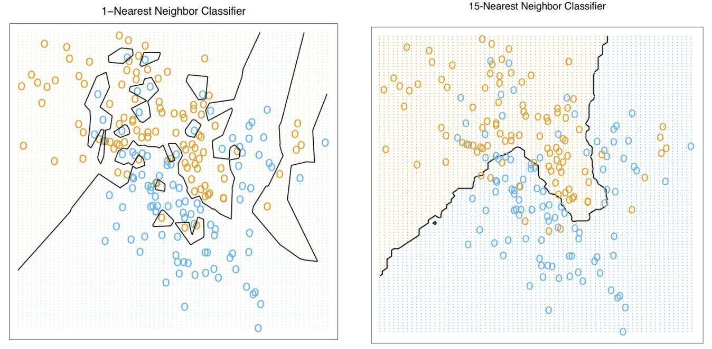
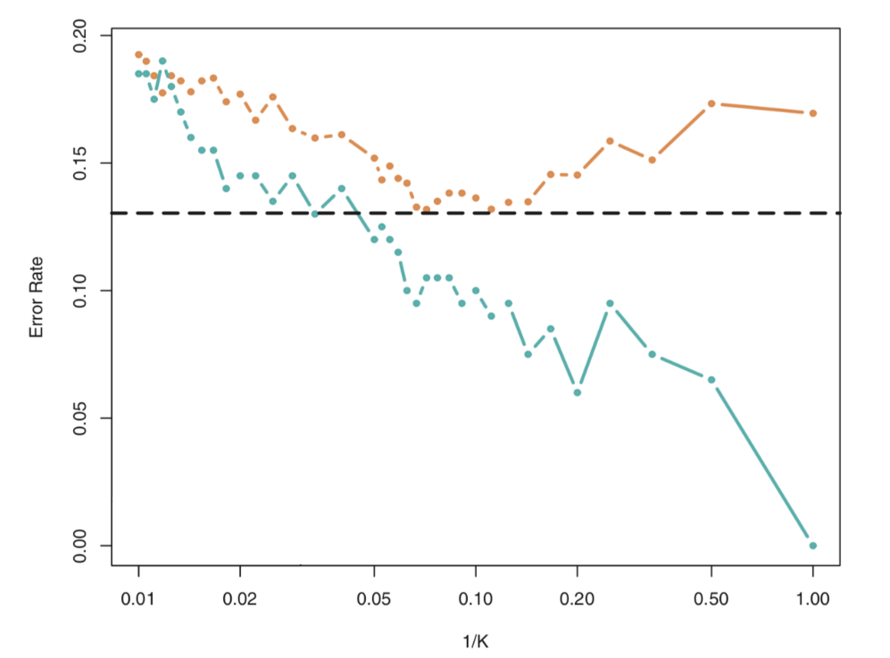

# Lecture 3, Jan 16, 2024

## $k$-Nearest Neighbours

\noteDefn{$k$\textit{-Nearest Neighbours}: The prediction for a test point $\bm x^*$ is computed as the average output across the $k$ nearest neighbours in the training dataset: $$\hat f(\bm x^*) = \frac{1}{k}\sum _{i \in \mathcal N_k(\bm x^*)} y^{(i)}$$where $\mathcal N_k(\bm x^*)$ is the set of $k$ training cases with inputs closest to $\bm x^*$. Alternatively, we can use a weighted average with each weight being inversely proportional to the neighbour's distance from $\bm x^*$.}

* $k$-NN assumes that similar inputs have similar outputs -- we're making an assumption on the smoothness of the underlying function
	* This is a memory-based method and does not require any model to be fit
	* $k$-NN is able to achieve Bayes optimality

{width=80%}

* This can also be used for classification, in which case the most common label amongst the $k$ nearest neighbours is used
	* To avoid ties, we can use an odd value of $k$ for binary classification problems
	* For multi-class classification, we can decrease $k$ until there is no longer a tie, reducing to $k = 1$ in the worst case

{width=50%}

* With increasing values of $k$, the model becomes *less* complex; the resulting output becomes smoother, exhibits more bias but less variance
	* For $k = 1$, this is essentially equivalent to constructing a Voronoi diagram of the input data
	* Smaller values of $k$ give more complex decision boundaries but risk overfitting as with any complex model
		* Overfitting makes us more susceptible to outliers
	* Rule of thumb: choose $k < \sqrt{N}$
		* We can also plot loss as shown in the figure and find the minimum
* $k$-NN requires a similarity/distance metric to find the nearest neighbours
	* Minkowski distance: $\operatorname{dist}(\bm x, \bm z) = \left(\sum _{i = 1}^D \abs{x_i - z_i}^p\right)^\frac{1}{p}$
		* For $p = 1$ this is Manhattan distance, for $p = 2$ this is Euclidean distance, for $p = \infty$ this is is the max of $\abs{x_i - z_i}$
	* Mahalanobis distance: $\operatorname{dist}(\bm x, \bm z) = \sqrt{(\bm x - \bm z)^T\bm\Sigma^{-1}(\bm x - \bm z)}$ where $\bm\Sigma$ is the covariance matrix of $\bm x$
* The choice of distance metric plays a key role in performance
	* Algorithms exist to choose the metric automatically
* $k$-NN can be sensitive to the scale of features, so if scale is unimportant, we should *normalize* each feature to be zero-mean and unit variance
	* Since the distance metric considers each dimension to be equal, the variance in each dimension can have large effects on the nearest neighbour calculations
	* Normalize as $x_i \gets \frac{x_i - \mu _i}{\sigma _i}, i = 1, 2, \dots, D$
	* $\mu _i, \sigma _i$ are the mean and standard deviations of the $i$-th feature
	* Note we should not normalize in a problem where the units/scale of the axes matter
* Each prediction has a runtime complexity of $\mathcal O(ND + N\log N)$ where $N$ is the number of training samples, $D$ is the number of features (dimensionality)
	* This includes both distance calculations and sorting
		* Distance calculations can be parallelized
	* Lots of research exists on efficient implementation of this algorithm
		* Using $k$-d trees reduces the cost to $\mathcal O(D\log N)$ but only if $D \ll N$
		* Randomized approximate NN calculations are more appropriate for sparse, high-dimensional problems
* All training points are required to be stored in order to make predictions, since the model doesn't learn
	* Can use automatic clustering and pick only the center of each cluster
	* Dimensionality reduction as a preprocessing step can reduce memory and time usage

### The Curse of Dimensionality

* This is the main problem associated with $k$-NN; as the number of dimensions increases, the number of training samples we need increases exponentially
* Consider a $D$-dimensional hypercube $[0, 1]^D$ where all training points are distributed uniformly
* Consider a test point $\bm x^*$; what is the length $l$ of the smallest hypercube within the unit cube that contains the $k$-nearest neighbours of $\bm x^*$?
	* Due to the uniform distribution, the proportion of points in the cube is equal to the volume of the cube divided by the volume of the unit cube
	* Therefore $l^D \approx \frac{k}{N}$ which gives $l \approx \left(\frac{k}{N}\right)^\frac{1}{D}$
* The value of $l$ increases very quickly with increasing $D$; with larger values of $D$, we have $l \approx 1$, so we will have to search almost the entire space
	* But if we are searching the entire space, this means the points might be far apart, so the algorithm will perform very poorly
* How many training points do we need to keep $l$ small?
	* If we want $l = 0.01$, then we can solve to get $N = 100^Dk$
	* This exponential growth in the amount of data needed is one of the main problems with $k$-NN
* Dimensionality reduction can be very important/helpful for this algorithm

### Probabilistic $k$-NN

* How can we make the algorithm probabilistic?
* For the case of binary classification, we can calculate the distribution of labels in the neighbourhood of a point
* If the data is parse, we might have zero probabilities for some classes
	* To overcome this, we can add pseudo-counts to the data and then normalize
	* Add 1 to the count of every category and then renormalise so the distribution still sums to 1
* e.g. binary classification problem with $k = 3$, we have 2 neighbours in class 1 and 1 neighbour in class 2, which gives us $P = [2/3, 1/3]$
	* To counteract the sparse data problem we will instead have $P = [2 + 1, 1 + 1]/5$

\noteSummary{$k$-nearest neighbours algorithm benefits:
\begin{itemize}
	\item Simple and easy to implement
	\item Easily parallelized
\end{itemize}
Drawbacks:
\begin{itemize}
	\item Choice of simliarity metric has significant impact on performance
	\item Since the entire training set has to be stored, memory usage can be prohibitive for large datasets
	\item Sensitive to noise in the labels (outliers/overfitting)
	\item Susceptible to the curse of dimensionality -- high dimensions require exponential amounts of data
\end{itemize}
}

