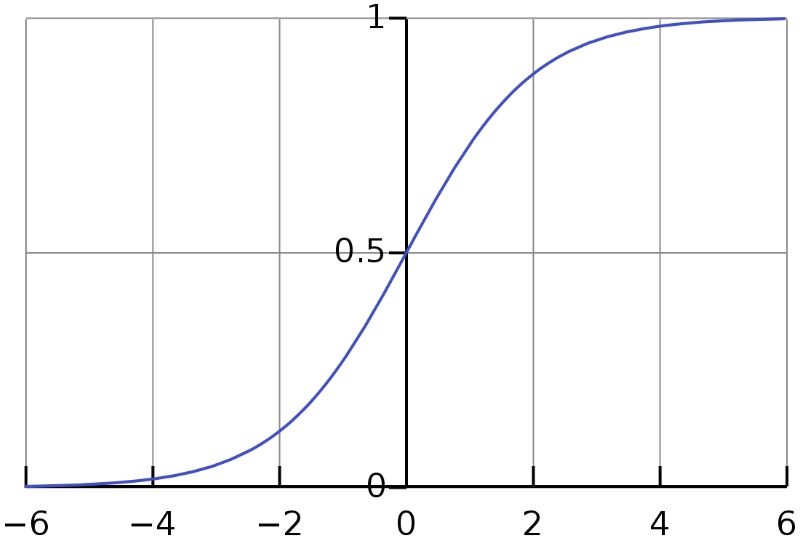

# Lecture 4, Jan 23, 2024

## Linear Regression

* A linear model in general is represented by $\hat f(\bm x, \bm w) = w_0 + \sum _{j = 1}^D w_jx_d$
	* $\bm w = \set{w_0, \dots, w_D}^T \in \reals^{D + 1}$ are undetermined weights of the model
	* This is a parametric supervised learning technique
* Using least squares loss gives the optimization problem: $\hat{\bm w} = \argmin _{\bm w \in \reals^{D + 1}} \sum _{i = 1}^N \left(y^{(i)} - w_0 - \sum _{j = 1}^D w_jx_j^{(i)}\right)^2$
	* Let the dummy feature $x_0 = 1$, then we have $\bm x = \set{x_0, \dots, x_D}^T \in \reals^{D + 1}$ so $\hat f(\bm x, \bm w) = \bm w^T\bm x$
	* Let $\bm X \in \reals^{N \times (D + 1)}$ such that the $i$th row contains $\bm x^{(i)}$, i.e. $\bm X_{ij} = x_j^{(i)}$; this allows us to write the vector of predictions as $\hat{\bm y} = \bm X\bm w \in \reals^N$
	* Let $\bm y = \set{y^{(1)}, \dots, y^{(N)}}^T \in \reals^N$
* The problem is then $\hat{\bm w} = \argmin _{\bm w \in \reals^{D + 1}} \norm{\bm y - \bm X\bm w}_2^2$
	* The loss function is $\mathcal L(\bm w) = \norm{\bm y - \bm X\bm w}_2^2 = (\bm y - \bm X\bm w)^T(\bm y - \bm X\bm w)$
	* $\alignedeqntwo[t]{\pdiff{\mathcal L}{\bm W}}{\pdiff{}{\bm w}(\bm y^T\bm y + \bm w^T\bm X^T\bm X\bm w - 2\bm y^T\bm X\bm w)}{2\bm X^T\bm X\bm w - 2\bm X^T\bm y}{2\bm X^T(\bm X\bm w - \bm y) = \bm 0}$
		* Note: $\pdiff{}{z}(\bm z^T\bm A\bm z) = (\bm A + \bm A^T)\bm z, \pdiff{}{\bm z}(\bm A\bm z) = \bm A^T$
* Therefore we need to solve $\bm X^T\bm X\bm w = \bm X^T\bm y$
	* $\bm X^T\bm X$ is invertible if $\bm X$ is full rank, i.e. if the features are linearly independent
		* Note equations of this form are known as *normal equations*
	* Can be interpreted as a projection scheme since we are enforcing that $(\bm y - \hat{\bm y}) \perp \bm X_i$ for all columns $\bm X_i$ of $\bm X$ (the residual should be orthogonal to the column space)
* We're essentially trying to solve $\bm X\bm w = \bm y$ where $\bm X \in \reals^{N \times (D + 1)}, \bm w \in \reals^{D + 1}, \bm y \in \reals^N$
	* The problem is *overdetermined* if $N > D + 1$ (i.e. we have more data points than feature dimensions, so $\bm X$ is tall and skinny)
		* We therefore cannot find $\bm w$ to solve this equation, so we can only minimize the residual
	* The problem is *undetermined* if $N < D + 1$ (i.e. we have more dimensions than data points, so $\bm X$ is short and fat)
		* This would have an infinite number of solutions, so we need to impose additional constraints

### Solving for the Weights

* Cholesky decomposition: $\bm X^T\bm X = \bm R^T\bm R$ where $\bm R \in \reals^{(D + 1) \times (D + 1)}$ is upper triangular
	* Note this is only possible since $\bm X^T\bm X$ is symmetric positive definite if it is full rank
	* Then we have $\hat{\bm w} = (\bm X^T\bm X)^{-1}\bm X^T\bm y = \bm R^{-1}\bm R^{-T}\bm X^T\bm y$
		* Note $\bm R^{-T} = (\bm R^{-1})^T = (\bm R^T)^{-1}$
	* Computationally this involves a forward and backward substitution to invert the upper and lower triangular matrices
		* First solve for $\bm z = \bm R^{-T}\bm x^T\bm y$, then $\bm w = \bm R^{-1}\bm z$
		* Both inverses are easy to compute due to them being triangular
	* Note it is common to add a small perturbation, replacing $\bm X^T\bm X$ with $\bm X^T\bm X + \lambda\bm I$ to prevent ill-conditioning; this is equivalent to $l_2$ regularization
	* Cost: $\textstyle O(N(D + 1)^2 + \frac{1}{3}(D + 1)^3)$
		* Computing $\bm R$ takes $mn^2 + \frac{1}{3}n^3$ flops
* Economic QR (aka. reduced or thin QR): $\bm X = \bm Q\bm R$ where $\bm Q \in \reals^{N \times (D + 1)}$ is orthonormal, $\bm R \in \reals^{(D + 1) \times (D + 1)}$ is upper-triangular
	* $\bm X^T\bm X\bm w = \bm X^T\bm y \implies \bm R^T\bm Q^T\bm Q^T\bm R\bm w = \bm R^T\bm Q^T\bm y \implies \bm R^T\bm R\bm w = \bm R^T\bm Q^T\bm y$
	* Then we have $\hat{\bm w} = \bm R^{-1}\bm Q^T\bm y$
	* Note instead of directly inverting $R$, we again use a backward substitution
	* This method can fail when $\bm X$ is nearly rank-deficient (i.e. two data points being close together); in this case, SVD is a more robust option
	* Cost: $\textstyle O(2N(D + 1)^2 + \frac{2}{3}(D + 1)^3)$ (approximate)
		* QR factorization costs about $2mn^2$ flops; for $m \gg n$ Cholesky is faster, but only a factor of 2 at most
* Singular value decomposition: $\bm X = \bm U\bm\Sigma\bm V^T$ where $\bm U \in \reals^{N \times N}, \bm V \in \reals^{(D + 1) \times (D + 1)}$ are orthogonal and $\bm\Sigma \in \reals^{N \times (D + 1)}$ is rectangular diagonal
	* Note we can write this as $\bm X = \rvec{\bm U_1}{\bm U_2}{\cvec{\bm\Sigma _1}{\bm 0}}{\bm V^T}$ or $\bm X = \bm U_1\bm\Sigma _1\bm V^T$
	* $\norm{\bm y - \bm X\bm w}_2^2 = \norm{\bm U^T(\bm y - \bm X\bm w)}_2^2 = \norm*{\cvec{\bm U_1^T\bm y}{\bm U_2\bm y} - \cvec{\bm\Sigma _1\bm V^T\bm w}{\bm 0}}_2^2 = \norm{\bm U_1^T\bm y - \bm\Sigma _1\bm V^T\bm w}_2^2 + \norm{\bm U_2^T\bm y}_2^2$
		* Since $\bm U$ is orthogonal, we can multiply any vector by it and not change the norm
	* We can now minimize this by choosing $\hat{\bm w} = \bm V\bm\Sigma _1^{-1}\bm U_1^T\bm y = \sum _{i = 1}^{D + 1} \bm v_i\frac{\bm u_i^T\bm y}{\sigma _i}$
		* The summation format is more efficient since $\bm\Sigma$ is diagonal
		* If some singular values are very small, we can truncate this summation for better numerical stability
	* Alternatively the same result can be obtained by simply substituting the SVD into the original expression
	* Cost: $O(2N(D + 1)^2 + 11N(D + 1)^3)$ (approximate)
* Moore-Penrose pseudoinverse: $\bm X^\dagger = (\bm X^T\bm X)^{-1}\bm X^T = \bm V\bm\Sigma^\dagger\bm U^T$
	* Then $\hat{\bm w} = \bm X^\dagger\bm y$ when $\bm X$ is full rank (so $\bm X^T\bm X$ is symmetric positive definite)
	* Using QR and SVD we can also write $\bm X^\dagger = \bm R^{-1}\bm Q^T$ or $\bm X^\dagger = \bm V\bm\Sigma _1^{-1}\bm U_1^T$
	* If $\bm X$ is rank deficient, then we can take $\hat{\bm w} = \bm V\bm\Sigma _1^\dagger\bm U_1^T\bm y$
		* $\bm\Sigma _1^\dagger = \diag\set{\sigma _1^\dagger, \dots, \sigma _{D + 1}^\dagger}$ and $\sigma _i^\dagger = \twocond{\textstyle\frac{1}{\sigma _i}}{\sigma _i > 0}{0}{\text{otherwise}}$
* The *condition number* for linear least-squares is defined as $\kappa(\bm X) = \norm{\bm X}\norm{\bm X^\dagger} = \frac{\sigma _\text{max}}{\sigma _\text{min}}$
	* This is a measure of the sensitivity of the weights to perturbations in the training data
	* High condition numbers can occur in learning problems where the features are strongly correlated
	* Rule of thumb: one digit of precision is lost for every power of 10 in the condition number
		* e.g. IEEE doubles have 16 digits of accuracy, so if a matrix has a condition number of $10^{10}$ we will only get 6 digits of accuracy
	* Note $\kappa(\bm X^T\bm X) = (\kappa(\bm X))^2$, i.e. when solving normal equations we square the condition number!
		* $\kappa(\bm X^T\bm X + \lambda\bm I) \leq \kappa(\bm X^T\bm X)$ for all positive $\lambda$
	* On the other hand, performing QR and SVD decomposition keeps the same condition number, so using these methods are a lot more stable
* In general SVD is more expensive than QR and Cholesky, but more numerically stable and can handle rank deficiencies
	* Which one to use is problem dependent
	* From Cholesky to QR to SVD we have increasing stability but also computational cost
* Storing $\bm X, \bm y$ use $O(ND) + O(N)$ memory
	* Using economy QR and SVD will require additional $O(ND)$ memory
		* Full QR and SVD is never practical for large datasets!
	* If the problem is too large to fit into memory, we will need iterative methods that compute the result term-by-term
* Another alternative is to use gradient descent
	* $\bm w \gets \bm w - \frac{\alpha}{2N}\del _{\bm w}\mathcal L = \bm w - \frac{\alpha}{N}\bm X^T(\hat{\bm y} - \bm y) = \bm w - \frac{\alpha}{N}\sum _{i = 1}^N(\hat y^{(i)} - y^{(i)})\bm x^{(i)}$
	* Each iteration requires an additional $O(ND)$ cost

### Underdetermined Least Squares

* Assume that $\rank(\bm X) = N$
* We need to impose additional constraints to get a unique solution
* Heavily underdetermined equations routinely arise in the field of *compressive sensing* and bioinformatics
* One approach is to use $\hat{\bm w} = \argmin _{\bm w \in \reals^{D + 1}} \norm{\bm w}_2^2$ such that $\bm X\bm w = \bm y$
	* This gives the *minimum norm solution* to the least squares-problem
	* Let $\bm\lambda \in \reals^N$ be the Lagrange multipliers
	* The Lagrangian is $L(\bm w, \bm\lambda) = \bm w^T\bm w + \bm\lambda^T(\bm X\bm w - \bm y)$
	* The optimality condition is $\del _{\bm w}L = 2\bm w + \bm X^T\bm\lambda = 0$ and $\del _{\bm\lambda}L = \bm X\bm w - \bm y = 0$
		* Solve: $\bm w = -\frac{1}{2}\bm X^T\bm\lambda$ and $\bm\lambda = -2(\bm X\bm X^T)^{-1}\bm y$
	* Therefore $\hat{\bm w} = \bm X^T(\bm X\bm X^T)^{-1}\bm y$
		* Note in practice we do not calculate this inverse explicitly but instead use a factorization scheme for better stability
	* Other options for constraints also exist such as minimizing the 1-norm
* Using QR factorization: factorize $\bm X^T\bm Q\bm R$, then $\hat{\bm w} = \bm Q\bm R^{-T}\bm y$
* Using economy SVD: $\bm X^T = \bm U_1\bm\Sigma _1\bm V^T$, then $\hat{\bm w} = \bm U_1\bm\Sigma _1^{-1}\bm V^T\bm y$
	* If $\bm X^T$ is not full rank we can use the same thresholding technique as overdetermined least squares (ignoring nearly zero singular values)

### Regression Models for Classification

* For a binary classification problem ($y = +1, -1$), consider a model that minimizes the $l_2$ loss and makes predictions as $\sgn\hat f(\bm x)$

{width=30%}

{width=30%}

* Notice that in the example above, the model became much worse after including the additional data
	* This is because we used a loss function that is inappropriate for classification!
* Make the labels instead $y \in \set{0, 1}$, and normalize the predictions using the logistic (aka sigmoid) function: $\sigma(z) = \frac{1}{1 + e^{-z}}$ and make predictions as $\hat y = \sigma(\bm w^T\bm x)$ and threshold at 0.5

{width=30%}

* We can interpret $\hat y$ as the estimated probability of $y = 1$, and use a loss function that captures the idea that more confidence on a wrong prediction should incur a higher penalty
	* For this, use cross-entropy loss: $\mathcal L_{CE}(\bm w) = \frac{1}{N}\sum _{i = 1}^N \left[-y^{(i)}\log\hat y^{(i)} - (1 - y^{(i)})\log(1 - \hat y^{(i)})\right]$
* Note for multi-class classification, we can have successive classifiers that pick out one class at a time (Lecture 2), or formulate as a multi-output regression problem and use one-hot encodings
* Note the gradient: $\del _{\bm w}\mathcal L_{CE}(\bm w) = \frac{1}{N}\sum _{i = 1}^N(\hat y^{(i)} - y^{(i)})\bm x^{(i)}$
	* The gradient is the same as the gradient of the least squares loss; this is not a coincidence

{width=30%}

