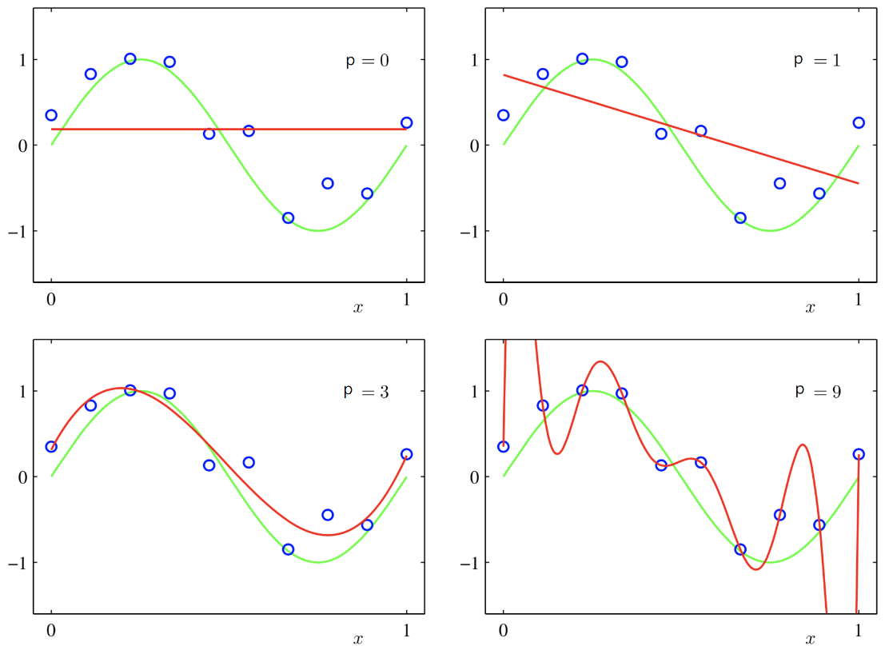
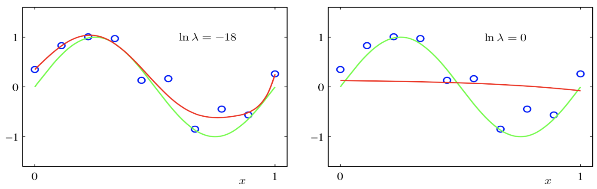

# Lecture 6, Feb 2, 2024

## Generalized Linear Models (GLMs)

\noteDefn{\textit{Generalized Linear Models}: A GLM is given by $$\hat f(\bm x, \bm w) = w_0 + \sum _{i = 1}^{M - 1} w_i\phi _i(\bm x)$$where $\bm w$ is a set of undetermined weigths and $\phi _i \colon \reals^D \mapsto \reals$ are a set of known basis functions.}

* The models may be nonlinear in the inputs $\bm x$, but still linear in the weights $\bm w$, which makes is still possible to use linear techniques
* To construct a GLM we need to select the appropriate basis functions, and formulate a strategy to estimate the weights
* Let $\phi _0(\bm x) = 1$ (the bias term) and $\bm\phi(\bm x) = \cvec{\phi _0(\bm x)}{\phi _1(\bm x)}{\vdots}{\phi _{M - 1}(\bm x)} \in \reals^M$
	* Then if we define the weight vector $\bm w = \rvec{w_0}{\dots}{w_m}^T$, we can write $\hat f(\bm x, \bm w) = \bm w^T\bm\phi(\bm x)$
	* We are using $\phi$ to map from the input space $\mathcal X$ to the *feature space* $\mathcal F$, and performing linear regression in the feature space
* Let the vector of training targets $\bm y = \rvec{y^{(1)}}{\dots}{y^{(N)}}^T \in \reals^N$ and $\bm \Phi \in \reals^{N \times M}$ where the $i$th row contains $\bm\phi(\bm x^{(i)}) \in \reals^M$
	* Then $\hat{\bm y} = \bm\Phi\bm w$
* Use the $l_2$ loss function $\hat{\bm w} = \argmin _{\bm w \in \reals^M} \norm{\bm y - \hat{\bm y}}_2^2$
	* Again the loss function can be written as $(\bm y - \bm\Phi\bm w)^T(\bm y - \bm\Phi\bm w)$
	* We can use the same techniques for the linear model, but instead of $D + 1$ weights we have $M$ weights
	* We essentially replace $\bm X \in \reals^{N \times (D + 1)}$ with $\bm\Phi \in \reals^{N \times M}$
* Derivation:
	* $\mathcal L(\bm w) = \bm y^T\bm y + \bm w^T\bm\Phi^T\bm\Phi\bm w - 2\bm y^T\Phi\bm w$
	* $\pdiff{\mathcal L}{\bm w} = (\bm\Phi^T\bm\Phi + (\bm\Phi^T\bm\Phi)^T)\bm w - 2\bm\Phi^T\bm y = 2\bm\Phi^T\bm\Phi\bm w - 2\bm\Phi^T\bm y = 0$
	* Therefore $\bm\Phi^T\bm\Phi\bm w = \bm\Phi^T\bm y$
* We can use the same techniques as linear models to solve the normal equations:
	* Cholesky factorization
		* Avoid this because the condition number is squared
	* (Economy) QR factorization
		* Use this only if $\bm\Phi$ is not rank-deficient
	* (Economy) SVD, or truncated SVD if $\bm\Phi$ is rank-deficient
		* Slowest, but the most stable

### Polynomial Regression

* The basis functions are the univariate polynomials $\set{1, x_i, x_i^2, \dots, x_i^p}$ up to order $p$
* If $D = 1$, then the basis functions are $\phi _i = x^i$ so $\hat f(x) = w_0 + w_1x + \dots + w_px^p$
	* Note taking tensor products of higher-order univariate polynomials is not a good idea since we will generate $p^D$ basis functions
	* We can circumvent this with the *kernel trick* covered later

{width=70%}

* Results for various values of $p$ are shown above
	* Notice that for smaller values of $p$ the model doesn't fit well since it doesn't have enough complexity (underfitting)
	* But for large values of $p$, the polynomial matches the training points perfectly but approximates the underlying function poorly
* To prevent overfitting, we need to restrict the number of features $M$ (which in this case restricts the degree of the polynomial
	* Increasing the number of data points also helps but we often can't just get more data
	* What if we know the underlying model is complex but we don't have enough data points?
	* How do we deal with noise?

### Regularization

* One pattern we may notice is that when the model is overfitting ($M$ too large), the weights start becoming very big in magnitude
* *Regularization* tries to keep the magnitudes of the weights reasonably small, as a way to prevent overfitting
* To keep the weight small, we can introduce the norm of the weights to the loss function, so the model is penalized for having weights that are too large

\noteDefn{\textit{Ridge Regression Method}: Choose the weights as $$\hat{\bm w} = \argmin _{\bm w \in \reals^{M + 1}} \abs{\bm y - \bm \Phi\bm w}_2^2 + \lambda\norm{\bm w}_2^2$$where $\lambda$ is the \textit{regularization parameter}.}

* Note $w_0$ is often excluded from the regularization term
* The regularized loss function is also quadratic in $\bm w$, so we can use the same steps as before
	* Expanded loss: $\bm y^T\bm y + \bm w^T\bm\Phi^T\bm\Phi\bm w - 2\bm w^T\bm\Phi^T\bm y + \lambda\bm w^T\bm w$
	* $\pdiff{\mathcal L}{\bm w} = 2\bm\Phi^T\bm\Phi\bm w - 2\bm\Phi^T\bm y + 2\lambda\bm w = 0$
	* Rearrange: $\bm\Phi^T\bm\Phi\bm w + \lambda\bm w = \bm\Phi^T\bm y \implies (\bm\Phi^T\bm\Phi + \lambda\bm I)\bm w = \bm\Phi^T\bm y$
		* Therefore $l_2$ regularization is equivalent to adding a small positive perturbation to the diagonal of $\bm\Phi^T\bm\Phi$
		* We saw this in a previous lecture -- this also helps with ill-conditioning
		* If $\lambda$ is sufficiently large we can avoid ill-conditioning completely
* Using SVD: $\bm\Phi = \bm U\bm\Sigma\bm V^T$
	* $((\bm U\bm\Sigma\bm V^T)^T\bm U\bm\Sigma\bm V^T + \lambda\bm I)\bm w = (\bm U\bm\Sigma\bm V^T)^T\bm y$
	* Simply to get $\bm V(\bm\Sigma^T\bm\Sigma + \lambda\bm I)\bm V^T\bm w = \bm V\bm\Sigma^T\bm U^T\bm y$
	* Multiply each side by $\bm V^T$ to get $(\bm\Sigma^T\bm\Sigma + \lambda\bm I)\bm V^T\bm w = \bm\Sigma^T\bm U^T\bm y$
	* Therefore $\bm w = \bm V(\bm\Sigma^T\bm\Sigma + \lambda\bm I)^{-1}\bm\Sigma^T\bm U^T\bm y$
	* This can be rewritten as $\hat{\bm w}(\lambda) = \sum _{i = 1}^M \bm v_i\frac{\sigma _i\bm u_i^T\bm y}{\sigma _i^2 + \lambda}$
		* $\bm v_i, \bm u_i$ are the $i$th columns of $\bm V$ and $\bm U$
		* If $0 \approx \sigma _i \ll \lambda$ this goes to 0
		* If $\sigma _i \gg \lambda$ this goes to the original unregularized solution
* The regularization has almost no impact on the contributions of large singular values but zeros out the contribution of smaller singular values

{width=70%}

* $\lambda$ is an important hyperparameter
	* Notice that with a reasonable value of $\lambda$ we have a pretty good model even at $p = 9$
	* However if the regularization is too extreme, the model will underfit as the loss is too focused on minimizing $\norm{\bm w}_2^2$
* To estimate $\lambda$ we can again use $\nu$-fold cross-validation just like we chose $k$ for $k$-NN
	* If the training dataset is small we can use leave-one-out cross-validation (i.e. $\nu = 1$)
	* There are fast algorithms for calculating this
	* Use cross-validation to select the best value of $\lambda$, then retrain the model on all the data using this new value

