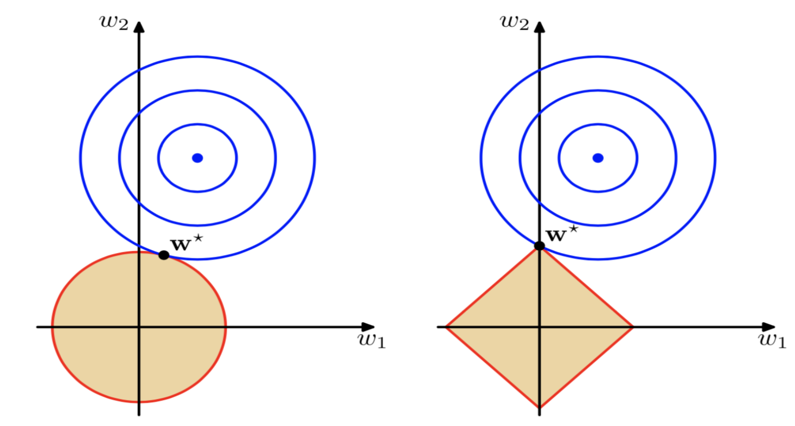

# Lecture 7, Feb 6, 2024

## Dual Representations of GLMs

* Consider the loss function: $\mathcal L(\bm w) = \norm{\bm y - \bm\phi\bm w}_2^2 = \sum _{i = 1}^N (\bm w^T\bm\phi(\bm x^{(i)}) - y^{(i)})^2 + \lambda\bm w^T\bm w$
	* Setting $\pdiff{\mathcal L}{\bm w} = 0 \implies 2\sum _{i = 1}^N\left(\bm w^T\bm \phi(\bm x^{(i)}) - y^{(i)}a\right)\bm\phi(\bm x^{(i)}) + 2\lambda\bm w = 0$
	* Then $\bm w = -\frac{1}{\lambda}\sum _{i = 1}^N\left(\bm w^T\bm \phi(\bm x^{(i)}) - y^{(i)}a\right)\bm\phi(\bm x^{(i)}) = \sum _{i = 1}^N \alpha _i\bm\phi(\bm x^{(i)}) = \bm\Phi^T\bm\alpha$
		* $\alpha _i = -\frac{1}{\lambda}(\bm w^T\bm\phi(\bm x^{(i)}) - y^{(i)})$ are the *dual variables* while $\bm w$ are the *primal variables*
* Substitute $\bm w = \bm\Phi^T\bm\alpha$ into the loss function: $\mathcal L(\bm \alpha) = \bm\alpha^T\bm\Phi\bm\Phi^T\bm\Phi\bm\Phi^T\bm\alpha - 2\bm\alpha^T\bm\Phi\bm\Phi^T\bm y + \bm y^T\bm y + \lambda\bm\alpha^T\bm\Phi\bm\Phi^T\bm\alpha = \bm\alpha^T\bm K\bm K\bm\alpha - 2\bm\alpha^T\bm K\bm y + \bm y^T\bm y + \lambda\bm\alpha^T\bm K\bm\alpha$
	* $\bm K = \bm\Phi\bm\Phi^T \in \reals^{N \times N}$ is the *Gram matrix*, which is real and symmetric
	* The $(i, j)$th entry of $\bm K$ is given by $K_{ij} = \bm\phi(\bm x^{(i)})^T\bm\phi(\bm x^{(j)}) = k(\bm x^{(i)}, \bm x^{(j)})$
	* $k \colon \mathcal X \times \mathcal X \mapsto \reals$ is the *kernel*
* Using the loss in terms of $\bm K$, we take $\nabla _{\bm\alpha}J = 0$ leads to $\bm\alpha = (\bm K + \lambda\bm 1)^{-1}\bm y$
	* With this solution for $\bm\alpha$ we have $\hat f(\bm x, \bm w) = \bm\phi(\bm x)^T\bm w = \bm\phi(\bm x)^T\bm\Phi^T(\bm K + \lambda\bm 1)^{-1}\bm y$
	* Note the $i$th entry of $\bm\Phi\bm\phi(\bm x)$ is $\bm\phi(\bm x^{(i)})\bm\phi(\bm x) = k(\bm x^{(i)}, \bm x)$
	* Let $\bm k(\bm x) = \set{k(\bm x^{(1)}, \bm x), \dots, k(\bm x^{(N)}, \bm x)}^T \in \reals^N$
* The model can then be rewritten as $\hat f(\bm x, \bm w) = \bm k(\bm x)^T(\bm K + \lambda\bm 1)^{-1}\bm y = \sum _{i = 1}^N \alpha _ik(\bm x, \bm x^{(i)})$
	* This is known as the *dual representation*
	* We've defined our model entirely in terms of the kernel; we don't actually need to evaluate the basis functions themselves, and only the inner products between the bases are needed
	* The choice of a kernel implicitly characterizes the feature space mapping $\phi$
* Using the kernel is often much more efficient than using the basis functions explicitly
	* e.g. for the polynomial features, $k(\bm x, \bm z) = \bm\phi(\bm x)^T\bm\phi(\bm z) = 1 + x_1z_1 + x_2z_2 + x_1x_2z_1z_2 + \dots + x_1\dots x_Dz_1\dots z_D = \prod _{i = 1}^D (1 + x_iz_i)$
	* The original features would need $\mathcal O(2^D)$ computation time, but using the kernel this is reduced to $\mathcal O(D)$ for the simple product
* The kernel can also be interpreted as a similarity metric, since it takes two points from $\mathcal X$ and returns a real scalar

\noteDefn{\textit{The kernel trick}: Any linear method that can be written in terms of dot products ${\bm x^{(i)}}^T\bm x^{(j)}$ can be \textit{kernelized} by replacing ${\bm x^{(i)}}^T\bm x^{(j)} \to k(\bm x^{(i)}, \bm x^{(j)})$, which results in a nonlinear generalization of the linear method.}

* This allows us to do kernel PCA, kernel SVM, etc
	* e.g. kernel $k$-NN
		* Distance computation in feature space is $\norm{\bm\phi(\bm x) - \bm\phi(\bm z)}_2^2 = \bm\phi(\bm x)^T\bm\phi(\bm x) + \bm\phi(\bm z)^T\bm\phi(\bm z) - 2\bm\phi(\bm x)^T\bm\phi(\bm z)$
		* Replace this by $k(\bm x, \bm x) + k(\bm z, \bm z) - 2k(\bm x, \bm z)$ to kernelize it
* Even though we derived this result for the squared loss specifically, the *representer theorem* states that this kernel form of the model will always be able to minimize the loss

### Kernel Selection

* The kernel function must define a dot product for some Hilbert space $\mathcal F$, which means it must be symmetric and positive semi-definite
	* Symmetry means $k(\bm x, \bm z) = k(\bm z, \bm x)$
	* PSD means $\iint u(\bm x)k(\bm x, \bm z)u(\bm z)\,\dd\bm x\,\dd\bm z \geq 0$ for all square integrable functions $u$
	* By extension this means:
		* $\bm K$ is positive semi-definite
		* Cauchy-Schwartz inequality: $k(\bm z, \bm z) \leq \sqrt{k(\bm x, \bm x)k(\bm z, \bm z)}$
		* Definiteness: $k(\bm x, \bm x) \geq 0$
	* This all makes sense intuitively if the kernel is interpreted as a distance metric
* Example kernels:
	* Linear: $k(\bm x, \bm z) = \bm x^T\bm z$
	* Polynomial: $k(\bm x, \bm z) = (1 + \bm x^T\bm z)^n$
	* Isotropic Gaussian: $k(\bm x, \bm z) = \exp\left(-\frac{1}{\theta}\norm{\bm x - \bm z}_2^2\right)$
		* $\theta > 0$ is a hyperparameter
	* Anisotropic Gaussian: $k(\bm x, \bm z) = \exp(-(\bm x - \bm z)^T\bm\Theta^{-1}(\bm x - \bm z))$
		* $\bm\Theta \in \reals^{D \times D}$ is symmetric positive definite and a hyperparameter
* We can go from kernels back to features, e.g. for the polynomial kernel:
	* $k(\bm x, \bm z) = (1 + x_1z_1 + x_2z_2 + \dots + x_Dz_D)^n$
	* For $D = 2$ and $n = 2$, $k(\bm x, \bm z) = 1 + x_1^2z_1^2 + x_2^2z_2^2 + 2x_1z_1 + 2x_2z_2 + 2x_1z_2x_2z_2$
	* Therefore $\bm\phi(\bm x) = \rvec{1}{x_1^2}{x_2^2}{\sqrt 2x_1}{\sqrt 2x_2}{\sqrt 2 x_1x_2}$
* The feature vector can even be infinite dimensional, e.g. for the Gaussian kernel:
	* For $D = 1, \theta = 1$, $\alignedeqntwo[t]{k(x, z)}{\exp(-(x - z)^2)}{\exp(-x^2)\exp(-z^2)\exp(2xz)}{\exp(-x^2)\exp(-z^2)\sum _{k = 0}^\infty \frac{2^kx^kz^k}{k!}}$
	* Therefore $\bm\phi(x) = \rvec{\exp(-x^2)}{\sqrt{\frac{2^1}{1!}}x^1\exp(-x^2)}{\sqrt{\frac{2^2}{2!}}x^2\exp(-x^2)}{\dots}$
* To select the kernel, we can use prior knowledge of the target function
	* If the target function is known to be smooth (i.e. differentiable $k$ times) then we can use a kernel that also has the same degree of smoothness
	* If the function is finitely smooth, use the Gaussian or another $C^\infty$ kernel
	* If the function is periodic we can use a periodic kernel
	* Plenty of literate exists in this area
* *Radial basis functions* (RBFs) are kernels that are translation invariant, i.e. their value only depends on the distance between the features
	* $k(\bm x^{(i)}, \bm x^{(j)}) = k(\norm{\bm x^{(i)} - \bm x^{(j)}}) = k(r)$
	* Examples of RBF kernels:
		* Gaussian: $k(r) = e^{-\frac{r^2}{\theta}}$
		* Multiquadratic: $k(r) = \sqrt{1 + \frac{r^2}{\theta}}$
		* Inverse multiquadratic: $k(r) = \frac{1}{\sqrt{1 + \frac{r^2}{\theta}}}$
		* Matern kernels: a family including
			* $C^0$: $\exp\left(-\frac{r}{\theta}\right)$
			* $C^2$: $\frac{1}{1 + \frac{r}{\theta}}\exp\left(-\frac{r}{\theta}\right)$
			* $C^4$: $\left(3 + 3\frac{r}{\theta} + \left(\frac{r}{\theta}\right)^2\right)\exp\left(-\frac{r}{\theta}\right)$
	* All the above kernels have $\theta$ has a hyperparameter; this is the shape parameter, where larger values spread out the function and gives a higher value for larger values of $r$

### Sparsity

* The regression model is $\hat f(\bm x, \bm\alpha) = \sum _{i = 1}^N \alpha _ik(\bm x, \bm x^{(i)})$ where $\bm\alpha = (\bm K + \lambda\bm 1)^{-1}\bm y$
* This can be interpreted as a GLM constructed using the $N$ basis functions $k(\bm x, \bm x^{(1)}), \dots, k(\bm x, \bm x^{(N)})$
	* We have one basis function per data point, so this is a *dense* regression model
* Note that when $\lambda = 0$, since we have $N$ basis functions, we will match our $N$ training points exactly
	* This can be useful if we know that there is no noise in the training data
	* When $\lambda = 0$, $\bm K$ is guaranteed to be non-singular if and only if the training data points are unique
* When $\lambda > 0$, $\bm K + \lambda\bm 1$ is symmetric positive definite, so we can compute the Cholesky factorization without worrying about singularities
	* Since we never formed normal equations, we never squared the condition number, so this is stable
* Computing this will take $\mathcal O(N^2)$ memory and $\mathcal O(N^3)$ time, which makes it very difficult to scale up
	* We can improve this by choosing only a subset of the basis functions, which gives us a *sparse* regression model
	* Alternatively, we can use $k$-means clustering to extract a set of representative points
		* Then the model is $\hat f(\bm x, \bm\alpha) = \sum _{i = 1}^M \alpha _ik(\bm x, \bm z^{(i)})$ and $\bm\alpha$ is computed with the $\bm z$ vectors
		* This also reduces inference cost
* Sparsity is generally a good idea because:
	* Reduction in computational and inference cost
	* Reduction in memory usage
	* Makes models more interpretable
	* Prevents overfitting
* *Orthogonal Marching Pursuit*: a greedy algorithm for sparse regression
	* Procedure:
		* Set $k = 0$ and let $\mathcal D_\phi = \set{\phi _1, \dots, \phi _M}$ be a dictionary of basis functions
		* Initialize $\mathcal I_s^{(k)}$, the set of selected basis functions, and $\mathcal I_c^{(k)}$, the set of candidate basis functions
		* Initialize $\bm r^{(0)} = \bm y$ as the residual, or training error vector
		* While $\norm{\bm r^{(k)}}_2 > \epsilon$, do:
			* $k \leftarrow k + 1$
			* Pick $i_k = \argmax _{i \in \mathcal I^{(k - 1)}_c} J(\phi _i)$
				* The metric is $J(\phi _i) = \frac{(\bm\Phi _i^T\bm r^{(k)})^2}{\bm\Phi _i^T\bm\Phi _i}$ where $\bm\Phi _i$ is the $i$th column of $\bm\Phi$
				* This is an approximation of the reduction in training error as a result of choosing the $i$th basis function
				* Think of this as checking how much the $i$th basis function is in the direction of the residual error
			* Add selected basis function index to $\mathcal I_s^{(k)}$ and remove it from $\mathcal I_c^{(k)}$
			* Solve $\bm\phi^{(k)}\bm w^{(k)} \approx \bm y$ for the weights
				* Note $\bm w^{(k)} \in \reals^k$ since in this iteration we have $k$ basis functions
				* $\bm\Phi^{(k)}$ has $k$ columns corresponding to the basis functions
			* Update the residual by $\bm r^{(k)} = \bm y - \bm\Phi^{(k)}\bm w^{(k)}$
		* The final sparse model is $\sum _{i \in \mathcal I^{(k)}_s} w_i\phi _i(\bm x)$
	* Updating the weights in each iteration can be done using incremental QR factorization to save time
	* The parameter $\epsilon$ can be chosen via cross-validation, or other model selection criteria
* For GLMs, if minimizing the least squares error with $l_2$ regularization, we can find a more efficient method to calculate the leave-one-out error
	* Let $\bm A = \bm K(\bm K + \lambda\bm 1)^{-1} = \bm\Phi(\bm\Phi^T\bm\Phi)^{-1}\bm\Phi^T$
	* Let $\hat f^{\backslash i}$ denote the model constructed by leaving out the $i$th training point
	* Then $y^{(i)} - \hat f^{\backslash i}(\bm x^{(i)}) = \frac{y^{(i)} - \hat f(\bm x^{(i)})}{1 - A_{ii}}$
	* Therefore the total leave-one-out error is $\frac{1}{N}\sum _{i = 1}^N \left(\frac{y^{(i)} - \hat f(\bm x^{(i)})}{1 - A_{ii}}\right)^2$
		* This is a function of $\lambda$, the regularization parameter; using this we can estimate the optimal value of $\lambda$
	* This means we don't have to train the model $N$ times for each data point we leave out, making this much more efficient
* Using $l_1$ regularization can also give models that are more sparse and easy to interpret
	* However with $l_1$ regularization we can no longer use linear algebra to obtain a closed form solution
	* Optimization algorithms need to be used in this case
* In summary:
	* If $M$ is high or possibly infinite, use kernel methods
	* If $N$ is high, use explicit basis functions
	* When both are high, options include greedy algorithms for sparsity, clustering, scholastic algorithms, etc

{width=50%}

