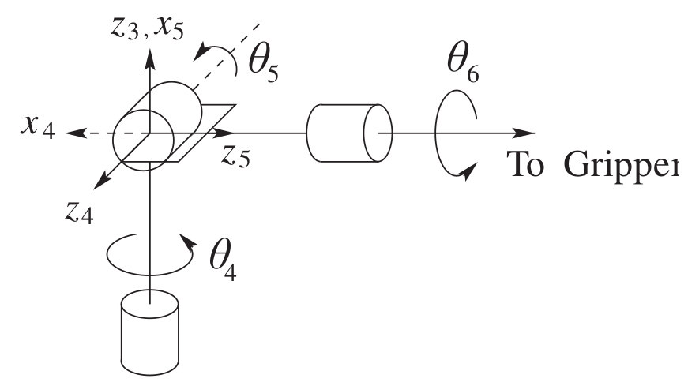

# Lecture 10, Sep 24, 2025

## Inverse Kinematics

* Given a desired position $O_d^0 \in \reals^3$ and orientation $R_d^0 \in \reals^{3 \times 3}$ for the end-effector in the world frame, we want to find $q_1, \dots, q_n$ such that $H_n^0(q_1, \dots, q_n)$ (the end-effector pose as a function of the joint variables) gives the pose that we want
	* The end-effector pose has 6 degrees of freedom, so whether we can get a solution depends on the number of joint variables $n$
	* If $n < 6$, then there are no general solutions (many poses will be impossible to reach)
	* If $n > 6$, then there are an infinite number of solutions (kinematically redundant manipulator)
	* If $n = 6$, then there are a finite number of solutions
		* This is why most practical robot manipulators (e.g. KUKA) has 6 joints

{width=50%}

* We can do this numerically or analytically, but for analytic solutions we need to make some more assumptions about the robot:
	* Assume the robot has 6 joints exactly
	* Assume that the last 3 joints are in a spherical wrist arrangement
* *Kinematic decoupling* is an analytical approach to inverse kinematics under these assumptions, which allows us to split the overall inverse kinematics problem into 2 parts
	* Let $O_c$ be the centre of the wrist; then between $O_c$ and $O_d$, there is a constant offset of $d_6$ along axis $z_6$ by construction of the spherical wrist; furthermore, $O_c$ is not affected by $q_4, q_5, q_6$
		* Note $O_c$ is the same as $O_4$ and $O_5$
		* Therefore we can write $O_d^0 = O_c^0 + R_6^0\cvec{0}{0}{d_0} \implies O_c^0 = O_d^0 - R_d^0\cvec{0}{0}{d}$
		* Now the problem becomes solving for $q_1, q_2, q_3$ so $O_c^0(q_1, q_2, q_3) = O_d^0 - R_d^0\cvec{0}{0}{d}$
			* We've decomposed the problem into a part with only 3 unknowns, since everything on the right hand side is known
	* Inverse position kinematics problem: given $O_d^0, R_d^0$, solve for $q_1, q_2, q_3$ such that we have the correct $O_c^0$
	* Inverse orientation kinematics problem: given $R_d^0$ and solutions for $q_1, q_2, q_3$, find $q_4, q_5, q_6$ to get the desired orientation
		* For this part we decompose as $R_d^0 = R_3^0(q_1, q_2, q_3)R_6^3(q_4, q_5, q_6)$; since $q_1, q_2, q_3$ are known, we can compute the first matrix and invert it
		* $R_6^3(q_4, q_5, q_6) = (R_3^0)^TR_d^0$

