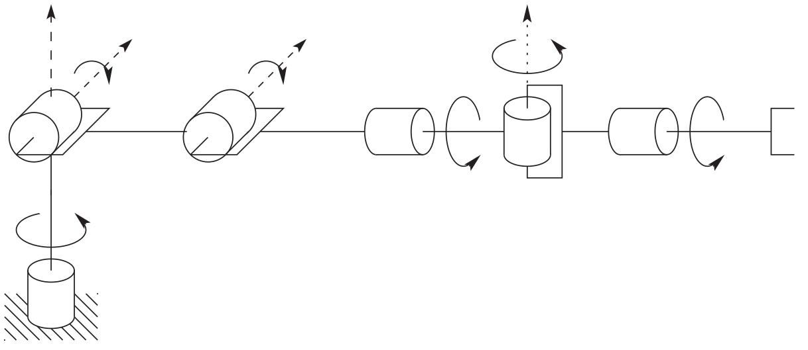

# Lecture 11, Sep 26, 2025

## Inverse Kinematics by Kinematic Decoupling

* Recall that we decomposed the problem so that $O_c(q_1, q_2, q_3) = O_d^0 - R_d^0\cvec{0}{0}{d_6}$
* For inverse position kinematics, we usually do this by analyzing the geometry
* For inverse orientation kinematics, notice that the 3 joints in a spherical wrist form $zyz$ Euler angles, so we can directly compute the joint angles $(\phi, \theta, \psi)$ using the formula introduced previously

{width=70%}

{width=50%}

* Example: Consider the RRR manipulator with spherical wrist as in the figure above
	* The center of the spherical wrist is $O_c^0 = \rvec{x_c}{y_c}{z_c}^T$
	* Let $r = \sqrt{x_c^2 + y_c^2}$ be the horizontal distance from the spherical wrist center to $O_0$
	* Let $s = \abs{z_c - d_1}$ be the vertical distance between the spherical wrist center and the top of link 1 (position of joint 2)
	* By geometry, $\theta _1 = \atantwo(y_c, x_c)$
	* Using the cosine law: $r^2 + s^2 = a_2^2 + d_4^2 - 2a_2d_4\cos\left(\frac{3\pi}{2} - \theta_3\right) = a_2^2 + d_4^2 + 2a_2d_4\sin\theta_3$
		* $\theta _3 = \sin^{-1}\left(\frac{r^2 + s^2 - a_2^2 - d_4^2}{2a_2d_4}\right)$
		* Another solution is $\theta _3 = \pi - \sin^{-1}\left(\frac{r^2 + s^2 - a_2^2 - d_4^2}{2a_2d_4}\right)$
			* There are 2 configurations possible, the "elbow-up" and "elbow-down" configurations
		* Note we can also write $\theta _3 = \atantwo(D, \pm\sqrt{1 - D^2})$ where $D = \frac{r^2 + s^2 - a_2^2 - d_4^2}{2a_2d_4}$
			* This gives a solution in the range $[-\pi, +\pi]$ while the former is in $[0, 2\pi]$
	* Using $\theta_3$, now $\theta _2 = \atantwo(s, r) - \atantwo\left(d_4\sin\left(\theta _3 - \frac{\pi}{2}\right), a_2 + d_4\cos\left(\theta _3 - \frac{\pi}{2}\right)\right)$
	* For inverse orientation kinematics, if we carry out the computation for $H_6^3$ we get something very similar to the $zyz$ Euler rotation matrix, but some of the signs may be different
		* The differences in sign are due to the assignment of the $x$ axes, since they can be flipped and still follow the DH rules
		* Watch out for this in labs

