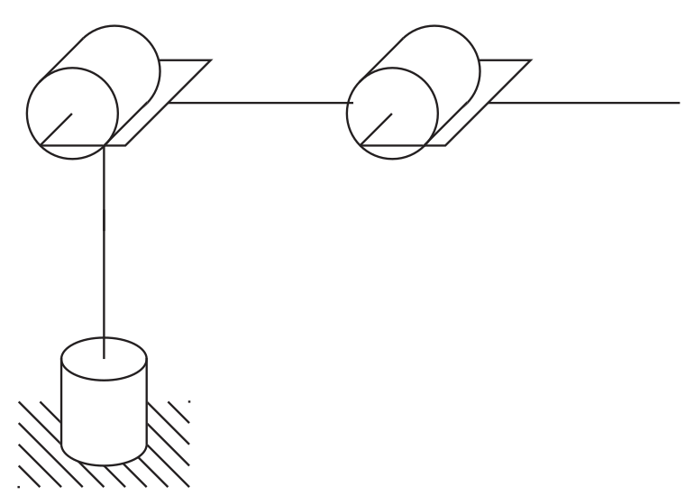

# Lecture 17, Oct 10, 2025

## End-Effector Force and Torque Problem

* Given a desired force $f^0$ and torque $n^0$ at the end-effector, what are the corresponding forces and torques we need to apply at the joints to produce this force and torque?
	* In physics, $F^0 = \cvec{f^0}{n^0} \in \reals^6$ is known as a *wrench*
* Consider a body with linear velocity $v^0(t)$ and angular velocity $w^0(t)$ subject to a wrench $F^0$, then from physics the work performed by the wrench over $[t_1, t_2]$ is $W = \int _{t_1}^{t_2} (v^0(t)^Tf^0(t) + w^0(t)^tn^0(t))\,\dt$
	* More compactly, $W = \int _{t_1}^{t_2} \xi^0(t)^TF^0(t)\,\dt$ where $\xi = \cvec{v^0(t)}{w^0(t)}$
	* Substitute $\xi = \cvec{\dot O_n^0}{w_n^0} = J(q)\dot q$ we get $W = \int _{t_1}^{t_2} \dot q(t)^TJ(q(t))^TF^0(t)\,\dt$
* Now consider the total work done at each joint (assuming all revolute joints for now for simplicity): $W_r = \int _{t_1}^{t_2} \sum _{i = 1}^n \dot q_i(t)\tau _i(t)\,\dt = \int _{t_1}^{t_2} \dot q(t)^T\tau(t)\,\dt$ where $\tau(t) = \rvec{\tau _1(t)}{\cdots}{\tau _n(t)}^T \in \reals^n$
* We can equate them due to energy conservation: $\int _{t_1}^{t_2} \dot q(t)^T\tau(t)\,\dt = \int _{t_1}^{t_2} \dot q(t)^TJ(q(t))^TF^0(t)\,\dt$
	* Using the argument that $\dot q(t)$ is entirely arbitrary, we conclude $\tau(t) = J(q(t))^TF^0(t)$
	* Now we can use this formula to get the joint torques we need
* A typical application: given $F^\text{load} = \cvec{f^\text{load}}{n^\text{load}}$, ignoring the robot's own weight, we apply $F^0 = -F^\text{load}$ to counteract the load, so the torque we need to apply at each joint is $\tau = J(q)^TF^0$

{width=40%}

* Example: consider a 3-link RRR articulated robot; the end-effector must hold a mass $M$ which applies a force $Mg = \SI{10}{N}$; ignoring the weight of the robot, what torques do we need to apply?
	* $F^\text{load} = \cvec{0}{0}{-10}{0}{0}{0} \implies F^0 = \cvec{0}{0}{10}{0}{0}{0}$
	* $\alignedeqntwo[t]{\tau}{J(q)^TF^0}{\begin{bmatrix} z_0^0 \times O_3^0 & z_1^0 \times (O_3^0 - O_1^0) & z_2^0 \times (O_3^0 - O_2^0) \\ z_0^0 & z_1^0 & z_2^0 \end{bmatrix}^TF^0}{\cvec{(z_0^0 \times O_3^0)^T}{(z_1^0 \times (O_3^0 - O_1^0))^T}{(z_2^0 \times (O_3^0 - O_2^0))^T}\cvec{0}{0}{10}}{\cvec{0}{10a_3\cos(\theta _2 + \theta _3) + 10a_2\cos(\theta _2)}{10a_3\cos(\theta _2 + \theta _3)}}$
	* Notice how the first component is 0, which makes sense since the first joint does not contribute to holding up a load at all
	* Note how the torque we need to apply depends on what the joint angles are
		* $\tau _2, \tau _3$ are maximum when $\cos(\theta _2 + \theta _3) = \cos(\theta _2) = 1$; intuitively this corresponds to the situation where the joints are fully extended and lined up
		* Conversely we get $\tau _2 = \tau _3 = 0$ if $\cos(\theta _2 + \theta _3) = \cos(\theta _2) = 0$, which intuitively corresponds to the situation where both joints are pointing straight up, so we don't need to apply any torque to hold up the load

