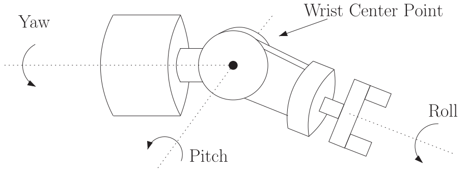

# Lecture 2, Sep 5, 2025

## Robot Manipulators Basics

* Manipulators are represented by a collection of rigid links connected by joints, which can be revolute (R, rotation around an axis) or prismatic (P, translation along an axis)
	* A series of links and joints forms a *kinematic chain*
* A spherical wrist is composed of 3 revolute joints (this is the case on the lab KUKA robots)
	* Typically all 3 degrees of freedom are consolidated into a single mechanical part, but expanded out in mathematical diagrams

{width=50%}

* The *topology* of a manipulator describes how links are connected; examples include serial chain (no loops), closed chain, or tree structure
	* Serial chains are much easier to control since we have a single fixed base, so we do not need to account for complex coupling like in closed chains
	* This course focuses on serial chains, the simplest topology
* Some popular serial chain robots:
	* Articulated manipulator: RRR, typically with wrist for 6 degrees of freedom
	* Spherical manipulator: RRP (named so because it maps out spherical coordinates)
	* SCARA: RRP, but unlike the spherical manipulator all 3 axes are parallel; typically used for pick-and-place tasks
* Our objective is to represent the pose of all the links (which leads to the pose of the end effector) as a function of the joint variables (rotation and translation)

### Notation

* We fix the world coordinate frame $0$, with origin (*base point*) $O_0$ and right-hand coordinate axes (orthonormal basis) $x_0, y_0, y_0$
	* Frame $0$ is typically attached at base of the robot
* A superscript is used to denote the reference frame: $p^0$ denotes a point $p$ in frame $0$ and $v^0$ denotes a vector
	* Note while points are defined as an offset with respect to a reference origin, vectors are just a direction and magnitude so they do not need a coordinate origin
	* $p^0 = O_0^0 + \cvec{a}{b}{c} = O_0 + ax_0^0 + by_0^0 + cz_0^0$
	* $v^0 = \cvec{d}{e}{f} = dx_0^0 + ey_0^0 + fz_0^0$
	* e.g. $x_0^1$ is the $x$ unit vector for frame $0$, expressed in frame $1$
* Note by definition $O_i^i = \cvec{0}{0}{0}, x_i^i = e_1 = \cvec{1}{0}{0}, y_i^i = e_2 = \cvec{0}{1}{0}, z_i^i = e_3 = \cvec{0}{0}{1}$ for any frame $i$
* To express $p^0$ in frame $1$, we can write $p^1 = O_0^1 + ax_0^1 + by_0^1 + cz_0^1$ and once we find the basis vector representations, the point can be computed

