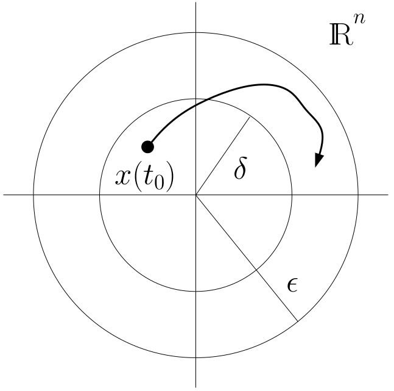

# Lecture 29, Nov 19, 2025

## Lyapunov Stability

* Consider a general nonlinear system $\dot x = f(x)$ where $x \in \reals^n$ and $f: \reals^n \mapsto \reals^n$ is continuously differentiable
* An *equilibrium* state $\bar x \in \reals^n$ is a state where $f(\bar x) = 0$, i.e. $x(t) = \bar x, \forall t \geq 0$

\noteDefn{An equilibrium is \textit{stable} if $\forall \varepsilon > 0, \exists \delta > 0$ such that $\norm{x(0)} < \delta \implies \norm{x(t)} < \varepsilon, \forall t \geq 0$.}

* In other words, given any positive radius $\varepsilon$ around the equilibrium, we can find another radius $\delta$, where if the initial state starts within $\delta$ of the equilibrium, then it will remain within a distance of $\varepsilon$ of the equilibrium forever
	* This is the formal definition, which is very hard to work with, so in practice we use equivalent statements of the definition

{width=35%}

\noteDefn{An equilibrium is \textit{asymptotically stable} if it is stable, and $$\exists \delta _0 > 0 \suchthat \norm{x(0)} < \delta _0 \implies \lim _{t \to \infty} x(t) = 0$$}
	* In other words, there exists a positive radius $\delta _0$ such that if we start within this distance of the equilibrium, we always converge to the equilibrium
* A continuously differentiable function $U: \reals^n \mapsto \reals$ is *positive definite* at $x = 0$ if $U(0) = 0$ and $U(x) > 0$ for all $x \neq 0$; *negative definite* if $-U(x)$ is positive definite at $0$ (i.e. $\forall x \neq 0, U(x) < 0$ and $U(0) = 0$)

\noteThm{\textit{Lyapunov's Theorem}: For a system where $f(0) = 0$, if we can find a continuously differentiable \textit{Lyapunov function} $V: \reals^n \mapsto \reals$ which is positive definite at $x = 0$, then:
\begin{enumerate}
	\item If $\dot V(x) = \pdiff{V}{x}f(x) \leq 0, \forall x \in \reals$, then $x = 0$ is stable.
	\item If $\dot V(x) = \pdiff{V}{x}f(x)$ is negative definite, then $x = 0$ is asymptotically stable.
\end{enumerate}}

* The Lyapunov function can be thought of as a measure of energy
	* Consider a solution $x(t)$, then if $\diff{}{t}V(x(t)) = \pdiff{V}{x}\dot x = \pdiff{V}{x}f(x) \leq 0$, then this "energy" either stays the same or decreases to zero
	* If $V(x)$ is positive definite, then $V(x) = 0 \implies x = 0$, so as $V(x)$ converges to 0, $x$ must also converge to its equilibrium
	* We essentially converted all the high-dimensional dynamics of the system in $x$ to the dynamics of a single scalar measure $V(x)$

