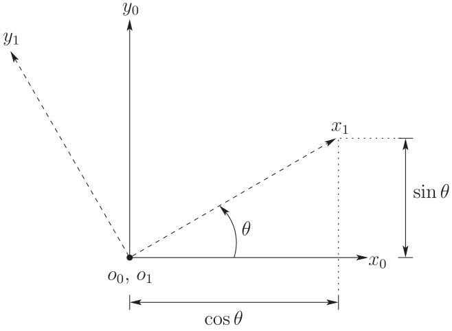
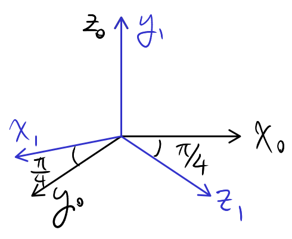

# Lecture 3, Sep 8, 2025

## Rotations

{width=50%}

* Consider 2 frames $O_0, x_0, y_0$ and $O_1, x_1, y_1$ in $\reals^2$ where $O_0 = O_1$; the two frames are separated by an angle $\theta$
* There are 2 ways to describe the relationship between the frames:
	1. Geometric: Specify the angle $\theta$ from $x_0$ to $x_1$
	2. Algebraic: Specify $x_1, y_1$ as expressed in frame 0, i.e. $x_1^0, y_1^0$
		* This is the preferred method that we will explore
* Let $R_1^0 = \rvec{x_1^0}{y_1^0}$ be the *rotation matrix* of **frame 1 with respect to frame 0**
	* Since the dot product represents a projection (when normalized), we can obtain the components of $x_1^0$ by taking the dot product $x_1 \cdot x_0$ and $x_1 \cdot y_0$ to project it onto the axes of frame 0
		* Recall $v_1 \cdot v_2 = \norm{v_1}\norm{v_2}\cos\theta$, so to actually compute the dot products we can use geometry
	* $x_1^0 = \cvec{x_1 \cdot x_0}{x_1 \cdot y_0}, y_1^0 = \cvec{y_1 \cdot x_0}{y_1 \cdot y_0}$
	* Therefore $R_1^0 = \mattwo{x_1 \cdot x_0}{y_1 \cdot x_0}{x_1 \cdot y_0}{y_1 \cdot y_0}$
* Generalizing to $\reals^3$, $R_1^0 = \rvec{x_1^0}{y_1^0}{z_1^0} = \matthreeb{x_1 \cdot x_0}{y_1 \cdot x_0}{z_1 \cdot x_0}{x_1 \cdot y_0}{y_1 \cdot y_0}{z_1 \cdot y_0}{x_1 \cdot z_0}{y_1 \cdot z_0}{z_1 \cdot z_0}$
	* Notice $R_0^1 = \matthreeb{x_0 \cdot x_1}{y_0 \cdot x_1}{z_0 \cdot x_1}{x_0 \cdot y_1}{y_0 \cdot y_1}{z_0 \cdot y_1}{x_0 \cdot z_1}{y_0 \cdot z_1}{z_0 \cdot z_1} = (R_1^0)^T$

{width=40%}

* Example: Consider the frames as arranged in the figure; find $R_1^0$
	* By geometry: $x_1^0 = \cvec{-\sqrt 2/2}{\sqrt 2/2}{0}, y_1^0 = \cvec{0}{0}{1}, z_1^0 = \cvec{\sqrt 2/2}{\sqrt 2/2}{0}$
* Rotation matrices are good for changing vector representations between frames
	* Let $v^1 = \rvec{a}{b}{c}^T = ax_1 + by_1 + cz_1$
	* To transform the vector, $v_0 = ax_1^0 + by_1^0 + cz_1^0 = \rvec{x_1^0}{y_1^0}{z_1^0}\cvec{a}{b}{c} = R_1^0v^1$
	* Note we used the rotation matrix of frame 1 with respect to frame 0, to transform $v^1$ to get $v^0$ -- the frame that the rotation matrix is with respect to is the frame we end up getting
		* i.e. The **superscript** on $v$ must match the **subscript** on $R$
* By the same logic, $v^1 = R_0^1v^0$, so $R_1^0 = (R_0^1)^{-1} \implies (R_1^0)^T = (R_1^0)^{-1}$
	* To invert a rotation matrix, we can simply take its transpose

\noteDefn{A matrix $R \in \reals^{m \times m}$ such that $R^T = R^{-1}$ is an \textit{orthogonal} matrix. \tcblower For all orthogonal matrices, all its columns must be unit vectors and are mutually orthogonal (dot product of 0).}

* Note that since $1 = \det(I) = \det(RR^T) = \det(R)\det(R^T) = (\det(R))^2 \implies \det(R) = \pm 1$
	* If we choose +1 we get a right-handed coordinate system; similarly -1 gives a left-handed coordinate system
	* We are only interested in right-handed coordinate systems

\noteDefn{The \textit{special orthogonal group} is defined as $$SO(3) = \set{R \in \reals^{3 \times 3} | R^T = R^{-1}, \det(R) = 1}$$}

* The *elementary rotation matrices* correspond to rotations by $\theta$ about one of the coordinate axes
	* Frame 1 is obtained from frame 0 by rotating by $\theta$ about one of the axes; the following matrices give $R_1^0$
	* $R_{x, \theta} = \matthreeb{1}{0}{0}{0}{\cos\theta}{-\sin\theta}{0}{\sin\theta}{\cos\theta}$
	* $R_{y, \theta} = \matthreeb{\cos\theta}{0}{\sin\theta}{0}{1}{0}{-\sin\theta}{0}{\cos\theta}$
	* $R_{z, \theta} = \matthreeb{\cos\theta}{-\sin\theta}{0}{\sin\theta}{\cos\theta}{0}{0}{0}{1}$

