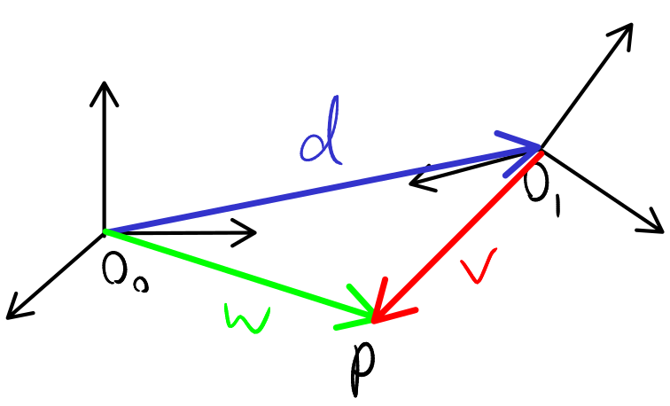

# Lecture 5, Sep 12, 2025

## Euler Angle Parameterization of Rotations

* We will parametrize rotations using $zyz$ Euler angles, i.e. $R_1^0 = R_{z,\phi}R_{y,\theta}R_{z,\varphi}$
	* Expanded: $R_1^0 = \matthreeb{\cos\phi\cos\theta\cos\varphi - \sin\phi\sin\varphi}{-\cos\phi\cos\theta\sin\varphi - \sin\phi\cos\varphi}{\cos\phi\sin\theta}{\sin\phi\cos\theta\cos\varphi + \cos\phi\sin\varphi}{-\sin\phi\cos\theta\sin\varphi + \cos\phi\cos\varphi}{\sin\phi\sin\theta}{-\sin\theta\cos\varphi}{\sin\theta\sin\varphi}{\cos\theta}$
	* This is the representation we choose to use since it directly coincides with the joint angles of a spherical wrist, e.g. on the KUKA robot
* Given $R$, we can do the inverse and find $(\phi, \theta, \varphi)$
	* Assuming $\sin\theta \neq 0$:
		* If $\sin\theta > 0$:
			* $\theta = \cos^{-1}(r_{33})$
			* $\varphi = \atantwo(r_{32}, -r_{31})$
			* $\phi = \atantwo(r_{23}, r_{13})$
		* If $\sin\theta < 0$:
			* $\theta = -\cos^{-1}(r_{33})$
			* $\varphi = \atantwo(-r_{32}, r_{31})$
			* $\phi = \atantwo(-r_{23}, -r_{13})$
	* Explanation:
		* We can recover $\theta$ from $r_{33}$, but since $\cos^{-1}$ is not unique, this gives rise to 2 different solutions
		* The other angles can be recovered by $\atantwo$, but note multiplying the two arguments of $\atantwo$ by a negative factor changes the result
		* If $\sin\theta > 0$ the factor is essentially cancelled out, but for $\sin\theta < 0$ we need to explicitly negate both arguments to undo the sign flip
	* If $\sin\theta = 0$, we have a *singularity* (e.g. when the robot folds in on itself); in this case there are an infinite number of solutions
		* These are undesirable because it is very hard to move the robot in this pose

## Rigid Motions in 3D

\noteDefn{A \textit{rigid motion} in frame 0 is a function $$T(p^0) = Rp^0 + d^0$$ where $R \in SO(3)$ is a rotational transformation, and $d^0$ is a coordinate vector in frame 0; i.e. a rotation followed by a translation.}

* Note $p$ is a point, so now we add the ability to translate
* Note if we reverse the order (translate first and then rotate), the translation will be different

{width=40%}

* Consider two frames, $O_0, x_0, y_0, z_0$ and $O_1, x_1, y_1, z_1$, and consider a point $p$; we have $O_0 + d = O_1$, $O_0 + w = p$, and $O_1 + v = p$
	* Geometrically (without considering coordinates), we know $w = d + v$
	* If we think about coordinates, we have, $w^0 = p^0$, $v^1 = p^1$ and $d^0 = O_1^0$
	* Then $w^0 = d^0 + v^0 \implies w^0 = d^0 + R_1^0v^1$
	* Substituting, we get the result $p^0 = O_1^0 + R_1^0p^1$
	* Notice that this is similar to when we worked with vectors, except now we need to know $O_1^0$

