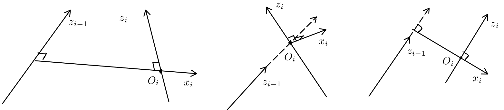

# Lecture 7, Sep 17, 2025

## Denavit-Hartenberg (DH) Parameters

* Recall that we can compute the pose of the end-effector by multiplying together all the $H_i^{i - 1}$ corresponding to the homogeneous transformations of each of the joints; however, the assignment of frames is still arbitrary, and we still need a way to efficiently compute $R_i^{i - 1}, O_i^{i - 1}$
* This method of systematically assigning coordinate frames and describing the links/joints is called the *Denavit-Hartenberg* (DH) convention
* First, we assign coordinate frames according to the following rules, starting from the inertial frame 0 all the way to the end effector $n$:
	* Attach frames as follows:
		* Attach frame 0 (the inertial frame) to the base link, which never moves
		* Attach frame $i$ to link $i$ where $i \in [1, n - 1]$ such that when joint $i$ is actuated, frame $i$ and link $i$ move
		* Attach frame $n$ to the end effector
	* All frames follow the two fundamental rules:
		* (DH1) $x_i$ is orthogonal to $z_{i - 1}$
		* (DH2) $x_i$ intersects $z_{i - 1}$ (i.e. if we extend the axes out infinitely in both directions, there is a point where they meet)
	* Note frame $n$ is not as constrained, so we generally put it on the end-effector

\noteNote{Due to the Denavit-Hartenberg frame rules, the origins of the frames are not necessarily physically on the joints or links, but they are always rigid with respect to the link. For most conventional geometries however, frame $i$ is usually at the center of joint $i$.}

{width=70%}

{width=100%}

* The procedure for assigning frames in detail is:
	1. Assign $z_0, \dots, z_{n - 1}$ such that $z_i$ is the axis of actuation of joint $i + 1$ (i.e. the axis of rotation for revolute joints, or the axis of translation for prismatic joints)
	2. Choose the base frame such that we have a right-handed frame
	3. Assign the $x$ axes for each of the frames in sequence:
		* If $z_{i - 1}$ and $z_i$ are not coplanar, then find the unique shortest line segment $s$ between $z_{i - 1}$ and $z_i$ to define $x_i$, and define $O_i$ as the intersection of $s$ and $z_i$
			* Due to the geometry, this is guaranteed to be orthogonal to both $z_{i - 1}$ and $z_i$, and by construction it intersects $z_{i - 1}$ and $z_i$
			* The point of intersection of $x_i$ and $z_i$ is defined as $O_i$
			* Choose $x_i$ so that it is parallel to $s$, and in the direction towards the next link
		* If $z_{i - 1}$ and $z_i$ intersect transversally (i.e. intersect but not parallel), declare $O_i$ as the intersection of the vectors, and define $x_i$ so that it is normal to the plane formed by $z_{i - 1}$ and $z_i$
			* Note there are two possible directions we can choose $x_i$; the choice does not matter
		* If $z_{i - 1}$ and $z_i$ are parallel (or they are the same), choose $O_i$ anywhere along $z_i$; $x_i$ can be chosen as any vector orthogonal to both $z_{i - 1}$ and $z_i$ as long as it intersects $z_{i - 1}$
	4. Assign the frame for the end-effector so that $O_n$ is on the end-effector and select $x_n$ to satisfy the two DH rules
		* The assignment of $z_n$ doesn't really matter in this case (as long as it is orthogonal to $x_n$) so do $x_n$ first
		* Typically the math works out easier if we make $z_n$ parallel to $z_{n - 1}$, if possible, so the transformation between the last 2 frames is simpler

