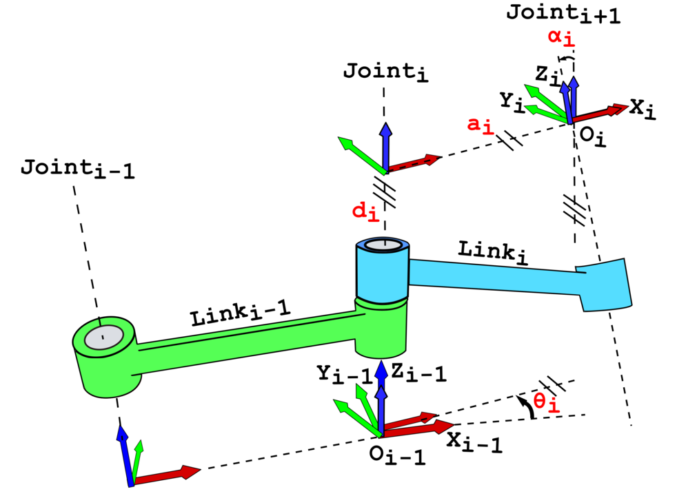
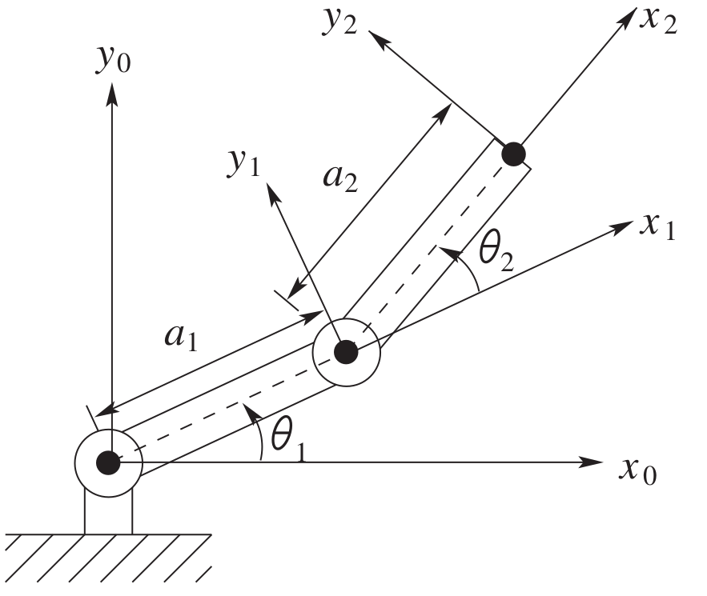
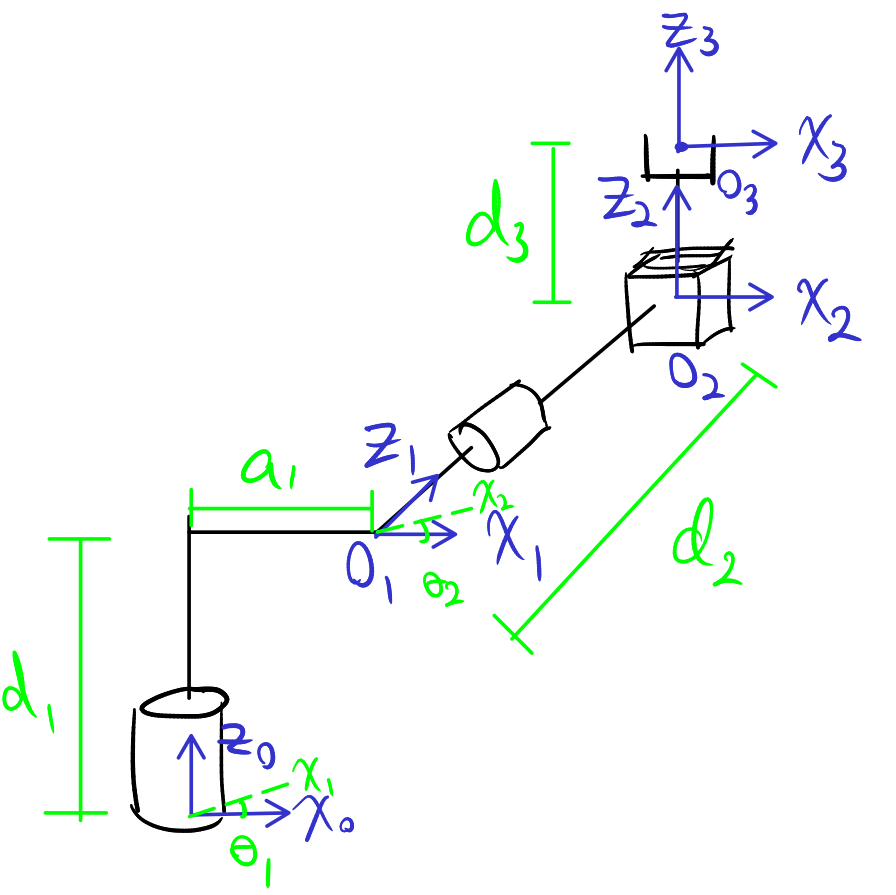

# Lecture 9, Sep 22, 2025

## DH Tables

{width=70%}

* Now that we have systematic frame assignments, we need a way to also systematically compute the homogeneous transformation for each joint/link
* After the frame assignment, we can describe every joint/link with just 4 parameters:
	1. Link twist $\alpha _i$: the signed angle between $z_{i - 1}$ and $z_i$, about $x_i$
	2. Link length $a_i$: the signed distance between $z_{i - 1}$ and $z_i$, along $x_i$
	3. Link offset $d_i$: the signed distance between $O_{i - 1}$ and $O_i$, along $z_{i - 1}$
	4. Joint angle $\theta _i$: the signed angle between $x_{i - 1}$ and $x_i$, about $z_{i - 1}$
* The angles can be better illustrated if we bring frame $i - 1$ and frame $i$ together
* This allows us to form a *DH table*, which lists out $a_i, \alpha _i, d_i, \theta _i$ for each $i \in [1, n]$
* Notice that each of the parameters corresponds to a single operation about a single axis, so we can get the overall homogeneous transformation for each stage of the manipulator by combining the 4 operations
	* $H_i^{i - 1} = \Rot_{z, \theta _i}\Trans_{z, d_i}\Trans_{x, a_i}\Rot_{x, \alpha _i} = \matfour{\cos\theta _i}{-\sin\theta _i\cos\alpha _i}{\sin\theta _i\sin\alpha _i}{a_i\cos\theta _i}{\sin\theta _i}{\cos\theta _i\cos\alpha _i}{-\cos\theta _i\sin\alpha _i}{a_i\sin\theta _i}{0}{\sin\alpha _i}{\cos\alpha _i}{d_i}{0}{0}{0}{1}$
	* The order of transformations here can be deduced by noticing the axis that each operation operates on

{width=40%}

* Consider the example in the image; the DH table for this example is the following

| Link | $a_i$ | $\alpha _i$ | $d_i$ | $\theta _i$ |
|---|---|---|---|---|
| 1 | $a_1$ | 0 | 0 | $\theta _1^*$ |
| 2 | $a_2$ | 0 | 0 | $\theta _2^*$ |

* Often we mark the variables that will be changed by joint movement with $*$ (these variables later become the joint variables $q$); the rest of the variables are rigid
	* For prismatic joints, this is always $d_i$, while for revolute joints this is $\theta _i$

{width=50%}

* Consider another example with an elbow in the first stage as in the above image; the DH table is the following

| Link | $a_i$ | $\alpha _i$ | $d_i$ | $\theta _i$ |
|---|---|---|---|---|
| 1 | $a_1$ | $-\pi/2$ | $d_1$ | $\theta _1^*$ |
| 2 | 0 | $\pi/2$ | $d_2$ | $\theta _2^*$ |
| 3 | 0 | 0 | $d_3^*$ | 0 |

