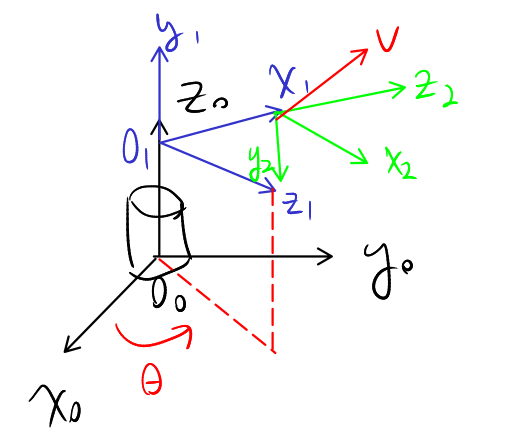

# Tutorial 2, Sep 15, 2025

{width=40%}

* Example 1: $v^2 = \cvec{1/2}{-1/2}{1/2}$
	* What is $v^1$?
		* $v^1 = R_2^1v^2$
		* $x_2^1 = \cvec{0}{0}{1}$
		* $y_2^1 = \cvec{0}{-1}{0}$
		* $z_2^1 = \cvec{1}{0}{0}$
		* $R_2^1 = \matthreeb{0}{0}{1}{0}{-1}{0}{1}{0}{0}$
		* $v^1 = R_2^1v^2 = \cvec{1/2}{1/2}{1/2}$
	* What is $v^0$?
		* To see what $R_1^0$ we drop frame 0 down so its origin coincides with frame 0
		* $z_1 \cdot x_0 = \cos\theta$
		* $z_1 \cdot y_0 = \cos(\pi/2 - \theta) = \sin\theta$
		* $y_1$ is parallel to $z_0$ so $y_1 \cdot z_0 = 1$
		* $x_1 \cdot y_0 = \cos\theta$
		* $x_1 \cdot x_0 = -\sin\theta$
		* $R_1^0 = \matthreeb{x_1 \cdot x_0}{y_1 \cdot x_0}{z_1 \cdot x_0}{x_1 \cdot y_0}{y_1 \cdot y_0}{z_1 \cdot y_0}{x_1 \cdot z_0}{y_1 \cdot z_0}{z_1 \cdot z_0} = \matthreeb{-\sin\theta}{0}{\cos\theta}{\cos\theta}{0}{\sin\theta}{0}{1}{0}$
		* $v^0 = R_1^0v^1 = \cvec{(\cos\theta - \sin\theta)/2}{(\cos\theta + \sin\theta)/2}{1/2}$

