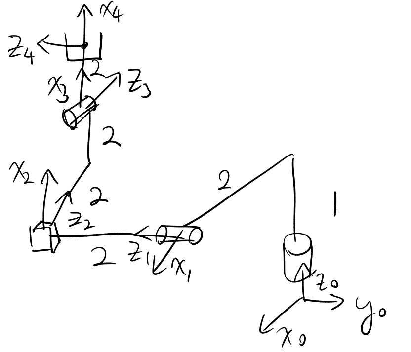

# Tutorial 4, Sep 29, 2025

## Drawing Manipulator from DH Table

* Procedure:
	1. Start at frame 0 and move to next frame in sequence
	2. Identify direction of $x$ axis of next frame by rotating the current $x$ axis by $\theta _i$ around the current $z$
	3. Identify the location of the new origin by moving $d_i$ along the current $z$ and $a_i$ along the new $x$
	4. Identify the direction of the new $z$ axis by rotating $\alpha _i$ along the new $x$

{width=60%}

* Example above has the following DH table:

| $a_i$ | $\alpha_i$ | $d_i$ | $\theta_i$ |
|---|---|---|---|
| 2 | $\pi/2$ | 1 | 0 |
| 0 | $-\pi/2$ | 2 | $\pi/2$ |
| 2 | 0 | 2 | 0 |
| 2 | $\pi/2$ | 0 | 0 |

