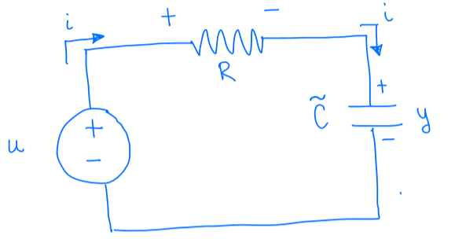

# Lecture 1, Sep 3, 2025

## Theory of Linear Control Systems

* *Dynamical systems* (aka *systems* or *dynamical processes*) are mathematical models that describe how quantities of interest evolve over time
	* At a high level: input $u(t)$, output $y(t)$
* We are interested in the theory of *analysis* (how is the system behaving?) and *control* (how can we make the system behave well/better?) for *linear time-invariant* (LTI) systems in continuous time

{width=50%}

* Consider the circuit above; let $y$ be the voltage across the capacitor and $u$ be the input voltage
	* $i = \tilde C\diff{y}{t}$
	* By KVL: $u - iR - y = 0 \implies u - R\tilde C\diff{y}{t} - y = 0$
	* Rearrange: $\diff{y}{t} = -\frac{1}{R\tilde C}y + \frac{1}{R\tilde C}u$
	* We now have an ODE representing the LTI system

\noteDefn{A \textit{linear time-invariant} system in \textit{state-space} form is represented by the following: $$\alignedlines{}{\dot{\bm x} = \bm A\bm x(t) + \bm B\bm u(t), t \ge 0}{\bm y(t) = \bm C\bm x(t) + \bm D\bm u(t)}$$ where $$\alignedlines{}{\bm x: [0, \infty) \in \reals^n \text{(state)}}{\bm u: [0, \infty) \in \reals^m \text{(input)}}{\bm y: [0, \infty) \in \reals^p \text{(output)}}$$
The first is known as the \textit{state equation} while the second is the \textit{measurement equation}.
\begin{itemize}
	\item $\bm A \in \reals^{n \times n}$ is the \textit{system} matrix.
	\item $\bm B \in \reals^{n \times m}$ is the \textit{input} matrix.
	\item $\bm C \in \reals^{p \times n}$ is the \textit{output} matrix.
	\item $\bm D \in \reals^{p \times m}$ is the \textit{feedforward} matrix.
\end{itemize}}

* For our example system: $x = y, \dot x = -\frac{1}{R\tilde C}x + \frac{1}{R\tilde C}u, y = x + u$ (note in this example we can fully measure the state)
	* $A = -\frac{1}{R\tilde C}$
	* $B = \frac{1}{R\tilde C}$
	* $C = 1$
	* $D = 0$
* Within dynamical systems we have several forms of representation:
	* Model-based representation (for systems represented as ODEs)
		* We are interested in continuous time, deterministic (no noise), LTI systems
	* Data-based representation (for streams of data)
	* Computer-based representation (for complicated systems that we cannot write down)

