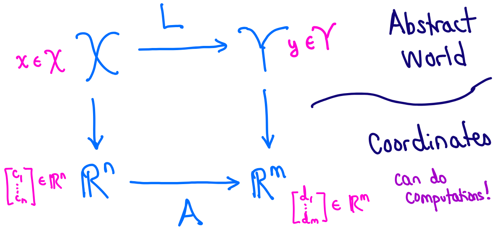

# Lecture 11, Oct 3, 2025

## Linear Maps and Matrix Representations

\noteDefn{A function $f: \mathcal X \mapsto \mathcal Y$ is \textit{injective} (one-to-one) if $$\forall x_1, x_2 \in \mathcal X,\,f(x_1) = f(x_2) \implies x_1 = x_2$$ or contrapositively $x_1 \neq x_2 \implies f(x_1) \neq f(x_2)$, i.e. different inputs always map to different outputs.
\\
$f$ is \textit{surjective} (onto) if $$\forall y \in \mathcal Y,\,\exists x \in \mathcal X \suchthat f(x) = y$$ i.e. the output reaches the entirety of $\mathcal Y$.
\tcblower
A function that is both injective and surjective is called \textit{bijective}.}

\noteDefn{Let $\mathcal X, \mathcal Y$ be vector spaces, then a function $L: \mathcal X \mapsto \mathcal Y$ is a \textit{linear transformation} (or \textit{linear map}) if $$\forall x_1, x_2 \in \mathcal X, \lambda \in \mathbb F,\, L(x + \lambda y) = L(x) + \lambda L(y)$$}

* Consider finite dimensional vector spaces $\mathcal X, \mathcal Y$ where $\set{x^1, \dots, x^n}$ is a basis for $\mathcal X$ and $\set{y^1, \dots, y^m}$ is a basis for $\mathcal Y$
	* For each $x_i$, $L(x_i) \in \mathcal Y$ so it can be expressed as coordinates $L(x^i) = \sum _{j = 1}^m a_{ji}y^j$
	* From this, we can form $\bm A = \matthree{a_{11}}{\cdots}{a_{1n}}{\vdots}{\ddots}{\vdots}{a_{m1}}{\cdots}{a_{mn}}$ where column $i$ contains the coordinates of $L(x^i)$
	* Now consider $x \in \mathcal X \implies x = \sum _{i = 1}^n c_ix^i$ and $y \in \mathcal Y \implies \sum _{j = 1}^m d_jy^j$ such that $L(x) = y$, then:
		* $\alignedimp[t]{L(x) = y}{L\left(\sum _{i = 1}^n c_ix^i\right) = \sum _{j = 1}^m d_jy^j}{\sum _{i = 1}^n c_iL(x^i) = \sum _{j = 1}^m d_jy^j}{\sum _{i = 1}^n c_i\sum _{j = 1}^m a_{ji}y^j = \sum _{j = 1}^m d_jy^j}{\sum _{j = 1}^m\left(\sum _{i = 1}^n a_{ji}c_i\right)y^j = \sum _{j = 1}^m d_jy^j}{\sum _{i = 1}^n a_{ji}c_i = d_i}{\bm A\cvec{c_1}{\vdots}{c_n} = \cvec{d_1}{\vdots}{d_n}}$
			* Note the last step uses the uniqueness of coordinate representations
* The key idea is that we can perform a linear transformation between the abstract vector spaces $\mathcal X$ and $\mathcal Y$ by first going from $\mathcal X$ to $\reals^n$ using a coordinate representation, then performing the transformation $\reals^n \mapsto \reals^m$ through a matrix multiplication by $\bm A$ to obtain coordinates for a vector in $\mathcal Y$, then mapping back to $\mathcal Y$ through the basis
* Note that a transformation has a matrix representation if and only if it is linear and maps between finite dimensional vector spaces

{width=70%}

* Example: The matrix representation of a counterclockwise rotation by $\theta$ in $\reals^2$, using the standard basis, is $\bm A = \mattwo{\cos\theta}{-\sin\theta}{\sin\theta}{\cos\theta}$; what is the equivalent transformation, using the basis $\mathcal B = \Set{\cvec{1}{1}, \cvec{0}{1}}$?
	* Denote the standard basis $\mathcal E = \Set{\cvec{1}{0}, \cvec{0}{1}}$
	* We want to find a matrix $\bar{\bm A}$ that takes us from $\reals^2$ represented with $\mathcal B$ to another $\reals^2$ represented with $\mathcal B$; we know that $\bm A$ takes us from $\reals^2$ represented with $\mathcal E$ to another $\reals^2$ represented with $\mathcal E$
	* Suppose we can get from basis $\mathcal B$ to basis $\mathcal E$ through $\bm M$, then we can get back to basis $\mathcal B$ by $\bm M^{-1}$
	* Therefore $\bar{\bm A}\bm z = \bm M^{-1}\bm A\bm M\bm z$ -- first applying $\bm M$ to get to $\mathcal E$, then applying $\bm A$ in basis $\mathcal E$, and then applying $\bm M^{-1}$ to get back to $\mathcal B$
		* Therefore $\bar{\bm A} = \bm M^{-1}\bm A\bm M$ -- a similarity transform
		* Note the order that we write this is kind of reversed
	* Let $\bm z$ have coordinates $\cvec{\bar\xi _1}{\bar\xi _2}$ in $\mathcal B$ and $\cvec{\xi _1}{\xi _2}$ in $\mathcal E$, i.e. $\bm z = \rvec{\bm b_1}{\bm b_2}\cvec{\bar\xi _1}{\bar\xi _2} = \rvec{\bm e_1}{\bm e_2}\cvec{\xi _1}{\xi _2}$
	* We want to find $\bm M$ such that $\cvec{\xi _1}{\xi _2} = \bm M\cvec{\bar\xi _1}{\bar\xi _2} \implies \bm M = \rvec{\bm e_1}{\bm e_2}^{-1}\rvec{\bm b_1}{\bm b_2}$
	* Therefore $\bm M = \mattwo{1}{0}{1}{1}$ and we can use this to find $\bar{\bm A}$

\noteDefn{Let $L: \mathcal X \mapsto \mathcal Y$ be a linear transformation. The \textit{null space} or \textit{kernel} of $L$ is $$\mathcal N(L) = \set{\bm x \in \mathcal X | L(\bm x) = \theta}$$ i.e. all the vectors that map to zero. This is a subspace.
\tcblower
The \textit{range} or \textit{image} of $L$ is $$\mathcal R(L) = \set{\bm y \in \mathcal Y | \exists \bm x \in \mathcal X,\,\bm y = L(\bm x)}$$ i.e. all the vectors that can be reached via $L$. This is another subspace.}

* Note for a subspace $\mathcal V$ of $\mathcal X$, then we denote, in general, the range of $\mathcal V$ under a linear transformation $L$ as $L(\mathcal V) = \set{\bm y \in \mathcal Y | \exists\bm x \in \mathcal V,\,\bm y = L(x)}$

\noteDefn{Let $L: \mathcal X \mapsto \mathcal Y$ be a linear transformation between finite dimensional vector spaces $\mathcal X, \mathcal Y$, then the \textit{rank} of $L$ is defined as $$\rank(L) = \dim(\mathcal R(L))$$}

\noteThm{$L: \mathcal X \mapsto \mathcal Y$ for finite dimensional $\mathcal X, \mathcal Y$ satisfies the following properties:
\begin{enumerate}
	\item $L$ is injective if and only if $\mathcal N(L) = \set{\theta}$
	\item $\dim(\mathcal R(L)) + \dim(\mathcal N(L)) = \dim(\mathcal X)$
\end{enumerate}}

* The second property (rank-nullity) can be proven as follows:
	* Let $k = \dim(\mathcal N(L))$ and $n = \dim(\mathcal X)$; we want to show $n - k = \dim(\mathcal R(L))$
	* Let $\Span{\bm x^1, \dots, \bm x^k}$ be a basis for $\mathcal N(L)$, and so $L(\bm x^i) = \theta$ for $i \in [1, k]$
	* Complete the basis such that $\Span{\bm x^1, \dots, \bm x^k, \bm x^{k + 1}, \dots, \bm x^n}$ be a basis for $\mathcal X$
	* Let $\bm x \in \mathcal X$, which has a unique coordinate representation $\bm x = \sum _{i = 1}^n c_i\bm x^i$ with respect to this basis
	* $\alignedeqntwo[t]{L(\bm x)}{L\left(\sum _{i = 1}^n c_i\bm x^i\right)}{\sum _{i = 1}^k c_iL(\bm x^i) + \sum _{i = k + 1}^n c_iL(\bm x^i)}{\sum _{i = k + 1}^n c_iL(\bm x^i)}$
	* This suggests $\set{L(\bm x^i)}$ for $i = k + 1, \dots, n$ forms a basis for $\mathcal R(L)$
		* To do this, we need to prove that they span $\mathcal R(L)$ and that they are linearly independent (in the notes)

\noteThm{Let $L: \mathcal X \mapsto \mathcal Y$, then for any matrix representation $\bm A$ of the linear map $L$,
\begin{gather}
	\dim(\mathcal R(L)) = \dim(\mathcal R(\bm A)) \\
	\dim(\mathcal N(L)) = \dim(\mathcal N(\bm A))
\end{gather}
\begin{enumerate}
	\item $L$ is surjective if and only if $\rank(\bm A) = \dim(\mathcal R(\bm A)) = \dim(\mathcal Y)$, i.e. all rows of $\bm A$ are linearly independent (full row rank)
	\item $L$ is injective if and only if $\dim(\mathcal N(\bm A)) = 0$, i.e. all columns of $\bm A$ are linearly independent (full column rank)
	\item $L$ is bijective if and only if $\bm A$ is square and invertible
\end{enumerate}}

