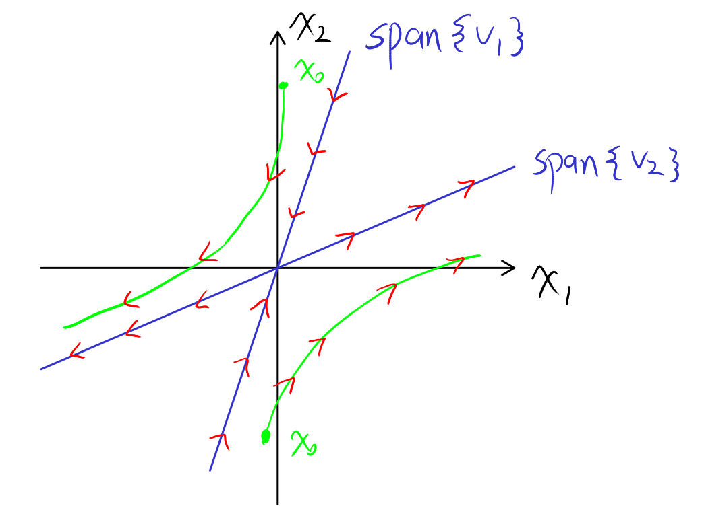
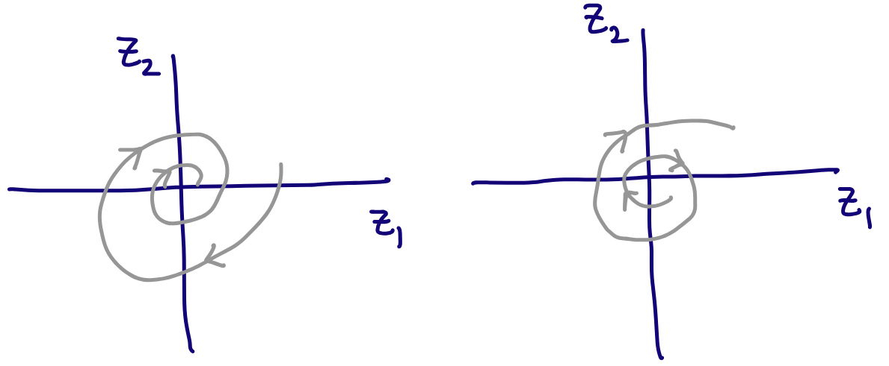

# Lecture 7, Sep 19, 2025

## Reasoning About System Behaviour With Eigenvalues and Eigenvectors

* Consider a system $\dot{\bm x} = \bm A\bm x, \bm x(0) = \bm x_0$
	* Assume that $\bm A$ is diagonalizable, so the solution is $\bm x(t) = e^{\bm At}\bm x_0 = \bm Pe^{\bm\Lambda t}\bm P^{-1}\bm x_0$
* Consider the transformed coordinate space $\bm z(t) = \bm P^{-1}\bm x(t)$; how does the system look in this coordinate system?
	* $\dot{\bm z} = \bm P^{-1}\dot{\bm x}(t) = \bm P^{-1}\bm A\bm x(t) = \bm P^{-1}\bm P\bm\Lambda\bm P^{-1}\bm x(t) = \bm\Lambda\bm z(t)$
	* Since $\bm\Lambda$ is diagonal, we get $\dot z_i(t) = \lambda _iz_i(t)$, in other words, a set of $n$ decoupled linear differential equations
	* Each one is solved by $z_i(t) = e^{\lambda _it}z_i(0)$, resulting in much easier to analyze system behaviour
	* $\bm x(t) = \bm P\bm z(t) = \sum _{i = 1}^n \bm v_i\bm z_i(t) = \sum _{i = 1}^n \bm v_ie^{\lambda _it}z_i(0)$
		* Each term of the sum is called the $i$-th *mode* of $x(t)$; the entire operation is known as a *modal decomposition*
		* We denote $\bm h_i(t) = \sum _{i = 1}^n \bm v_ie^{\lambda _it}z_i(0)$
* Geometrically, we can imagine drawing each of the $\bm v_i$ as a line; if the associated $\lambda _i$ is negative, solutions shrink and go towards 0 along this line; conversely if $\lambda _i$ is positive, solutions expand and go to infinity along the line
	* For any initial condition $\bm x_0$ we can decompose it into components along each $\bm v_i$, and each of those components will evolve according to $\lambda _i$ (towards or away from the origin at a speed determined by the magnitude)
	* In the $z$ coordinate system this is easier to see since the $\bm v_i$ are now along the coordinate axes

{width=60%}

### System Behaviour According to Eigenvalues

* With the above knowledge we can now categorize systems according to their eigenvalues
* Case 1: Real and nonzero eigenvalues
	* If all eigenvalues are less than 0, we have a *stable node* since all initial conditions converge towards zero
	* If all eigenvalues are greater than 0, we have an *unstable node* since all initial conditions explode to infinity (except for 0, which stays at 0)
	* If eigenvalues have mixed signs, we get a *saddle point* as initial conditions will move towards zero along one axis but diverge away from it on another axis; again, zero is the only initial condition that does not diverge
* Case 2: Complex conjugate eigenvalues $\lambda _1 = a + ib, \lambda _2 = a - ib$ (recall that the solution in this case is $e^{at}\mattwo{\cos(bt)}{\sin(bt)}{-\sin(bt)}{\cos(bt)}$)
	* If $a < 0$, we get a *stable focus* as solutions spiral in towards zero
	* If $a > 0$, we get an *unstable focus* as solutions spiral outwards from zero towards infinity
	* If $a = 0$, we get a *centre* since all solutions stay orbiting the origin in a circle, not converging or diverging
	* In all cases, the magnitude determines the rate of spiral
* Case 3: One nonzero eigenvalue
	* The eigenvector with zero eigenvalue forms a line, where every point on the line is an equilibrium
	* If the other eigenvalue is less than zero, all solutions converge towards that line; if the other eigenvalue is greater than zero then all solutions diverge from the line
	* All initial conditions follow a straight path towards the equilibrium line, defined by the other eigenvector (nonzero eigenvalue)

{width=80%}

