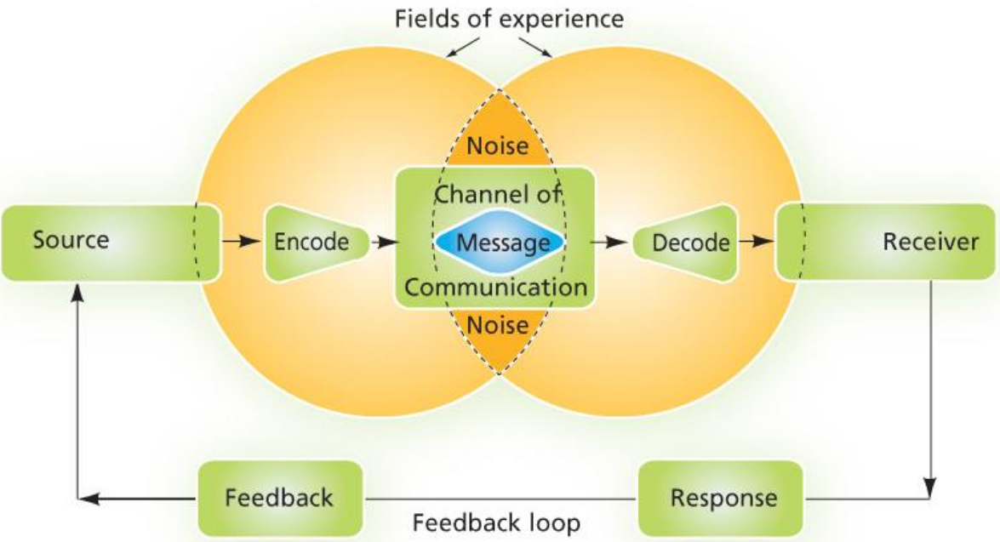
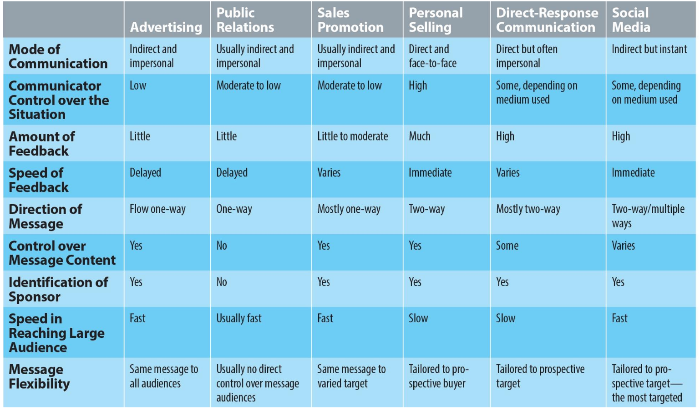
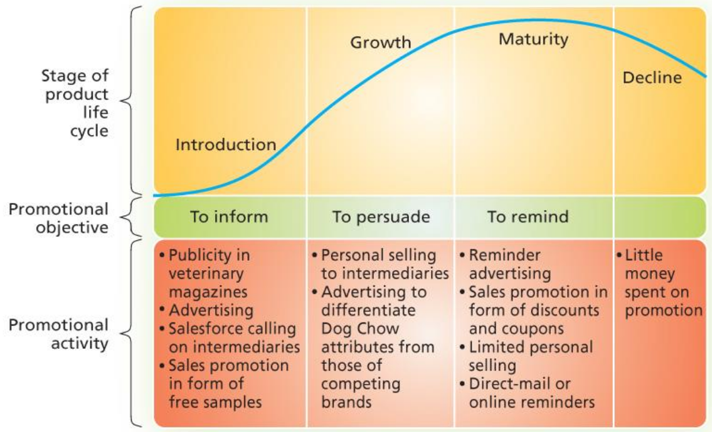
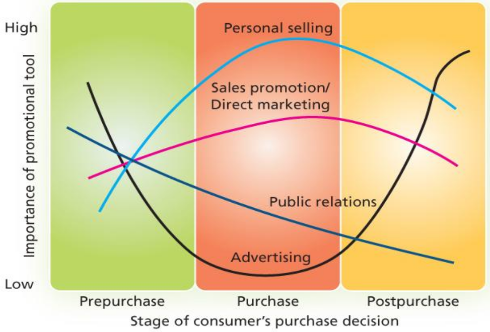
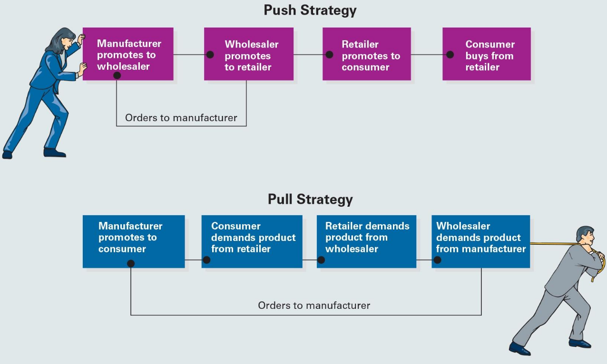

# Lecture 10, Nov 18, 2025

## Promotion and Communication

* Also referred to as "integrated marketing communications" (IMC); consisting of 3 components:
	1. Consumer or target market
	2. Channels or vehicles through which the message is delivered
	3. Evaluation of the results of the communication
* The communications process is modeled by a 5-step process illustrated in the figures below

{width=70%}

{width=90%}

* The 6 promotional channels (or tools of IMC):
	1. Advertisements (e.g. print, TV, radio, outdoor)
		* Paid, non-personal communication, targeting a large number of customers, not necessarily all in the target market
		* The sender has full control over how the message is encoded
		* Hard to determine customer response since there are few direct feedback channels; feedback is delayed
		* Very expensive
		* Used to build awareness, but does not directly induce a purchase
	2. Personal selling (e.g. door-to-door or street level soliciting, telemarketing)
		* Two-way (often face-to-face) personal communication, very targeted
		* Some control over how the message is encoded (however salespeople can differ)
		* Feedback is immediate due to the direct communication
		* Very expensive
		* Very common in B2B space -- firms will try to meet with and directly market to the client
	3. Public relations (e.g. press releases, celebrity endorsement, word of mouth, unpaid reviews)
		* Unpaid, non-personal communication, through a voluntary third party (e.g. the media)
		* Little control over how the message is encoded; however PR R&Cs (e.g. a good PR department) can be helpful
		* Receivers perceive the message as more credible since the parties are not seen as self-serving
	4. Sales promotion (e.g. samples & premiums, coupons, loyalty programs, contests & sweepstakes, point-of-purchase displays)
		* Short-term incentive to encourage purchase
		* The firm has some level of control depending on distribution channels (direct vs. indirect), but it's always temporary
		* Accounts for 76% of all marketing expenditures for packaged goods companies
	5. Direct marketing (e.g. mail advertisement, catalogues, influencers, shopping channels/direct response TV)
		* Direct, targeted communication between the organization and the customer to engage a specific audience
		* Unlike advertisements, this is a lot more targeted and involves a much more immediate feedback process (e.g. how many calls did we get during the ad?)
		* Calls the customer to action immediately (e.g. "call in the next x minutes for a discount")
		* The firm has a lot of control over the message encoding
	6. Digital marketing and social media
		* Kind of a general category that intersects with many of the other areas and makes them more complex
		* Two-way communication as the consumer can create content
		* Applies to both B2B and B2C
		* Consists of online marketing, content marketing, or social media promotion

{width=100%}

{width=70%}

{width=50%}

* A company often uses a mix of these channels, which is their *promotional mix*
	* The promotional mix can be based on the product life cycle
		* In the early stages the goal is to inform customers and spread awareness
		* In the growth stage the goal is to persuade customers that you are differentiated
		* In the maturity stage the goal is to remind customers of your relevance
	* Based on product characteristics
		* Greater level of complexity leads to greater need for personal selling
		* Greater risk leads to greater needs for personal selling
		* Mass-market advertising for establishing reputation when it comes to ancillary services after sale
	* Know the target market -- their places and reasons of purchase, the channels they use, the market size, whether to do mass or targeted marketing, whether they are first-time or repeat buyers
	* Based on the stage of the buyer's decision process
		* In the pre purchase stage advertising is good for informing the customer, but less good at pushing the customer to make the purchase
		* In the purchase stage personal selling, sales, and direct marketing are much more effective
* There are 2 broad *channel strategies*:
	* "Pushing" the product through the channel, from manufacturer to retailer to customer, by marketing to the next channel member
		* The manufacturer promotes to the wholesaler, which promotes to the retailer, which promotes to the end consumer
		* Personal selling and sales promotions play major roles
		* Examples: trade show promotions, discounts to retailers, collaborating with channel members
	* "Pulling" the product through the channel by marketing directly to the end-consumers to encourage them to demand the product
		* The manufacturer promotes directly to the end consumer, which drives demand to the retailer, then wholesaler, and then back to the manufacturer
		* e.g. "Intel Inside" stickers
		* Examples: word of mouth referrals, customer relationship management, sales promotion at the end-user level

{width=80%}

* A successful IMC program delivers a consistent message across channels in the marketing mix and maximizes the impact of a limited promotional budget
* The development and execution of an IMC program has 3 stages:
	1. Planning stage
		* Identify the target audience
		* Specify the objectives
		* Set the budget (based on % of sales, matching competitors, company finances, or objective and task)
		* Select the right promotional elements
		* Design the promotion
		* Schedule the promotion
	2. Implementation stage
		* Pretesting the promotion (do a pilot at a smaller scale)
		* Executing the promotion
	3. Evaluation stage
		* Post-testing the promotion
		* Making needed changes based on performance of each channel
		* Possible evaluation metrics:
			* Impressions (number of times the ad appears)
			* Click-through rates (number of clicks out of total impressions)
			* Estimated "eyeballs" on earned media
			* Survey results
			* Increase in traffic
			* Coupon redemption rates
			* Attendees at sponsored events
			* Return on investment (revenue gain minus ad cost, as a percentage of ad cost)

