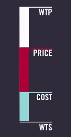
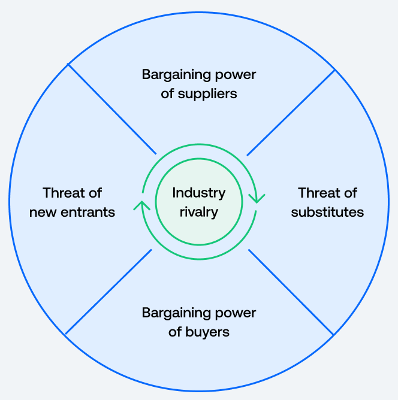

# Lecture 2, Sep 9, 2025

## The Value Stick

{width=10%}

* The *value stick* breaks down the cost that the consumer pays for a single item
	* At the top is the consumer's willingness to pay (WTP)
	* In the middle is the price set by the firm
	* At the bottom is the cost to produce the item
* The difference between customer's WTP and the cost to produce is the *value creation* per item, while the difference between the price and the cost is the *value capture* per item
* The firm can manipulate the consumer's willingness to pay or the cost to produce the item
	* The goal of any action is ultimately to affect one of these two levers
	* The "wider" this value stick, the bigger the firm's competitive advantage
* If a firm's value stick looks exactly like another's, this will drive down profit due to competition
	* The point of strategy is to have a different value stick than another firm
* Orthogonal to this, the size of the market (how many units can you sell?) also matters -- is the firm targeting a mainstream market (WTP is lower, but you can sell more), or a niche market (WTP higher, but sells less)

## Porter's 5 Forces Model

{width=40%}

* One of the most commonly used frameworks in industry (external) analysis, Porter's 5 forces are:
	1. Power of suppliers
		* How many suppliers are there? How big are they?
		* Do suppliers hold critical resources?
	2. Power of buyers
		* Are buyers price-sensitive?
		* Is the switching cost high or low? (i.e. is it costly for customers to switch between competitors?)
		* Are customers loyal to one brand?
		* How much differentiation are there between the competitors' products?
			* Loyalty programs are a common way to create artificial differentiation -- typically it indicates low differentiation
	3. Threat of substitutes (note, this considers adjacent industries, which is different from competitors)
		* How appealing are the substitutes? (Ease of use, cost, quality, etc.)
	4. Threat of new entrants
		* Is it hard to enter the industry?
	5. Rivalry among existing competitors
* To perform an analysis, define the industry, identify the parties involved for each force and how they contribute to the force, assess the strength of each force, and assess whether it is conducive to sustained profits
	* For a firm, there are different ways to define the industry (e.g. for Starbucks, we can define it as the coffee industry, the non-alcoholic drinks industry, etc)
	* Try the analysis at different levels to see if they agree
* Porter's 5 forces is an industry-level analysis as it doesn't really consider the differences between competing firms
	* Use this when you are the incumbent
* Example: Starbucks, coffee industry
	1. Identify the agents in each of the forces:
		* Suppliers: coffee producers, dairy farms, paper cup producers, syrup producers
		* Substitutes: energy drinks (e.g. Red Bull, Monster, etc.), tea, bottled drinks, caffeine pills
		* Competitors: Tim Hortons, Second Cup, Dunkin' Donuts, McDonald's, local coffee shops
	2. Assess strength of forces:
		* Buyers: buyers are price-sensitive, switching cost is very low, leading to low WTP so power of buyers is strong
		* Substitutes: a lot of people just want caffeinated drinks, but many people also drink coffee because they specifically want coffee
			* We need to understand which category most of the customers come from
		* Suppliers: many growers exist and not many large conglomerates; power of suppliers is low
			* For specialty coffee this may be different since there are very few suppliers that can match the same quality
		* New entrants: entry barriers are low (low costs to open a new coffee shop)

