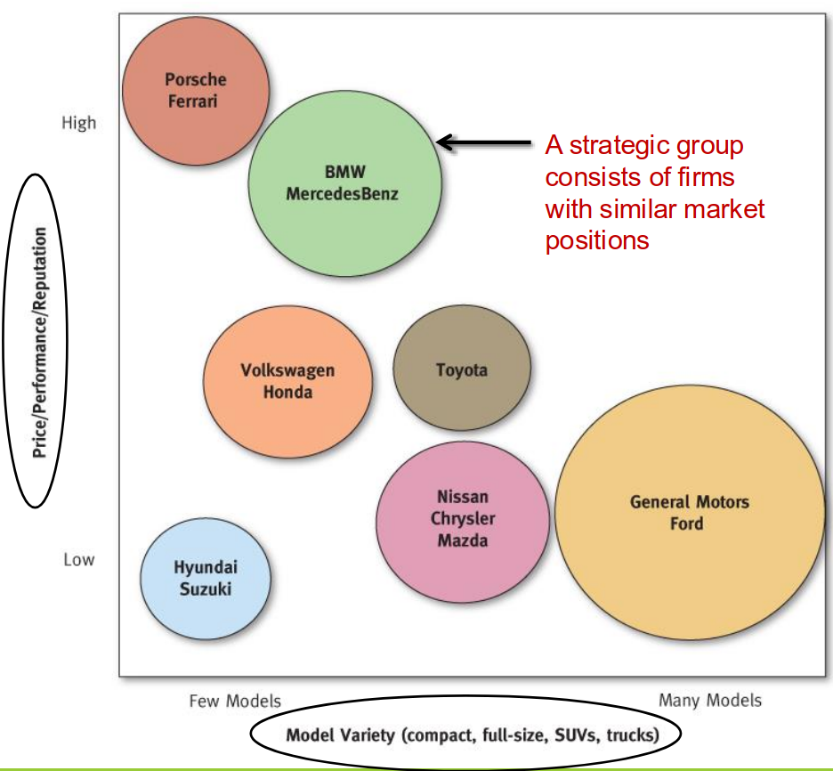

# Lecture 3, Sep 16, 2025

## Porter's 5 Forces -- Continued

* Porter's 5 forces model is often used to analyze the immediate industry and competitive environment of a firm
	* Outside this immediate environment, we also have the macro-environment, including factors such as the broader economic conditions, sociocultural forces, technological, environmental, political and legal/regulatory factors
* To assess the power of entry barriers, consider:
	* Importance of economies of scale (e.g. Walmart is successful due to its scale, which drives down per-unit costs; customer WTS is low so economies of scale are important)
	* Experience disadvantages (e.g. Intel)
	* Brand loyalty (e.g. Apple)
	* High capital requirements (e.g. Pfizer, infrastructure companies)
	* Restricted access to distribution channels (e.g.)
	* Restrictive regulatory policies (e.g. Rogers/Bel)
	* Tariffs and international trade restrictions
	* Threat of retaliation by incumbents
* Generally if the 5 forces are all low, then the industry will have high profits, and the industry is considered "attractive" (to incumbents and investors)
	* More attractive industries generally have higher return on invested capital
* Example: engineering consulting industry
	* Threat of new entrants is high: reputation is important and customers are more likely to stick with firms they worked with before (entry barrier), but employees of existing firms can also start their spin-offs and take their customers, and it doesn't take a lot of capital to start a new firm
	* Power of buyers is high: switching costs are low, and buyers can simply start their own engineering department
	* Threat of substitutes is low: virtually no substitutes exist since you need professional engineers by law
	* Power of supplies is low: employees can come from various universities that offer engineering degrees
	* Rivalry among existing competitors is high: a lot of existing, very established firms
* From the 5 forces analysis we can see which forces are exerting strong pressure or are likely to change quickly, so we can pay more attention to them
	* Ultimately we use this for *stable industries*, to form a competitive strategy
	* IBISWorld is a good resource for getting 5 forces and SWOT analyses
	* [NAICS codes](https://www.naics.com/search/) are the standardized industry classifications, which can be used to define the industry
* Common pitfalls include:
	* Analyzing at the level of the firm instead of the industry
	* Not defining the industry clearly (leads to confusion between substitutes and rivals)
	* Not including the full range of substitutes
	* Using the wrong point of view for the analysis (should be as seen by the incumbents, not a new entrant)

## Strategic Group Mapping

{width=60%}

* This model can be used to analyze the market positions of your firm and rivals
* The *strategic group map* plots players in the industry on a graph with 2 dimensions being two primary competitive characteristics
	* We can group firms with similar market positions into strategic groups
* Driving forces and market pressures often favour some strategic groups and hurt others; using the strategic group map we can see where different firms are and which groups will be affected by which forces
* Choosing which dimensions to use relies on strong market knowledge to tell which aspects are important

## Key Success Factors (KSFs)

* What do all companies in the industry have to do well to stay in the game to be successful?
	* Identify 5-6 factors
* Ask the following questions:
	1. On what basis do buyers choose between brands?
	2. What resources and capabilities are needed to compete successfully?
	3. What shortcomings are likely to put a company at a competitive disadvantage?
* Example: KSFs for the engineering consulting industry
	* Buyers choose between brands based on past project success (reputation), experience of the firm in the area, relationship with the firms, and pricing
	* Firms need experienced employees with differentiated skills to compete successfully
	* Critical shortcomings include lack of expertise, lack of manpower, or high costs
	* KSFs: diverse and experienced workforce, effective work processes, past success

## Competitively Important Resources and Capabilities (SWOT Analysis)

* Firms need to exploit their R&Cs in a manner that offers values to customers in ways that rivals cannot match
	* In the ideal situation, rivals would not want to replicate what you do and choose to enter a different industry instead
* *Resources* are tangible and intangible assets that are owned or controlled by a company, e.g. brands, expertise, patents, alliances, company culture, etc
	* Resources should pass the VRIN test to be a sustainable competitive advantage: valuable, rare, in-imitable (hard to copy), non-substitutable (hard to replace with a substitute)
	* Sometimes resources can be bundled to generate a sustainable competitive advantage
	* e.g. De Beers' ownership of diamond mines, creating artificial scarcity, and marketing to make it culturally desirable
* *Capabilities* are the capacity of a firm to perform some internal activity competently (proficiencies), e.g. R&D, social media engagement/PR, inventory management
	* A *core competence* is something that a company does proficiently that is also central to its strategy and competitive success
	* *Distinctive competences* are capabilities that only one firm has
* Common types of R&Cs include:
	* Specialized expertise or competitively important capability
	* Valuable physical assets (e.g. real estate, natural resources)
	* Valuable human resources (e.g. workforce, talented employees/management)
	* Valuable organizational assets (e.g. patents, distributors)
	* Valuable intangible assets
	* Alliances or cooperative ventures
* A SWOT analysis is another technique for analysis -- SWOT stands for Strengths, Weaknesses, Opportunities, and Threats
	* Strengths and weaknesses are internal analysis, opportunities and threats are external analysis
	* Refer to slides for a comprehensive list of possible examples of each
	* Example factors:
		* Strengths: core competences, cost advantages
			* e.g. Intel being able to make processors
		* Weaknesses: product quality (objective or perceived), brand image/reputation
		* Opportunities: acquiring firms with attractive technology, expanding into new geographic markets
			* e.g. expanding into countries like China or India
		* Threats: new entrants, emergence of better/cheaper technologies, unfavourable demographic shifts

## Analyzing Prices and Costs

* The *value chain* is every step that a business goes through to generate value -- at every step of the way, the goal is to reduce costs and/or add value for the end user
	* We can classify activities as *primary activities* which create value or reduce costs directly, or *support activities* which facilitate and enhance the performance of the primary activities

{width=50%}

{width=80%}

* Within a value chain a firm can *backward* or *forward integrate*, e.g. Apple producing their own chips is backward integration, or a manufacturer expanding into retain is forward integration
* *Benchmarking* compares the company's performance with other firms in the industry and borrows from their "best practices" if possible
	* We can compare relative cost breakdowns with the rest of the industry to see the advantages of each firm and how they are differentiated from each other (e.g. high production costs vs high marking costs translating into lower prices vs better brand image)

## Overall Competitive Strength Analysis

* To assess a company's overall competitive strength, use KSFs to answer these questions:
	* How does the company rank relative to competitors on each of the KSFs?
	* Does the company have a net competitive advantage or disadvantage compared to rivals?
* To perform the analysis, identify the KSFs, determine a weighting for each one (summing to 1), and score each firm on each KSF
	* This is known as a *weighted competitive strength assessment*
	* This can be used to identify defensive and offensive strategies
		* If there is a major rival that is much weaker than you in one KSF, it's a good candidate for an offensive strategy to capture market share from that rival by focusing on that KSF
		* If there is a strong rival, it's good to avoid antagonizing them, and avoid focusing on the KSFs that they are better at

