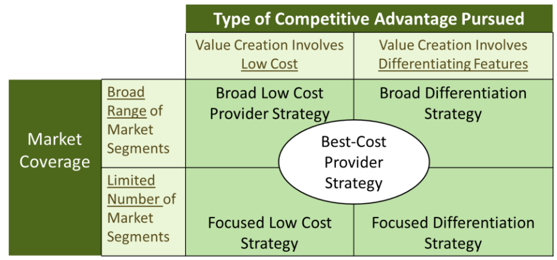
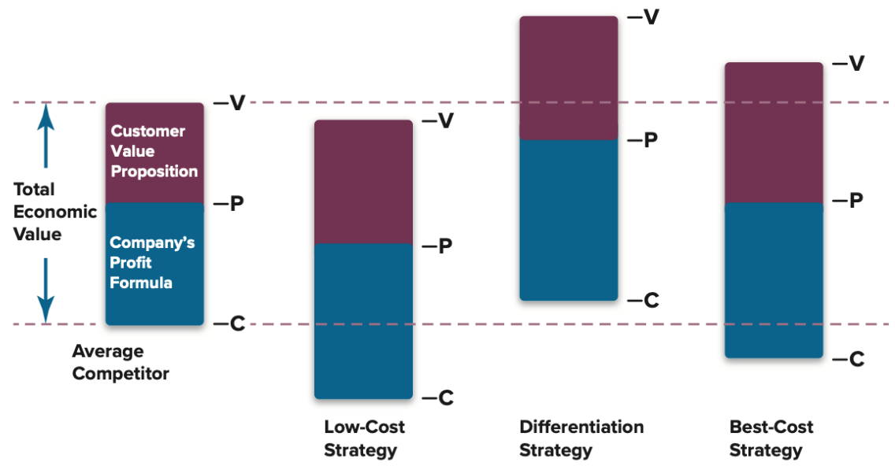

# Lecture 4, Sep 23, 2025

## Market Positioning

* Studies have found that on average, 10-20% of the profit variability of a firm comes from the industry, but 30-40% comes from strategic choices, so choosing the correct strategy is very important!
* Firms compete on two dimensions -- the cost/uniqueness and the scope of operation (appeal to mass market)
	* The first dimension is about the value stick -- pushing down the production cost or pushing up the customer's willingness to pay
* This breaks down into 3 general strategies:
	1. Low cost (cost leadership): the firm becomes the lowest cost producer, appealing to the widest audience
	2. Broad differentiation: the firm offers a premium product, often with a higher cost
	3. Focus: deliberately serving only a subset of the market, focusing either on cost or uniqueness

{width=60%}

{width=60%}

### Cost Leadership Strategy

* To achieve low costs, a firm needs to focus on performing essential value chain activities more cost-effectively or eliminating some cost producing activities altogether
* A very successful example is Walmart
* A low cost strategy works well generally when the power of buyers is high, e.g. when:
	* Buyers are price sensitive (buyers are price makers)
	* There isn't much (perceived) distinction between the offerings of different players
	* Low customer loyalty and low switching costs
	* Economies of scale can be exploited
* Beware of the hazards:
	* Cutting price by an amount greater than the cost advantage
	* Methods to cut cost are easily imitated by others
	* Becoming too fixated on reducing costs and ignoring customer preferences (reducing quality too much) or declining price sensitivity (e.g. Southwest's 2022 holiday meltdown)
	* New technological breakthroughs allowing rivals to reduce costs

### Broad Differentiation Strategy

* A firm should focus/incorporate features that raises the product performance (as perceived by the buyer), enhance buyer satisfaction in intangible ways, or lower the buyers costs of using the product (i.e. make it easier)
	* Differentiation themes can include wider selection/availability, superior service, performance, prestige
* Successful differentiation allows a firm to charge higher prices, increase sales, and gain customer loyalty
* Successful example: Starbucks, Apple, Tesla
* A differentiation strategy works well when:
	* Buyers' preferences are diverse and one standard product doesn't satisfy everyone
	* There are multiple ways to differentiate (so not all firms are trying to differentiate in the same way)
	* When the company has the R&C to actually do it
	* When the cost of producing the differentiating features is less than the revenue increase it brings
* Differentiation strategies are hard to maintain
	* Maintaining differentiation is expensive
	* Rivals can imitate the differentiated features (e.g. McDonald's offering premium coffee)
	* Buyers may see little value in the differentiated feature
* Maintaining a differentiation strategy requires continued innovation to stay ahead of rivals as they imitate the leader

### Focused Strategies

* Firms following this strategy tries to design their products to appeal to a narrow, well-defined group of buyers
* A focused strategy is viable when:
	* The industry has many niche and segments
	* Industry leaders cannot (or are not interested in) serving the niche
	* The niche is large enough to be profitable
	* The niche is stable, so buyers don't flock to the mainstream
	* The firm as the R&C to serve the niche successfully
* The focused strategies are often more suitable for new firms to enter, since there is less pressure from the larger incumbent firms which have a lot of resources to retaliate
* Examples include Porter Airlines (focused differentiation), Air Transat (focused low cost, operates only to vacation destinations)
* The hazards of a focused strategy include:
	* Competitors find ways to match the focuser's capabilities in serving the niche
	* Preferences of buyers in the niche shift towards the mainstream
	* The segment becoming so attractive that rivals become interested
* Strategies can shift; often companies move from focused differentiation to broad differentiation as the market evolves, e.g. Tesla

### Best Cost Strategy

* The best-cost strategy is a middle ground (hybrid) strategy; firms following this strategy aim to provide the best value, and must have both efficiency and distinctiveness
* Examples: IKEA, Toyota, Honda
* Best-cost strategies work well if the firm has:
	* A superior (more efficient) value chain
	* R&Cs that allow differentiating attributes to be incorporated at a low cost
* If not done well, the firm is stuck in the middle
* Often this results in middle-of-the-pack rankings and average performance
* The competitive advantage from a best-cost strategy is rarely sustainable, since it is easy to match

