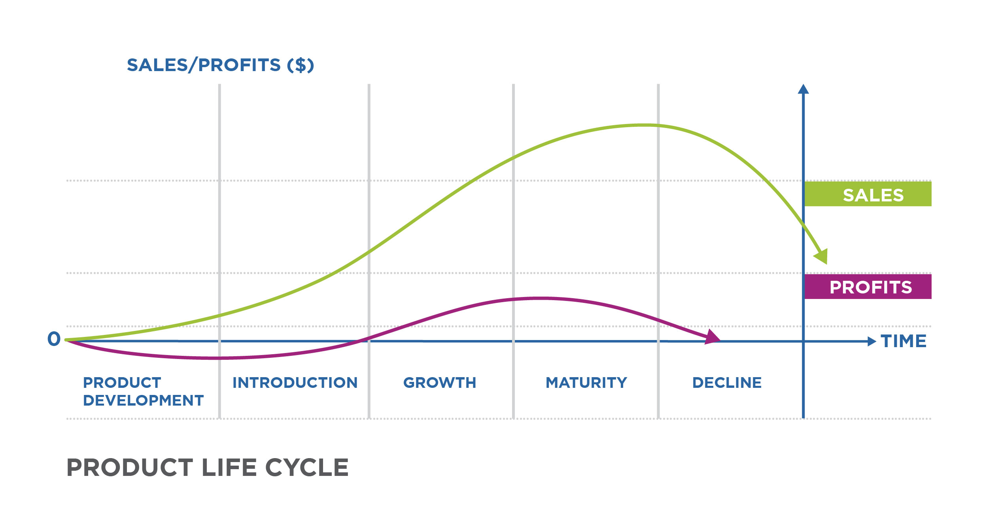
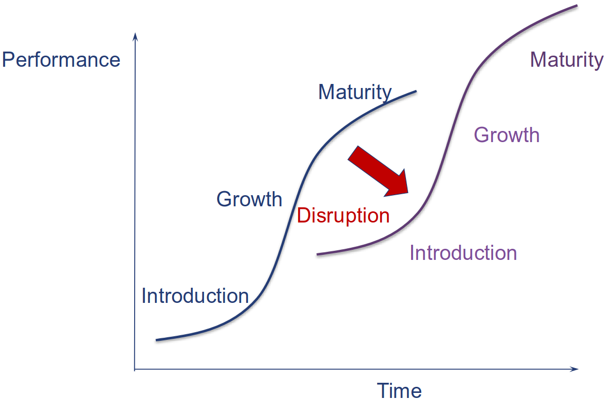
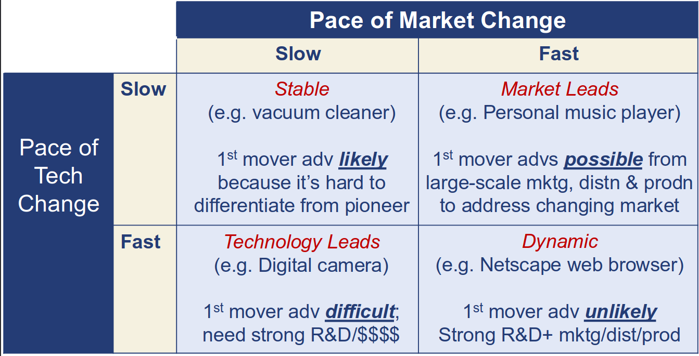
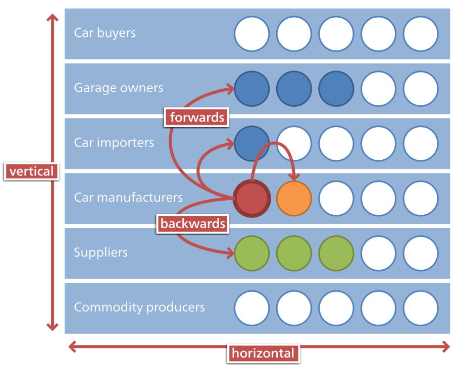

# Lecture 5, Sep 20, 2025

## Changing Strategies

* The industry can change, so a company must adopt its strategy accordingly; generally there are 3 types of change:
	1. Normal evolution along the industry life cycle (*continuous* or *incremental change*)
	2. Disruptive technological change
	3. Changes stemming from competitors' actions

### The Industry Lifecycle

{width=100%}

* The industry life cycle consists of the following stages:
	* Product introduction
		* The overall industry is still niche
		* Competitors are still trying to figure out what customers actually want and what works
		* In this stage, firms are trying to gain awareness
	* Industry growth
		* The industry expands beyond niche customers and becomes more profitable
		* Now firms know what customers like, and variety of products decreases
		* Firms innovate on the production process to reduce costs
		* In this stage, firms are trying to differentiate themselves from other players to capture more of the growth
	* Industry maturity
		* The industry slows and there are fewer new buyers
		* Companies focus on cost-based competition, and as competition ramps up the industry slowly becomes less profitable over time
		* In this stage, firms are trying to maintain brand loyalty to retain their profits as the overall industry stops growing
	* Industry decline
		* When a new technology gets introduced that replaces the existing technology, the industry is slowly phased out
		* Firms must adapt to the new technology or shift their strategy or risk getting left behind
		* Sometimes the entire industry goes away, since the R&Cs that enable firms in a industry are now useless in the new industry; but in other cases, companies are able to use their existing R&Cs which are also valuable in the new industry to adapt
			* e.g. Blockbuster went away because their resources are no longer useful in the streaming age, however automobile companies are able to adapt their production lines to make EVs and stay profitable
* As the industry evolves through the life cycle, products become more commodified and less differentiated, and competition intensifies, all of which leads to a decline in profits

### Disruptive Technologies

{width=50%}

* Disruptive technologies are introduced at a lower performance than the current market technology, but grows fast enough that it surpasses the current technology
* Disruptive technologies destroy the R&Cs of incumbent firms, which does the most damage when the industry is in the maturity stage
	* When first introduced, they may seem non-threatening, but once they start growing it could be too late for existing buyers to adapt or compete with the new technology
* They are always introduced by entrants since incumbents are busy satisfying the needs of their mainstream and most profitable customers
* The new technology could shape the source of value to customers, the type of customers, or distribution channels

### Change From Competitor Actions

* Individual firms can make moves which change the industry, often through offensive strategic actions
* Some examples include:
	* Merger of Indigo and Chapters
	* Ryanair adding low-cost positioning to the airline industry
	* Google acquiring Android and entering the phone industry

## Strategic Moves in Detail

* Once a company settles on a strategy, it has to answer 3 main questions:
	1. What competitive actions do they take? (offensive or defensive?)
	2. What should the timing of the actions be? (first mover, fast follower, or late follower?)
	3. What should the scope of operations be?

### Competitive Actions

* Offensive moves are aggressive moves to gain competitive advantage over rivals
	* This involves attacking another company by taking someone else's market or changing your own strategy
* Importantly, offensive moves need to be grounded in a firm's strength (R&Cs) to attack other firms where they are weaker
	* Otherwise, when the competitor responds to the attack, the firm will be hurt more than how much they benefited from the attack
	* Actions need to be aligned with internal capabilities and external opportunities
* Offensive moves include:
	* For cost leadership strategies:
		* Using a cost advantage to attack competitors on price or value
	* For differentiation strategies:
		* Leapfrogging competitors with next-gen technologies
		* Continuous product innovation
		* Adopting and improving on others' ideas
* Defensive moves are protective moves that lower the risk of attach or weaken the impact of attacks
* Defensive moves often take one of two forms: taking actions to block challengers (e.g. using IP) or taking actions to signal the likelihood of strong retaliation (i.e. building a reputation)
* Example of defensive moves:
	* Buying competitors (e.g. Facebook buying Instagram and WhatsApp to stay relevant)
	* Shaping industry rules (e.g. Public Mobile challenging the foreign ownership of Wind)
	* Locking out competition (e.g. through patents or proprietary standards like Kindle or iTunes)

### Timing of Market Entry

* Companies can enter the market at different times; each of the timings has its own set of advantages and disadvantages
	* For first movers, they gain brand recognition and capture the early market and VRIN resources, and is able to set standards for the entire industry; they become more experienced than later entrants, and they also benefit from network effects (companies with more users have higher WTS, e.g. social media)
	* For fast followers, they can learn from the mistakes of the early movers and enjoy lower R&D costs; they also have an opportunity to leapfrog the existing players
	* For late followers, they can take advantage of the low risk from a mature market understanding and mature technology; there are also opportunities for acquiring existing players or creating new niches
* Generally, earlier entrants have more potential, but later entrants take less risk
	* A lot of companies that we consider "pioneers" of an industry are not actually the first movers!
* The optimal timing depends on the industry dynamics, and the firm's resources and capabilities
* The pace of the market change and technological change determine the source and likelihood of early mover advantages

{width=60%}

### Scope of Operations

* The *scope* of a firm refers to the range of its activities, the breadth of its offerings, the extent of its geographic presence, and its mix of businesses
* Firms can expand in 2 directions:
	* *Horizontal expansion*: expanding within a firm's target market
		* Lowering costs, expanding geographic coverage, adding product categories, gaining new technologies (or other R&Cs), and preparing for the convergence of industries
	* *Vertical expansion*: expanding up and down the value chain
		* e.g. a car manufacturer cutting out the dealer is forward expansion, while expanding into steel and rubber processing is backward integration
		* This is done because it strengthens a company's position via cost reduction or a differentiating-based advantage
		* Beware of disadvantages, including greater investment, greater vulnerability to technological changes and less flexibility

{width=50%}

* Mergers and acquisitions involves combining 2 companies
	* 70% of mergers and acquisitions fail to bring about the promised value!
	* Often leads to a clash in cultures and competitive priorities
* Outsourcing is a way of narrowing the firm's scope by contracting out an activity to be performed by another firm
	* A company shouldn't perform an activity that can be done better, faster, or cheaper than someone else
	* The advantages are more flexibility and faster decision making
	* Don't outsource an activity that gives you your competitive advantage
* Strategic alliances are partnerships between firms where they join forces to achieve common goals
	* This is a middle ground between acquisitions/mergers and outsourcing
	* Allows companies to make up for resources deficiencies, and involves shared resources, knowledge, and risk
	* Companies mutually depend on each other
* Key actions for a successful alliance:
	* Creating a system for managing alliances
	* Build relationships with partners and establish trust
	* Protect from the threat of opportunism by setting up safeguards
	* Make commitments to partners and see that they do the same
	* Make learning a routine part of the management process
* Generally we ask the question, do we want to make, borrow, or buy some resource?

