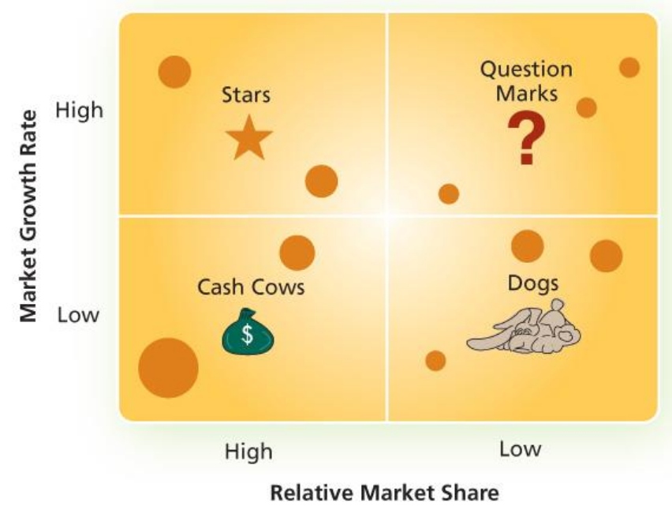
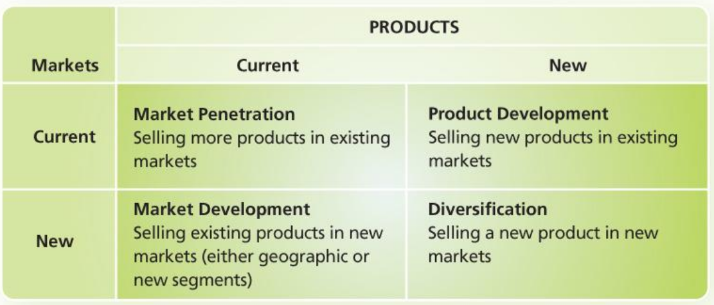

# Lecture 6, Oct 7, 2025

## Marketing

* What is marketing?
	* "A set of business practices designed to plan for and present an organization's products or services in ways that build effective customer relationships."
	* Marketing increases the WTS of customers
	* Marketing is a way for potential parties of an exchange to communicate
* More practically, marketing is about managing profitable customer relationships -- attracting new customers, or retaining and growing current customers
	* One aspect is to raise consumer awareness
		* e.g. Intel's very successful "Intel Inside" sticker campaign, which made a company that is not directly customer-facing a household name, and established them as "industry-standard"
			* This was their first step into B2C marketing, previously they mostly did B2B marketing
* Marketing can be focused on business-type customers (*B2B*) or consumer-type customers (*B2C*)
	* B2C marketing targets the actual end users of the product, while B2B targets the people paying for the product
	* e.g. manufacturer of a medical device will need B2B marketing because they sell to hospitals, not patients directly
* Marketing process:
	1. Identifying consumer needs & wants
		* Needs are basic physiological necessities (food, water, shelter, transportation)
		* Wants are a way to satisfy that need, often shaped by culture (e.g. meat vs. meat alternatives, public transportation vs. expensive car)
		* A lot of marketing is shaping the customer's wants -- convincing them that your product is the way to satisfy their needs
	2. Identify market segment, target, position (STP)
		* Market segment and targeting is whom to serve -- how is the market split and which split do we target?
			* e.g. for the Wii, Nintendo identified unmet needs in the market of "casual gamers" not met by current products; they saw the market as segmented between core gamers and casual gamers and chose to target casual gamers
		* Positioning is how to serve -- what should be the key benefits and points of differentiation?
			* Product positioning, not company positioning
	3. Develop and execute a marketing program based on the marketing mix (4P's)
		* 4P's:
			* Product: features, brand name, packaging, service, warranty
			* Place: outlets, channels, coverage, transportation
			* Price: list price, rebates, discounts, payment period
			* Promotion: advertising, sales, etc
	4. Build profitable customer relationships
		* Customer relationship management is a set of strategies that focus on building customer loyalty
		* Rewarding customers who buy frequently or buy more stuff
		* Create artificial switching costs through loyalty programs
	5. Manage product portfolio
		* How many products should we make? Should we make more? When should we retire old products? Do we market each of them differently?
		* e.g. Unilever has more than 400 brands in > 180 countries
		* Often this follows the 20-80 rule, i.e. 20% of the brands make 80% of the sales
* This 5 step process is often cyclical rather than linear
* The goal is always about creating value and customer satisfaction -- the customer should be happy enough to come back
* Over the years, customers are becoming more active and more influential in marketing activities and decisions
	* Early marketing was primarily product based
	* Recently social media marketing is becoming more valuable
* In the early stages of a company/market, there needs to be more marketing to raise awareness (~20%)
* Marketing also needs to be aligned with a company's strategy
	* Cost leadership strategy companies typically spend less (percentage wise) on marketing
	* Companies going for differentiation typically spend more
	* The average for the industry also heavily dictates how much companies need to spend on marketing
* The *Boston Consulting Group growth-share matrix* is used to analyze the current product portfolio, with 1 dimension plotting the relative market share and another dimension plotting the market growth rate
	* We want to retire products that are in the bottom right corner, which have low current market share and are growing slowly

{width=50%}

* The *product/market expansion grid* is used to think about the different ways the portfolio market could be expanded
	* Separate into 4 quadrants, for current and new products and current and new markets

{width=60%}

### Consumer Behaviour

* In this section we focus on B2C marketing
* Value is only what is perceived by the customer, so we need to understand the customer to understand what value is
* How do we discover customer behaviour?
	* Qualitative research (e.g. focus groups)
	* Quantitative research (e.g. interviews)
	* Customer feedback (e.g. customer service, social media, sales)
	* Competitive intelligence
	* Socio-economic and cultural trends
* The customer purchase decision process is a 5 step process:
	1. Problem recognition: when customer wants become intense enough to trigger action
	2. Information search
	3. Evaluation of alternatives
	4. Purchase decision: deciding where and when to buy
	5. Post-purchase behaviour: returns, help, warranties, post-purchase anxiety, telling others about experience
* *Buyer involvement* is how invested they are in the purchase; high-involvement comes when the product is expensive, has serious consequences or reflects on your social image
	* For high involvement purchases the firm needs to educate the customers about the product and its category
	* For low involvement purchases, customers are more sensitive to price, convenience, and familiarity
		* For market leaders: encourage and reinforce habitual purchases by maintaining high quality and frequent ads to reinforce this
		* For market challengers: encourage variety seeking through giving out coupons, "trying something new" messaging
* Consumers don't make their decisions in an isolated process -- there are a lot of influences
	* Psychological: motivation, personality, lifestyle, values/beliefs
		* e.g. creating a false sense of status
	* Socio-cultural influences: influential people, social class, family, cultural norms
	* Situational influences: reason for purchase, social and physical setting
	* Marketing mix influence: product, price, promotion, pace

