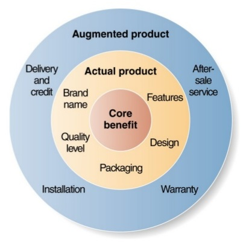
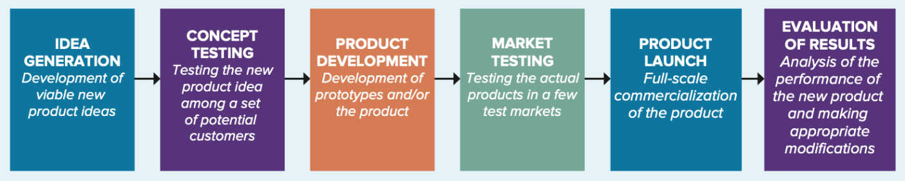

# Lecture 8, Nov 4, 2025

## Product

{width=40%}

* The value of a product has 3 layers: the core product (value preposition/benefit), actual product (e.g. quality, features, design, branding, packaging), and augmented product (i.e. associated services, e.g. customer service, delivery, etc)
	* e.g. for a Ferrari:
		* Core product: status symbol, luxurious driving experience
		* Actual product: the design of the car, the quality of the car, the engine, etc.
		* Augmented product: delivery, etc
* One way of classifying product is consumer products (selling to end-users) vs. business products (selling to organizations)
	* Business products can be *production goods* (products that are used to make other products) or *support goods* (not directly used to make other products, e.g. consulting, chairs)
	* Consumer products have 4 broad categories:
		* Convenience products: bought with little time and effort (low involvement), e.g. daily purchases
		* Shopping products: often extensive comparison (higher involvement), e.g. large purchases, apparel
		* Specialty products: brand reputation is very important, e.g. luxury products, medical services
		* Unsought products: products that consumers don't know they need, e.g. treatment for an unknown condition, insurance
* Products are organized into a hierarchical structure:
	* *Product mix*: The complete set of all products offered by a firm, typically consisting of various product lines
		* *Product mix breadth* is the variety of product lines
	* *Product line*: A group of associated items that consumers use together (or think are similar), e.g. toothbrush and toothpaste as the oral care product line
		* *Product line depth* is the number of categories within the product line
	* *Product category*: An assortment of items that consumers see as reasonable substitutes for one another, e.g. different toothbrushes

### New Product Development

* There are 2 ways products can be "new":
	* New for the company
		* e.g. adding a new division of the company
		* New R&Cs may be needed
	* New for the customer
		* There can be different degrees of "new", e.g. launching a new iPhone model vs. first introducing the iPhone

{width=100%}

* Launching a new product always comes with risks, and the product development process aims to reduce that risk
	* Depending on how "new" the product is, certain steps may be skipped
	* Note this is geared towards established firms
* The process has 6 steps, and is not necessarily linear:
	1. Ideation: Developing a pool of product ideas; various inputs, e.g. customer input, internal R&D, employees, competitors
	2. Concept testing: Developing ideas into concepts, and presenting the concepts to representatives of the target market to evaluate them (effective especially for familiar products)
	3. Product development: Developing prototypes of the product, doing alpha (internal) and beta (users) testing
	4. Market testing: Testing the product in a few markets to see what marketing tactics work the best, and look for potential adjustments for the product
		* Can choose a small test market to do a mini-product launch
		* Can be either a premarket test (surveying customers) or test marketing (mini-product launch, estimate market demand); the latter is more expensive and involved
	5. Product launch: Full-scale product commercialization; the most important step in the product introduction process, involves coordination of all aspects of the marketing mix, and proper timing
	6. Evaluation of results: Post-launch review to determine whether the product launch was a success and if any changes to the marketing mix are needed
		* This is based on satisfaction of technical requirements, customer acceptance, and satisfaction of the firm's financial requirements (e.g. sales and profits)
		* This is also needed to adapt as the product moves along its lifecycle
* In real life, the point of the product development process is to check, at each step, whether to abandon the product, in order to reduce the impact of failure
* Why do products fail?
	* Wrong market assessment (e.g. incorrect size estimation)
	* Failure to understand the product/market fit
	* Bad product marketing, e.g. incorrect segment targeted
	* Not differentiated enough
	* Too complex (too much effort on the consumer side) or bad timing (ahead of its time)
	* Overextending a firm's R&Cs
	* Mismatch between brand's image and product

### Product Lifecycle Management

* The customers buying the product are different depending on which stage of the lifecycle the product is in
	* Customers who buy the product in the introduction stage of the life cycle are innovators (2.5%) and early adopters (13.5%), who are more risk-tolerant and are driven by the desire to have the product first
		* These are the customers who will be the beta testers
	* In the growth stage the early majority (34%) buy the product, then in the maturity state the late majority (35%) buys
	* The laggards (16%) only join in the decline or not at all
* At different stages of the product life cycle marketing has different goals:
	* In the introduction stage, we aim to gain awareness
	* In the growth stage, stress differentiation
	* In the maturity stage, maintain brand loyalty
* For the product mix, in the introduction stage there are only a few products, then build extensions and brand familiarity in the growth stage, diversity brand and models in the maturity stage, and drop the product in the decline stage

### Branding

* A brand is a way to identify and differentiate the products of a firm from others
	* If there is no difference, the product becomes a commodity and firms can only compete on price
* *Brand equity* is the value of the brand -- the consumer's perception of the added value that the branding brings, reflected in how they act
	* Brand equity arises from differences in consumer responses
	* Consumer preference stems from their awareness and knowledge of the brand
	* The consumer's perceptions, preferences, and behaviour are impacted by the brand equity
* Building brand equity:
	* Choosing brand elements: choosing a distinct and memorable brand name, URL, logos, symbols, jingles, endorsements, etc
	* Integrating the brand with marketing programs
	* Leveraging secondary associations (e.g. linking to geographic regions, characters, events, emotions, etc)
* Brand equity allows a firm to charge higher than rivals for the same quality product (higher WTP) or profit from licensing the brand name
	* A way to measure the brand equity is the net present value of potential licensing fees of the brand
* Brand names are one of the only things that competitors cannot copy
* Good brand names should be:
	* Suggestive of positive product qualities/benefits
	* Memorable, distinctive
	* Fit the company/product image
	* Can be registered and legally protected
	* Can be translated well into other languages
* With many products, companies can choose to pursue a *multiproduct* or *multibranding* strategy
	* Multiproduct (aka family brand): one name for all products in a product line
		* Favourable attitudes towards one product can translate towards other products
		* Save on marketing costs and easily add extensions to increase the product line depth
		* e.g. Apple, Kraft
	* Multibranding (aka individual brands): each product has a distinct name/branding
		* Different brands can target different markets/segments of the market
		* Failure of one brand won't affect other brands
		* The more diverse the company's products (usage or performance), the more likely they are to use individual brands
		* e.g. Unilever, GM, Rogers
* *Co-branding* is when two brands are combined on a product
	* e.g. airlines working with credit card companies
	* Can fail if the customers for each of the brands are very different
* *Private branding/labelling* is when a retailer/wholesaler owns a brand and sells under that brand (as opposed to manufacturer branding)
	* Can create loyalty to the store
* Packaging and labelling can both be used to promote the product
	* Can influence consumer behaviour, e.g. for food, smaller packaging makes consumers consume more

