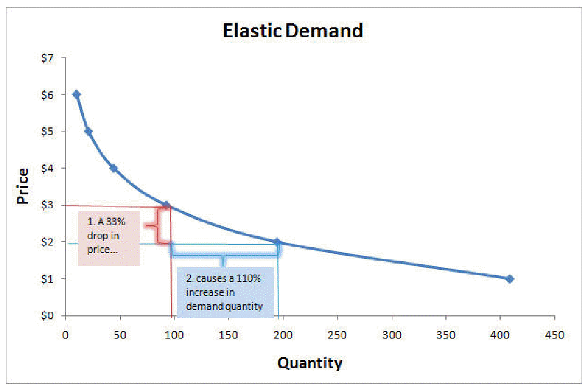
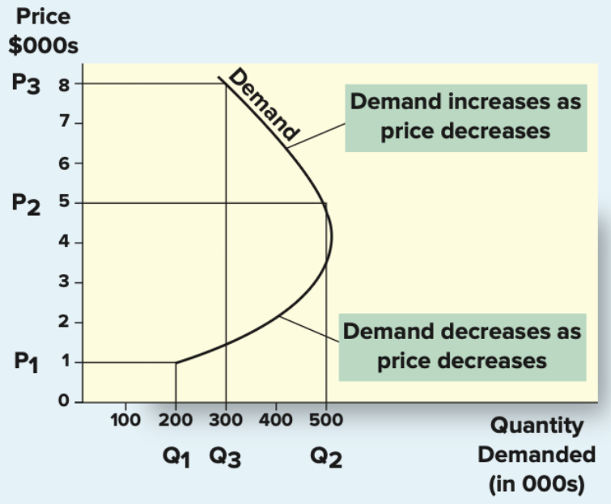
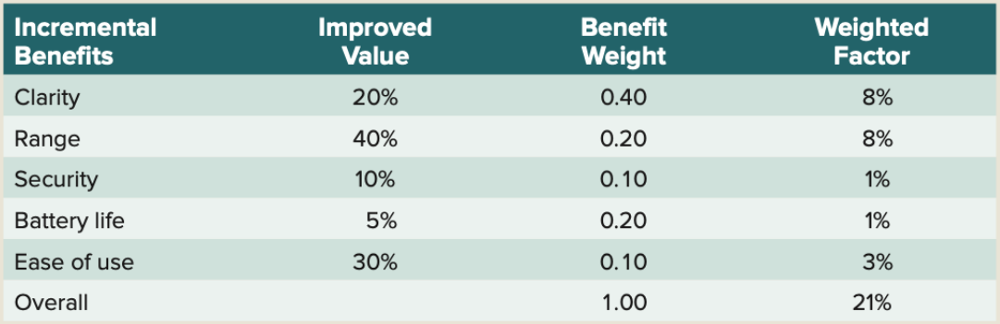

# Lecture 9, Nov 11, 2025

## Pricing

* *Price* is the "overall sacrifice" a consumer is willing to make to acquire a product or service; this includes for the product itself, but also associated transaction costs and non-monetary costs
	* e.g. taxes, shipping costs, travel costs, time to purchase
* Choosing the right price is the most challenging of the 4 P's
	* If price is set too high, the consumer perceives less value, and may purchase less or not at all, or negatively affect brand perception
	* If price is set too low, the firm makes less profit, and the consumer may perceive the product to be of less quality (especially for products that consumers do not know well, e.g. wine)
		* Willingness to pay can be positively correlated with price as consumers often judge quality through price
* The 5 C's of pricing:
	* Company objectives: strategy and orientation of the firm
		* Profit-oriented: high profit margins, e.g. enforcing a minimum profit margin across the firm
		* Sales oriented: low prices to increase sales and drive traction, even at the cost of profit
			* Early ventures often use this strategy to prove that their product is viable and enter the market
		* Competitor oriented: low prices to drive out or match competitors
			* Often used in mature markets
		* Customer oriented: premium pricing, targeting consumers that highly value a particular product
			* For focused differentiation strategies
			* Higher price can signal more value
	* Customers (demand)
		* Lowering prices often leads to more units sold, and often more profit overall
		* We can plot this on a graph where the $x$ axis is quantity (unit sold) and $y$ axis is price
			* The demand curve is often downward sloping (reduce price - increase demand)
			* If we know the demand curve, we can pick the point where we make the most profit, but this is often hard to estimate without a monopoly on the market
		* *Elasticity* is a measure of how sensitive the demand is to price changes: how much % increase in demand do we get for each % of decrease in price?
			* Demand is inelastic when changes in price does not affect demand much 
		* More essential products are generally less elastic (e.g. staple foods); less essential products and products with lots of substitutes are more elastic
		* For some products, e.g. luxury goods, the demand curve may not be downward sloping; lower price can lead to customers perceiving the product as lower quality and lower the demand
			* As price goes from very low to normal, the demand increases as customers perceive more quality
			* As price keeps increasing, the demand decreases again as customers perceive less value
		* Companies can further use *dynamic pricing* and change the price constantly based on the current demand
	* Costs
		* Total cost is the sum of fixed costs (does not vary by the volume produced) and variable costs (scales with the volume produced)
		* Fixed costs include R&D, marketing, equipment purchase, etc.
		* Variable costs include material, labour, shipping, etc.
		* The *break-even point* is the number of sales needed so that revenues match costs
			* Equal to the total fixed cost divided by the profit per unit (unit price minus unit variable costs)
	* Competition
		* We can break competition into 4 generic scenarios:
			* Fewer firms, lower price competition: Monopoly -- one firm controls the entire market
				* e.g. power
			* Fewer firms, higher price competition: Oligopoly -- a few firms control the market
				* e.g. airlines -- industry is particularly competitive since there's oversupply in the off-season
			* Many firms, more price competition: Pure competition: many firms selling undifferentiated products
				* e.g. commodities like corn
			* Many firms, lower price competition: Monopolistic competition -- many firms selling differentiated products at different prices
				* e.g. watches
	* Channel members
		* Different channel members can have different perspectives

{width=50%}

{width=50%}

* 3 main pricing methods:
	* Cost-based: determine price by starting with cost, without consideration for consumers and competitors
	* Competitor-based: determine price based on what competitors are doing and how the firm wants consumers to perceive its products relative to competitors
	* Value-based: focuses on the overall value perceived by consumers
		* *Improvement value method*: making a list of incremental benefits and asking customers to rate the improvement on each, then doing a weighted sum and using the final improvement to price relative to the existing products
		* *Cost of ownership method*: comparing the savings from a new product to an existing product, e.g. LED bulbs vs fluorescent bulbs

{width=70%}

* In the long term, firms can follow a *pricing strategy*
	* Everyday low pricing (EDLP): pricing products somewhere between nonsale prices and deep-discount sale prices offered by competitors, e.g. Walmart
	* High/low pricing: temporarily reducing prices during sales events, e.g. fashion
		* Not everything is on sale at the same time, so customers are drawn in and potentially leave with non-sale products
* For new products, the 2 general strategies are:
	* *Price skimming*: high prices to capitalize on the initial period where buyers are not price sensitive, sends quality signal; relying on high margin
		* e.g. new phones
	* *Market penetration pricing*: low initial prices to capture market share quickly; relying on volume and economies of scale
		* e.g. Uber
* For individual products the firm can use the following tactics:
	* *Price lining*: establishing a price floor and ceiling for a product category, then using pricing differences to represent differences in quality
		* e.g. different variations of iPhones in the same generation
	* *Price bundling*: grouping multiple products together and selling them for a lower price
	* *Leader pricing*: increasing store traffic by aggressively pricing and advertising a regularly purchased item (e.g. rotisserie chickens)
	* Discounts: markdowns, quantity/size discounts, coupons and rebates
	* For B2B: seasonal discounts (to even out revenue between seasons), cash discounts, allowances, quantity

## Marketing Channels (Place)

* *Channels* are how firms get the products/services to the end user
	* *Direct marketing channels* are when the firm sells directly to the customer
		* e.g. selling directly through the company website
	* *Indirect marketing channels* are when the firm sells to an intermediary, and then intermediary sells to the end customer
		* e.g. selling through dealers
* Having intermediaries simplifies the transactions in the market and can reduce costs by reducing the number of connections needed
	* Retailers, distributors, and resellers are all intermediaries
* Advantages of direct marketing:
	* More control over pricing and advertising
	* More profiting due to cutting out the middleman
	* Acquiring user data
* Advantages of indirect marketing:
	* Efficiency due to managing fewer contacts (lower cost compared to having a sales team)
	* Outsouring inventory risks
	* More exposure (reaching more of the market), especially for smaller firms
* Important factors in choosing distribution channels include:
	* Characteristics of the customer base (who is buying and how?) -- which channels best cover the target market?
	* Characteristics of the product, e.g. complexity
	* Characteristics of the company, e.g. size
* Early in the product lifecycle, the firm often doesn't have a lot of options; as the product becomes more mature, more distribution channels are added
* Different channels can conflict with each other
	* *Vertical conflicts* are when the producer and distributor have different incentives
		* Retailers care less about the brand's image and more about driving sales, so they are incentivized to lower prices so inventory moves faster
		* This is why there are often contracts for how much the retailer can sell the products for, or producers marking MSRP on their products
	* *Horizontal conflicts* are when multiple distributors compete with each other
	* Some situations might be a combination of both, e.g. Apple selling through their website and through third party stores

