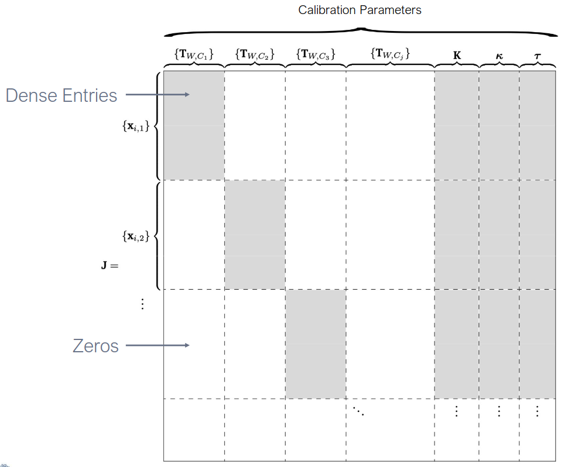
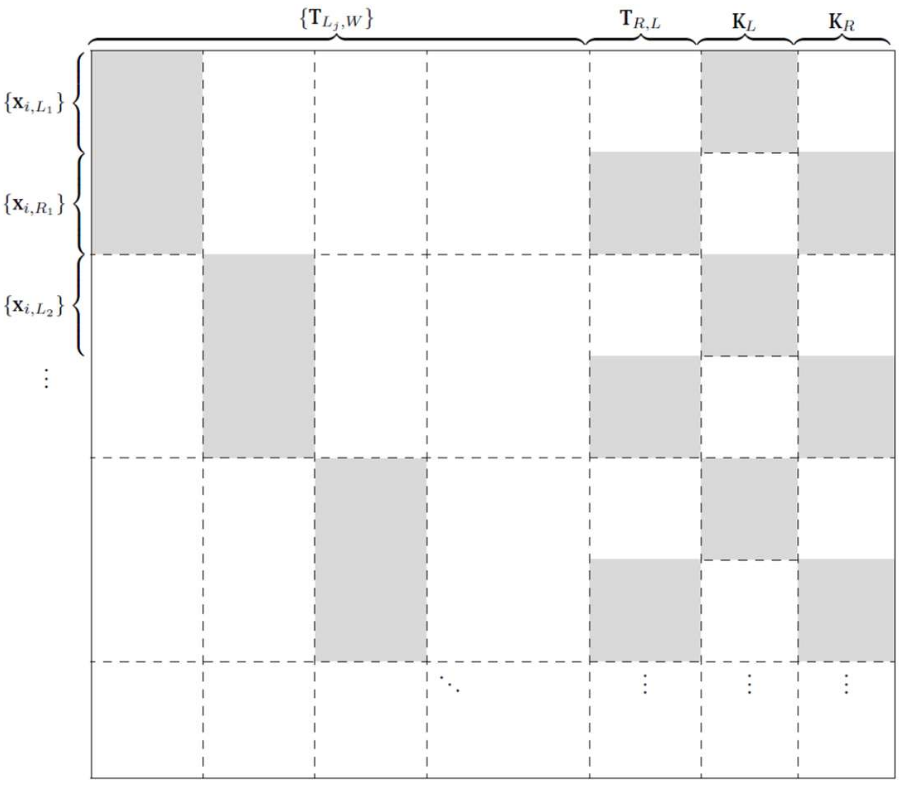

# Lecture 11, Oct 10, 2025

## Camera Calibration

* *Camera calibration* is the process of characterizing the geometric and photometric properties of the imaging system in use
	* Geometric detection, e.g. determining $\bm K$, is what we are primarily concerned with; photometric calibration (e.g. getting consistent brightness and colour values across pixels) is less important since we use techniques such as feature detection, which are invariant to photometric properties
	* This is done by using a calibration pattern with a known geometry, then solving for the camera parameters using the known quantities of the target
* The most common target for geometric calibration is a flat checkerboard pattern
	* Critical to keep the checkerboard flat and include a variety of views (multiple angles, distances, fully covering the image plane)
	* Other patterns exist, e.g. intersecting orthogonal planes, circle patterns, etc
	* Checkerboard is good because the cross junctions are not affected by foreshortening, and the simple square pattern is easy to detect, allowing for pixel or subpixel-level accuracy
	* For a circle, the effect of foreshortening distorts it into an ellipse, but critically the centre of this ellipse is not the same as the original centre of the circle
* Recall our forward imaging model: $\bm x_{ij} = f(\bm p_i; \bm C_j, \bm t_j, \bm K, \bm\kappa, \bm\tau)$ for point $i$ in camera $j$
	* For calibration, we want to recover all of these parameters; most often we're interested in $\bm K, \bm\kappa, \bm\tau$ but all parameters need to be estimated to solve the problem
	* The $n$-planes approach is to take $n$ images of our known calibration target, so for each image we get a different set of extrinsic parameters
		* This means we need at least a minimum number of points per image for this to work
* Targetless calibration and online calibration (as the robot is operating) is also possible, but much harder; most often we want to solve the calibration problem given known positions of landmark points in some frame (usually the target's frame)
	* DLT can be used, but it does not handle radial or tangential distortion, so it will be a very bad approximation
	* DLT also doesn't work when all points are coplanar, which is often the case
* We can often get an initial guess and use NLS, using all feature points from all views in a big single optimization process
	* The structure of the Jacobian can be used for some speedups, but practically computers are already fast enough
	* For NLS, we optimize the sum of squared reprojection errors, i.e. predicted location minus observed location
	* $E_{NLS}(\delta\bm\theta) = \sum _{ij}\norm*{\pdiff{f}{\bm C_j}\delta\bm C_j + \pdiff{f}{\bm t_j}\delta\bm t_j + \pdiff{f}{\bm K}\delta\bm K + \pdiff{f}{\bm\kappa}\delta\bm\kappa + \pdiff{f}{\bm\tau}\delta\bm\tau - \bm r_{ij}}^2$
		* Note the partials should be taken with respect to each parameter individually (a bit of abuse of notation, especially for the matrix...)
* In the Jacobian, only the extrinsics for one measurement affects that measurement, but the intrinsics and distortion parameters affect all measurements, so we get a sparse structure like the following figure

{width=70%}

* There are many existing toolboxes for calibration: MATLAB, OpenCV, ROS1/ROS2
* For stereo calibration, we need to add a rigid body transformation between the cameras to our optimization parameters
	* We can either do intrinsics for the 2 cameras separately, or include both intrinsics along with the transformation between cameras in a big optimization
	* For stereo the projection matrices have the following form:
		* $\tilde{\bm P}_L = \mattwo{\bm K_L}{0}{\bm 0^T}{1}\mattwo{\bm C_{L,W}}{\bm t_{L,W}}{\bm 0^T}{1} = \tilde{\bm K}\bm T_{L,W}$
		* $\tilde{\bm P}_R = \mattwo{\bm K_R}{0}{\bm 0^T}{1}\mattwo{\bm C_{R,L}}{\bm t_{R,L}}{\bm 0^T}{1}\mattwo{\bm C_{L,W}}{\bm t_{L,W}}{\bm 0^T}{1} = \tilde{\bm K}\bm T_{R, L}\bm T_{L,W}$
		* Multiply a world point $\tilde{\bm p}_i$ by these matrices to get the corresponding pixel locations in the left or right camera

{width=60%}

