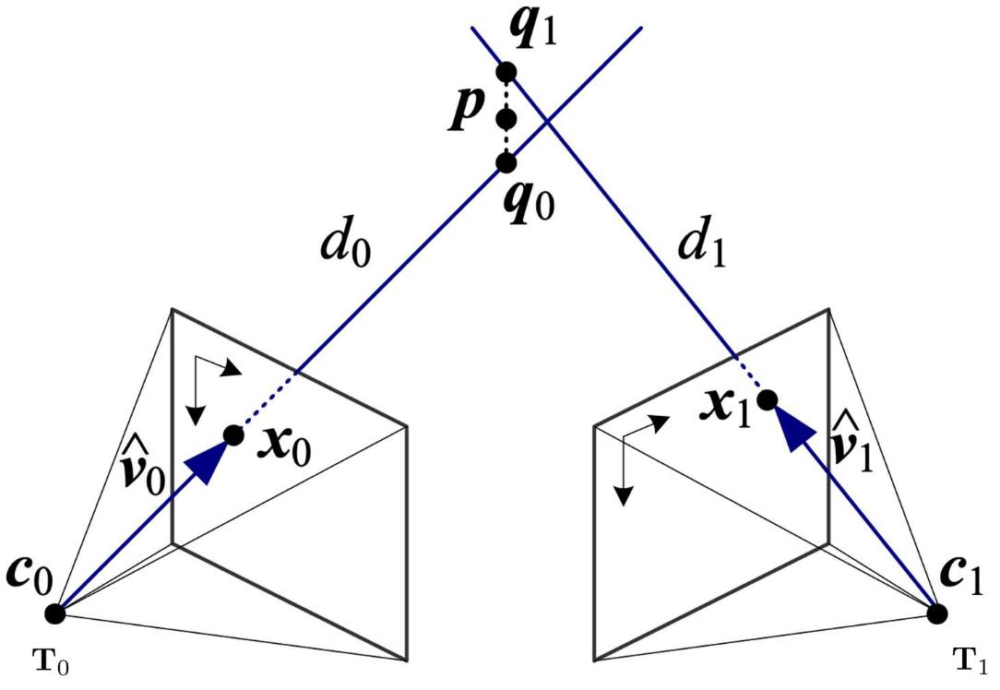
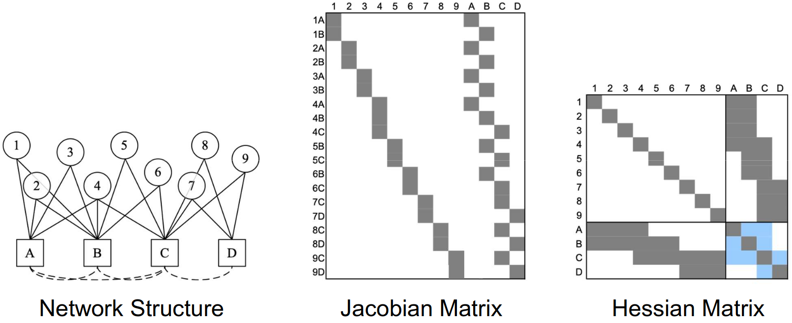
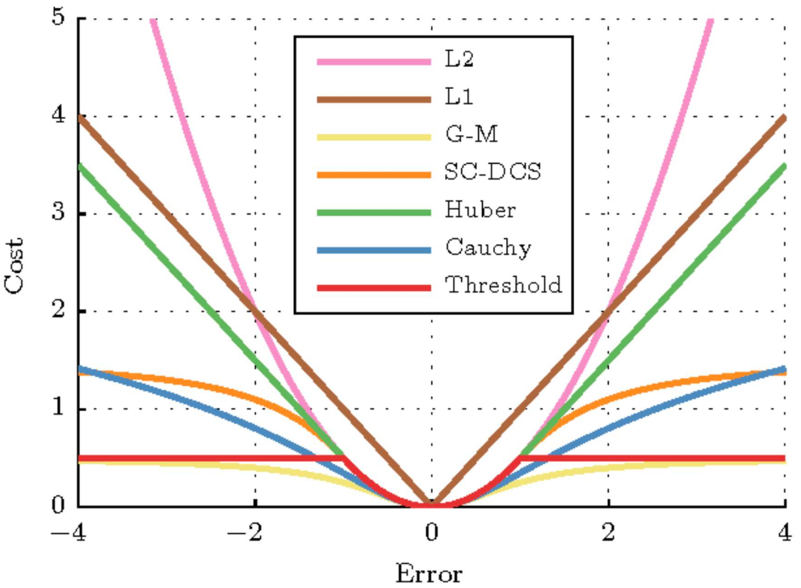

# Lecture 12, Oct 14, 2025

## Structure From Motion and Bundle Adjustment

* *Structure from Motion* (SfM) is a problem of determining the 3D positions of landmark points (structure) and camera poses (motion) from a set of sparse image feature correspondences
	* The process of the optimization depends on whether we know the camera poses
	* If camera positions are unknown and no other data is available, everything can only be known up to scale
	* With known camera poses or other measurements, we can recover the scale
	* The process usually involves:
		1. Take lots of cameras of the object
		2. Identify features and match across images
		3. Apply joint optimization to find camera poses and 3D positions of feature points (and possibly other camera parameters)
* *Triangulation* is the process of finding the 3D position of a landmark point from multiple images, with known camera poses
	* Given 2D correspondences $\set{\bm x_j}$ and cameras $\set{\bm P_j = \bm K_j\rvec{\bm C_j}{\bm t_j}}$ with optical centres $\set{\bm c_j}$, the goal is to find the point $\bm p$ closest to all of the rays from each camera
	* Each ray has direction $\bm v_j = \bm C_j^{-1}\bm K_j^{-1}\bar{\bm x}_j$ (need to be normalized to get $\hat{\bm v}_j$)
	* There will always be some error, so the rays will never perfectly intersect, so we need to find the point that is the closest to all the rays
	* For each ray we try to find the distance from camera centre, $d_j$, to minimize the error $\norm{\bm c_j + d_j\hat{\bm v}_j - \bm p}^2$
		* Solution is $d_j = \hat{\bm v}_j \cdot (\bm p - \bm c_j)$
		* The closest point on the ray to $p$ will be $\bm q_j = \bm c_j + (\hat{\bm v}_j\hat{\bm v}_j^T)(\bm p - \bm c_j)$
	* Now we can use all the $\bm q_j$ in a least squares optimization to find $\bm p$, optimizing for the squared error between the $\bm q_j$ and $\bm p$

{width=60%}

{width=50%}

* *Bundle adjustment* (BA) is the problem of jointly optimizing the 3D structure and viewing parameters (camera poses and possibly calibration parameters)
	* The name comes from "adjusting" the "bundles" of rays coming from each camera
	* This is often a very large but sparse parameter optimization problem
	* We can solve this through nonlinear least squares
	* Modern techniques use *M-estimators* for outliers since they can significantly affect the result
* BA originated from *photogrammetry*, the science of measurement from photographs, often used in surveying
	* Early photogrammetry was analog, using devices such as the stereoplotter, a device that allows a human to look at 2 images in a stereo setup (anaglyph) and plot out a contour
* Since there are thousands of parameters involved, we need to take advantage of the structure of the optimization problem to make it tractable
	* Naive NLS results in cubic complexity
	* Most of the time we have sparse Jacobians and Hessians ($\bm J^T\bm J$), and we can exploit this by using techniques such as sparse Cholesky factorization
		* We get a block between features when they can be seen together, and a block between a feature and a camera when the feature is visible from that camera
		* In the Hessian, the location of features don't affect each other directly (only indirectly through camera pose), so we have a somewhat diagonal structure
	* By ordering the parameters carefully we can make the matrix sparser (by grouping relevant parameters together to form a locally dense block), which improves performance
		* Global parameters should be grouped (if optimized at all)

{width=90%}

* If we add a new image/camera to an existing solution, we can use techniques such as the EKF to apply incremental updates
* For very large problems, there are techniques to reduce the computational complexity
	* Sliding window adjustment optimizes only the parameters within the window (e.g. temporal), instead of optimizing the global problem at every step
		* Past measurements are marginalized away and the uncertainty incorporated in the environment representation
	* Keyframe-based algorithms only optimize a subset of relevant keyframes
		* Keyframe determination can be based on spatial or temporal or feature-overlap thresholds
	* Both of these are often used in SLAM
* We can use different parametrizations for points and angles, which have a big impact on the numerical stability of computations
	* Ideally parameterizations should be locally linear for the chosen error model, so NLS has an easier time (i.e. we don't want dramatic changes in curvature)
	* For points, we parameterize as $\tilde{\bm x} = (\tilde x, \tilde y, \tilde z, \tilde w)$ to incorporate points at infinity
		* Landmark points should be kept in homogeneous coordinates to prevent numerical instability, as we often get points near infinity in real life
	* For rotations, the best choices are quaternions or rotation matrices (both subject to constraints)
		* Quaternions in particular are numerically stable and compact
		* Incremental updates can use any 3-parameter parametrization, e.g. Euler, Rodriguez (axis-angle), etc
* The optimization can be extremely sensitive to outliers, so we need robust error metrics and cost functions
	* RANSAC can be used to eliminate some outliers, but there might still be some remaining
		* Sometimes the line between the two can be blurred, e.g. in the case of points that are close or in repeating patterns
		* RANSAC requires knowing the outlier ratio and suitable thresholds, which makes it imperfect at filtering outliers
* We need to use *robust estimators*, where the cost of outliers is down-weighted, i.e. the estimator ignores data points if they appear to be an outlier
	* We need more than just a Gaussian to handle outliers, since Gaussians have short tails; outliers necessitate distribution with longer tails
	* When points get too far away, *robust cost functions* have a zero or small gradient so the outliers no longer affect the optimization
		* They will look like the quadratic (L2) loss near the origin, but when further away the error flattens out to give less weight to outliers
		* Note this means we need to make assumptions about convergence -- in this case if we start too far away, we may end up in the flat region of the gradient and be unable to converge

{width=50%}

