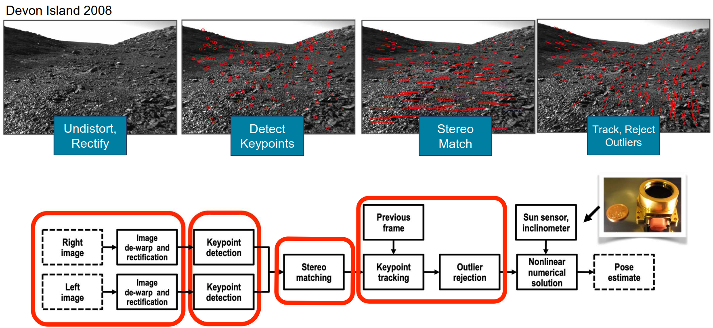

# Lecture 13, Oct 17, 2025

## Incremental SfM and Visual Odometry

* Suppose we're processing images as they arrive, can we build up the SfM problem incrementally instead of all at once as in bundle adjustment?
* This problem is known as *incremental SfM*, or *visual odometry* (VO) and *visual SLAM*
	* Visual odometry only computes the positions, while in visual SLAM we also build up a scene representation and potentially incorporates loop closures
	* Visual odometry methods compute the *egomotion* between frames, i.e. the motion of the camera/robot platform relative to the world
	* We will discuss stereo visual odometry, since we need depth information when doing frame-to-frame motion estimation
* Visual odometry can be used in environments where normal wheel odometry is infeasible/inaccurate, e.g. high-slip environments like sand, aerial vehicles, or where we require higher short-term accuracy than wheel odometry can offer
* VO algorithms can be grouped into 4 categories, depending on whether they use monocular or stereo images, and whether they use image features or directly use pixel intensities
	* Feature-based VO algorithms run feature extraction and matching, while intensity based methods directly try to match pixel intensities from one image to the next
	* Importantly, stereo measurements have an invertible observation model, so we can take points in one frame and use the inverse model to calculate where we should expect it in the next frame
* Define the combined stereo camera model (note the origin is defined as the middle of the cameras, so the cameras centres are at $x = \pm b/2$
	* Assuming same intrinsics for both cameras, $\bm M = \matfour{f_u}{0}{c_u}{f_u\frac{b}{2}}{0}{f_v}{c_v}{0}{f_u}{0}{c_u}{-f_u\frac{b}{2}}{0}{f_v}{c_v}{0}, \bm p = \cvec{x}{y}{z}{1}$
	* The forward model is $\rvec{u_l}{v_l}{u_r}{v_r}^T = \bm f(\bm p) = \bm M\frac{1}{z}\bm p$ where $(u_l, v_l)$ and $(u_r, v_r)$ are the rectified pixel coordinates
		* Jacobian given by $\pdiff{\bm f}{\bm p} = \bm M\frac{1}{p_3}\matfour{1}{0}{-{p_1}/{p_3}}{0}{0}{1}{-{p_2}/{p_3}}{0}{0}{0}{0}{0}{0}{0}{-{p_4}/{p_3}}{1}$
	* Inverse model: $\bm\rho = \cvec{x}{y}{z} = \bm g(y) = \frac{b}{u_l - u_r}\cvec{\frac{1}{2}(u_l + u_r) - c_u}{\frac{f_u}{f_v}\left(\frac{1}{2}(v_l + v_r) - c_v\right)}{f_u}$
		* This is only possible to do for a stereo camera since we have depth information
		* Jacobian: $\pdiff{\bm g}{\bm y} = \frac{b}{(u_l - u_r)^2}\mat{\mrow{-u_r + c_u}{0}{u_l - c_u}{0}\mrow{-\frac{f_u}{f_v}\left(\frac{1}{2}(v_l + v_r) - c_v\right)}{\frac{f_u}{2f_v}}{\frac{f_u}{f_v}\left(\frac{1}{2}(v_l + v_r) - c_v\right)}\mrow{\frac{f_u}{2f_v}}{-f_u}{0}{f_u}{0}}$
* The VO problem involves finding the relative transformation between frames $\bm T_{ba}$, given an image captured in frame $a$ and an image in frame $b$
* In a feature-based stereo VO pipeline, we run the standard stereo matching, then feature detection and matching of features between frames; then we can do outlier rejection (very important) and then solve for the pose transformation, potentially incorporating other sensors into the mix

{width=100%}

* To compute the pose transformation between frames, we can try to align the point clouds we get from the two frames (since the stereo model is invertible)
	* Assuming we know correspondences perfectly, there is a closed-form solution
	* Let $\bm p_a^j, \bm p_b^j$ be the points in frames $\vcx{F}_a$ and $\vcx{F}_b$ respectively; we wish to minimize a squared cost function with respect to the rotation $\bm C_{ba}$ and translation $\bm r_a$
	* $E(\bm C_{ba}, \bm r_a) = \frac{1}{2}\sum _{j = 1}^J w_j\left(\bm p_b^j - \bm C_{ba}(\bm p_a^j - \bm r_a)\right)^T\left(\bm p_b^j - \bm C_{ba}(\bm p_a^j - \bm r_a)\right)$
	* Each data point can have a weight, usually based on our confidence of that feature; this can be a scalar or matrix weight
* Scalar weighted point cloud alignment has an exact solution without iteration:
	1. Compute centroids $\bm p_a = \frac{\sum _{j = 1}^J w^j\bm p_a^j}{\sum _{j = 1}^J w^j}, \bm p_b = \frac{\sum _{j = 1}^J w^j\bm p_b^j}{\sum _{j = 1}^J w^j}$
		* The idea is to align the two point cloud centroids, so we only have an alignment (rotation) to solve for
	2. Compute the outer product matrix $\bm W_{ba} = \frac{1}{\sum _{j - 1}^J w^j}\sum _{j = 1}^J w^j(\bm p_b^j - \bm p_b)(\bm p_a^j - \bm p_a)^T$
	3. Compute the SVD of the outer product matrix, $\bm V\bm S\bm U^T = \bm W_{ba}$
	4. Compute the rotation using the SVD, and then use the inverse of the rotation to compute the correct translation vector
		* $\bm C_{ba} = \bm V\matthree{1}{0}{0}{0}{1}{0}{0}{0}{\det(\bm U)\det(\bm V)}\bm U^T$
		* $\bm r_a = -\bm C_{ba}^T\bm p_b + \bm p_a$
		* Notice the translation is just subtracting the centroids (in the correct frame)
* Bonus: this can be used to align point clouds without registration by iterating, which is the ICP algorithm
* Due to the stereo geometry, we typically have much higher depth uncertainty than in $x$ and $y$, and further points have more uncertainty; using simple scalar weights does not capture this complexity, so it's often inaccurate
	* Consider a Gaussian noise model (ignoring for now the long tail we discussed before)
	* $\bm y = \bm f(\bm p) + \bm n, \bm n \sim \mathcal N(\bm 0, \bm R)$ where $\bm R \in \reals^{4 \times 4}$ is the pixel measurement noise covariance (in both cameras)
	* Linearize the inverse model: $\hat{\bm\rho} = \bm g(\bm y) = \bm g(\bm f(\bm\rho) + \bm n) \approx \bm\rho + \pdiff{\bm g}{\bm y}\bm n$
	* Therefore $\hat{\bm\rho} \sim \mathcal N(\bm\rho, \bm G\bm R\bm G^T)$ where $\bm G = \eval{\pdiff{\bm g}{\bm y}}{\bm y}$
* Now we can use the landmark covariances in the optimization as matrix weights
	* $E(\bm C_{ba}, \bm r_a) = \frac{1}{2}\sum _{j = 1}^J \left(\bm p_b^j - \bm C_{ba}(\bm p_a^j - \bm r_a)\right)^T\bm\Sigma^j\left(\bm p_b^j - \bm C_{ba}(\bm p_a^j - \bm r_a)\right)$
	* $\bm\Sigma^j = \left(\bm G_b^j\bm R_b^j{\bm G_b^j}^T + \bm C_{ba}\bm G_a^j\bm R_a^j{\bm G_a^j}^T\bm C_{ba}^T\right)^{-1}$ where $\bm G_b^j = \eval{\pdiff{\bm g}{\bm y}}{\bm f(\bm p_b^j)}, \bm G_a^j = \eval{\pdiff{\bm g}{\bm y}}{\bm f(\bm p_a^j)}$ and $\bm R_b^j, \bm R_a^j$ are the pixel measurement covariances in the two cameras for each point
		* Note now we have covariances resulting from measurement errors in both frames, so we need to transform the uncertainty in frame $a$ to frame $b$ using $\bm C_{ba}$
	* With matrix weights, this no longer has a closed-form solution, so we use Gauss-Newton to iterate as usual
* For outlier rejection, we can first do RANSAC with scalar-weighted point cloud alignment to find the inlier set, then use matrix-weighted alignment to calculate the precise transformation
	* If we have other sensors, we can add another term to the cost function for point cloud alignment to incorporate it

