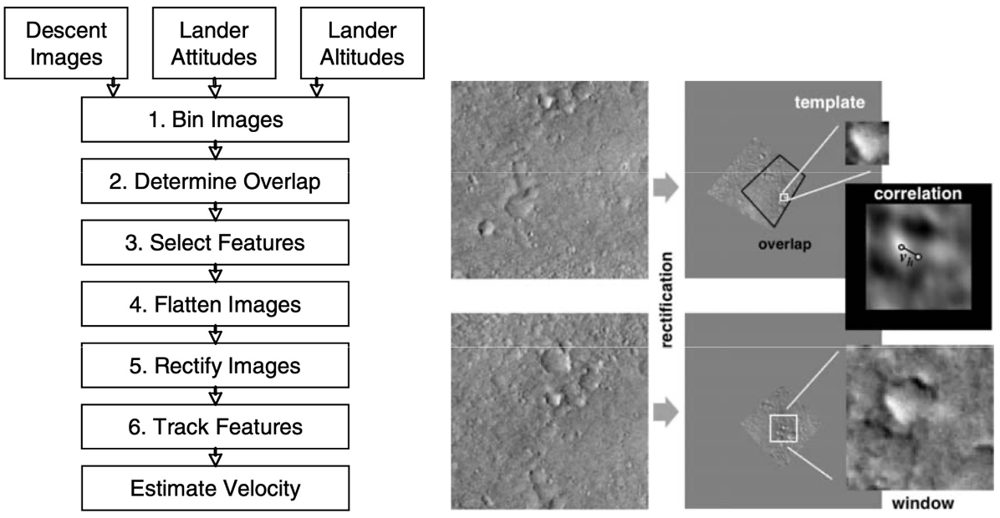

# Lecture 14, Oct 21, 2025

## Case Study: Computer Vision on Mars

* The Descent Image Motion Estimation System (MER-DIMES) was a system used for descent of Mars Exploration Rovers to estimate horizontal velocity in order to determine when to fire rockets
	* Radar provided distance to ground (assuming a flat landing surface), monocular camera used to determine lateral velocity
	* Computation was very constrained (20MHz, no FPU, 128MB RAM)
	* Estimates horizontal motion over 3 frames
	* Uses a single feature (but looks for 2), fusing with IMU and altimeter data
	* Process:
		* Image downsampling
		* Masking shadow of parachute using estimation of sun location (this would give us an incorrect zero velocity)
		* Determine image overlap region (based on altitude and velocity estimate) to define the search region
		* Harris corners over a coarse grid, thresholding to 2 best features
		* Correction for CCD effects (e.g. vignetting), patch rectification
		* Feature matching using over 2-image pyramid for scale invariance

{width=80%}

* Spirit and Opportunity rovers used 3 sets of stereo cameras:
	* Hazard cameras mounted under the solar panels on both sides, for close-range obstacle detection
	* Navigation cameras on the main sensor mast, for visual odometry
	* Panoramic cameras on the main mast, with different filters that can be applied, for long-range imaging and mineral classification
	* Navcams and hazcams were 1024x1024, 12-bit color depth
	* Wheel odometry was insufficient due to wheel slip and degradation of calibration errors; VO was used
	* Traversibility is estimated by fitting planes to small patches of stereo data, checking for protruding obstacles (by checking for residuals of plane fit), excessive tilt, then inflating obstacles on an occupancy grid and determine the path using trajectory rollout
* The Mars Science Laboratory ramped this up with many more cameras and a much larger vehicle
* Perseverance was able to estimate traversibility and trajectories while driving, unlike previous rovers which needed to stop to take pictures; it also built maps
* The Ingenuity helicopter carried by Perseverance used visual odometry for navigation, using a single downward-facing camera
	* Used RANSAC for outlier rejection and to eliminate the shadow of the helicopter
	* At least 12 FAST features selected per frame for matching
	* Had to account for motion blur, lighting changes, and feature-poor terrain

