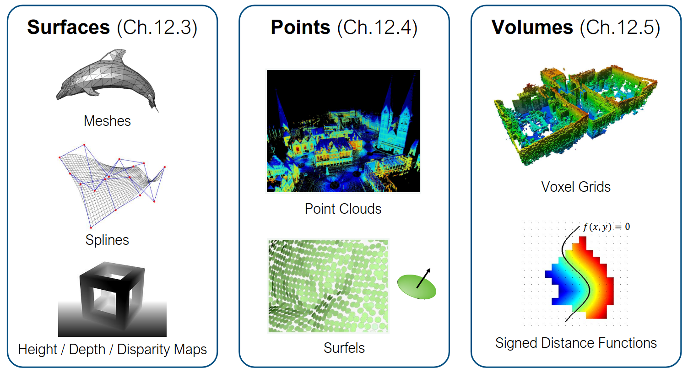
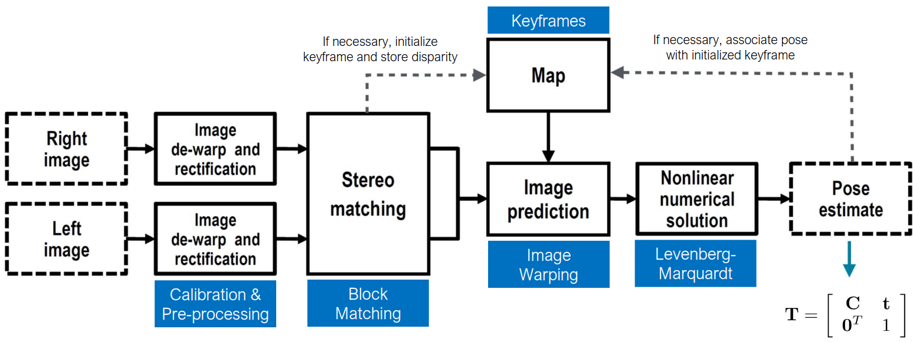
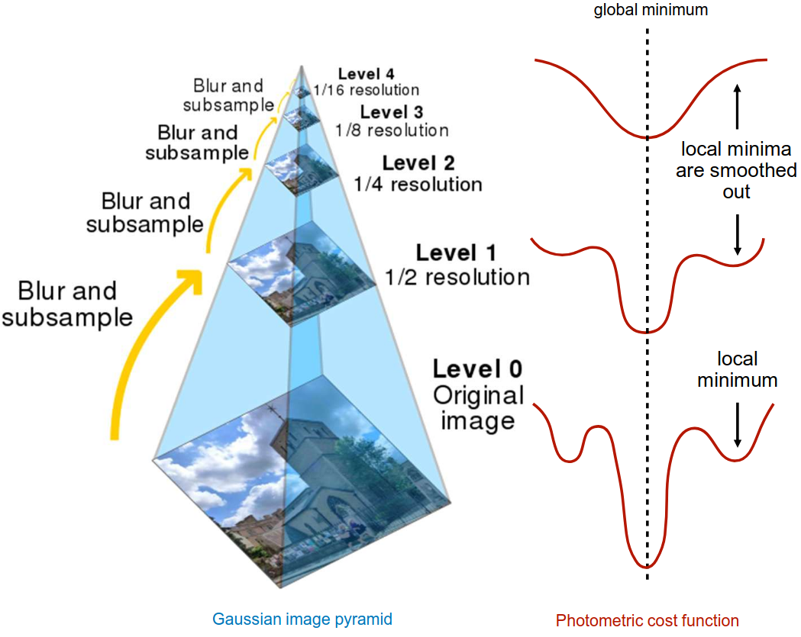
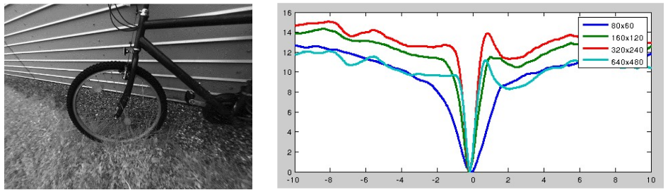

# Lecture 16, Nov 4, 2025

## Dense/Photometric Mapping

* In *dense mapping*, we try to match images between frames based on intensities only, as opposed to using features in sparse mapping
	* Instead of minimizing the geometric error of features, we minimize the photometric error of intensities between frames
	* Also known as *direct* methods, since we're directly matching pixel intensities
		* Note pure "dense" methods recover depth for each pixel; most methods are somewhere in between
	* We are attempting to solve the camera motion estimation and pixel correspondence problems at once, so this is generally harder
		* In feature-based matching we essentially decoupled the pose estimation and association problems into two distinct steps
	* Feature matching can be impacted significantly by blurring, noise and outliers, which is particularly relevant in the case of motion blur and camera defocusing
		* By doing photometric mapping, we optimize over the entire image at once (global), so we can still recover matches even under significant blurring and noise
* In summary, dense vision:
	* Is robust to common failure modes, e.g. blur, self-similar textures, defocus
	* Uses almost all information in the image (as opposed to only pixels around features)
	* Can be used for scene understanding and path planning
	* Uses implicit data association by matching pixel intensities
	* Very high dimensionality ($10^5$ to $10^6$ pixels per image, making it very computationally expensive)
	* Contains a lot more local minima (due to implicit data association), so initialization is important (i.e. works only for small camera movements)
* In a dense mapping pipeline, we use an estimate of the camera transformation between frames (e.g. from odometry) to predict the transformation/warping of the previous frame to the next frame, and then solve a nonlinear optimization problem for the pose
	* We use stereo as usual, since dense depth is needed to predict the warped image in general
* For a real-time scenario we can combine dense and sparse mapping by using sparse matching for pose estimates, and using dense mapping to reconstruct the map for planning purposes
* The dense map can be represented in different ways:
	* Surface-based maps: meshes, splines (fitting splines to points), and height/depth maps
	* Point-based maps: point clouds, surfels (like voxels but 2D), Gaussian splats
	* Volume-based maps: voxel grids (e.g. octrees for adaptive resolution), signed distance functions

{width=60%}

### Dense/Photometric Mapping Pipeline

{width=100%}

* We use a modified stereo camera model, similar to the one presented in the VO lecture but this time using one set of pixel coordinates and the disparity
	* Forward model: $\bm y = \cvec{u_l}{v_l}{d} = \bm f(\bm p) = \bm M\frac{1}{p_3}\bm p$
		* Modified camera matrix and homogeneous coordinates: $\bm M = \mat{\mrow{f_u}{0}{c_u}{0}\mrow{0}{f_v}{c_v}{0}\mrow{0}{0}{0}{f_ub}}, \bm p = \cvec{sx}{sy}{sz}{s}$
		* $\pdiff{\bm f}{\bm p} = \frac{1}{p_3}\bm M\matfour{1}{0}{-p_1/p_3}{0}{0}{1}{-p_2/p_3}{0}{0}{0}{0}{0}{0}{0}{-p_4/p_3}{1}$
	* Inverse model: $\bm\rho = \cvec{x}{y}{z} = \bm g(\bm y) = \frac{b}{d}\cvec{u_l - c_u}{\frac{f_u}{f_v}(v_l - c_v)}{f_u}$
		* $\pdiff{\bm g}{\bm y} = \frac{b}{d^2}\matthree{b}{0}{c_u - u_l}{0}{\frac{f_u}{f_v}d}{\frac{f_u}{f_v}(c_v - v_l)}{0}{0}{-f_u}$
* From the input, we select keyframes (based on e.g. spatial/temporal changes, information estimates, etc) and incorporate pointclouds from keyframes into the map
* Given a transformation between frames $\bm T_{k, k - 1}$, we can map pixels in the previous frame $(u_{k - 1}, v_{k - 1})$ to the next frame $(u_k, v_k)$ as $\cvec{u_k}{v_k}{d_k} = \bm f\left(\bm T_{k, k - 1}\bm g\left(\cvec{u_{k - 1}}{v_{k - 1}}{d_{k - 1}}\right)\right)$
	* Use the inverse camera model to get 3D points from pixels, transform into the new frame, and project it through the forward camera model to get the expected pixel location and disparity
	* This process will leave holes in the new image, so we need to interpolate
* For matching, again assume photometric consistency: $I_k(u_k, v_k) = I_{k - 1}(u_{k - 1}, v_{k - 1}) + n$ where $n \sim \mathcal N(0, \sigma^2)$ is some noise
* Define the *photometric error* for each pixel, and sum over all pixels of interest to get the overall cost, which we can optimize to get the transformation
	* $e_i = I_{k - 1}(\bm u_{k - 1}^i) - I_k'(\bm u_k^i)$ where $I_k'(\bm u)$ is an interpolated image indexed with continuous coordinates
	* $\bm y_k^i = \cvec{u_k^i}{v_k^i}{d_k^i} = \cvec{\bm u_k^i}{d_k^i} = \bm f(\bm T_{k, k - 1}\bm g(\bm y_{k - 1}^i))$
	* Solve for $\hat{\bm T}_{k, k - 1} = \argmin _{\bm T_{k, k - 1}}\sum _{i = 1}^N\left(\frac{1}{\sigma}e_i\right)^2$
* The disparity map of keyframes can be included in the optimization to generate better maps, combining the pixel intensity error, disparity difference in the active frame (actual vs. predicted disparity in next frame), and disparity difference from the original observation
	* $\bm e_i = \cvec{I_{k - 1}(\bm u_{k - 1}^i) - I_k'(\bm u_k^i)}{d_k^i - \bar D_k'(\bm u_k^i)}{d_{k - 1}^i - \bar d_{k - 1}^i}$
		* Note $d_{k - 1}$ is the disparity to be optimized (function of $\bm T_{k, k - 1}$), $\bar d_{k - 1}$ is the actual observed disparity (from stereo matching) and $\bar D_k'$ is the interpolated disparity in the current frame
		* First term is the usual photometric error term
		* Second term is the difference between the observed disparities in the next frame and the predicted disparities based on $\bm T_{k, k - 1}$ and $d_{k - 1}$
		* Third term is the difference between the optimized disparity map and original disparity observations, so the optimized map is not too different from the observed map
	* We can use a matrix weight $\bm W_i^{-1}$, usually diagonal with variances, and optimize in both $\bm T_{k, k - 1}$ and $d_{k - 1}$

### Tips and Tricks

* Due to the prevalence of local minima, we need a very good initial guess for the optimization
	* One method is to use an IMU/odometry
	* Another commonly used method is coarse-to-fine optimization, i.e. starting with a blurred and subsampled image, then repeatedly optimizing while increasing resolution

{width=60%}

{width=50%}

* Instead of operating on all pixels, which is computationally intensive, we can choose to match over only informative pixels
	* Can be done based on gradient strength: $\norm{\nabla I(u, v)} \geq \nabla _{min}$
	* We can also do this over a grid, and for each grid cell take the pixels with the best gradient
	* The result is retained pixels that are often concentrated along edges and corners
	* This trades off accuracy for computation time
* Using a GPU to parallelize the error computation can significantly speed up the matching
* Unlike features, direct photometric mapping is affected by effects such as gamma, exposure, vignetting, lens attenuation, etc
	* For even better accuracy, we can perform photometric calibration to build a photometric camera model incorporating all of these effects

