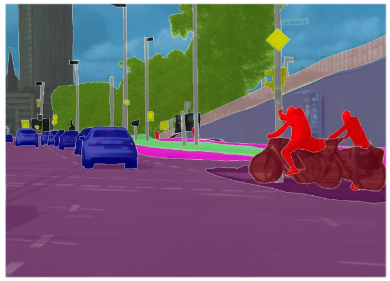
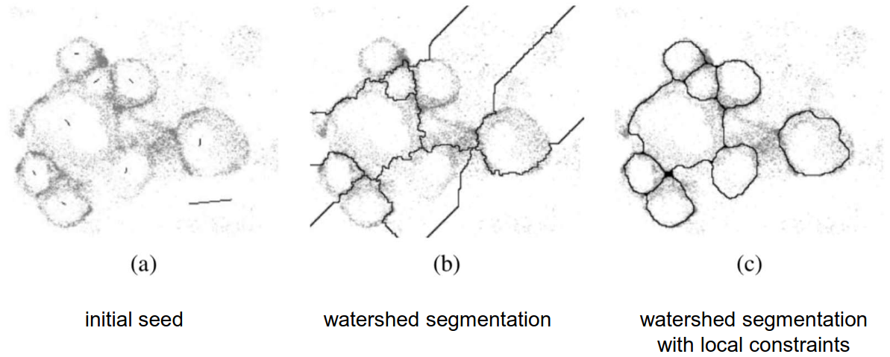
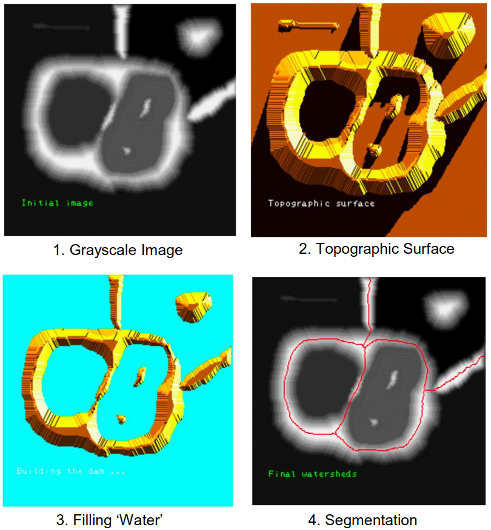
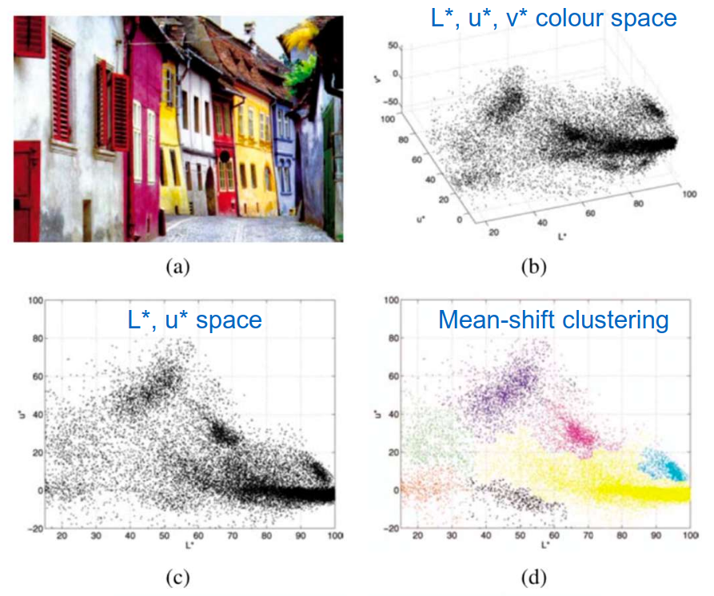
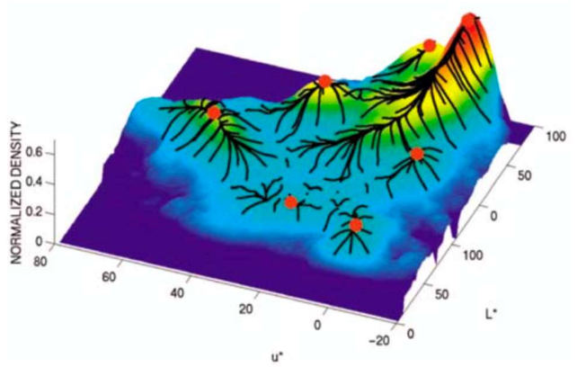
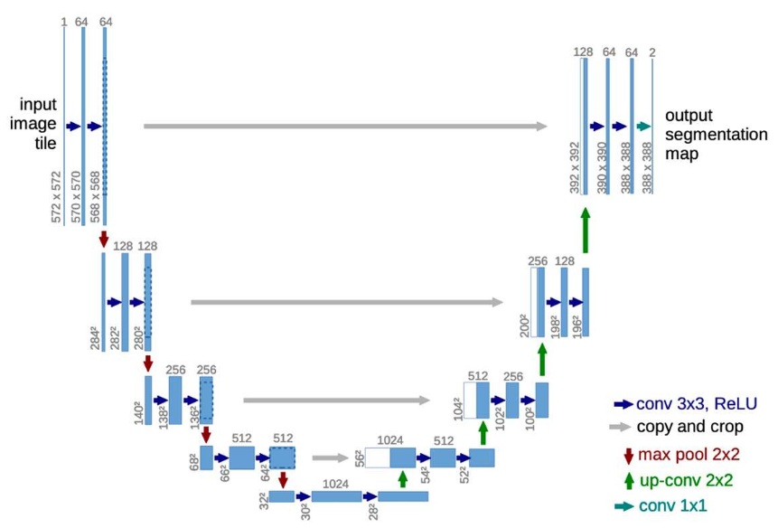
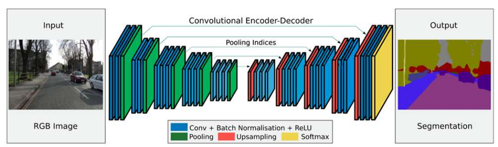

# Lecture 17, Nov 7, 2025

## Image Segmentation

* *Gestalt theory* is the idea of "the whole is greater than the sum of its parts" -- we perceive images as entire patterns, instead of individual components/pixels
	* Law of proximity: We naturally group things together based on proximity
	* Law of similarity: We group things based on similarity
	* Law of continuity: We group continuous objects together, and we understand that an object continues even if it's partially occluded
* *Segmentation* is the task of finding pixels that "go together", grouping them and potentially classifying them
	* Early techniques were *divisive* (breaking up an image/objects) or *agglomerative* (growing out from a point) and operate locally
	* More recent techniques are global and optimize across regions
	* Many types of segmentation:
		* *Coarse segmentation*: bounding boxes for objects
		* *Fine segmentation*: splines to describe boundaries between objects or pixel-wise labels/masks
		* *Semantic segmentation*: segmenting based on what the object is, e.g. chair vs non-chair
		* *Instance segmentation*: semantic segmentation, but being able to tell apart different instances of objects
		* *Panoptic segmentation*: segmenting instances of countable objects (foreground "things", e.g. people) and grouping together uncountable objects (background "stuff", e.g. a road)

{width=40%}

### Classical Segmentation Methods

* The simplest segmentation approach is to just to apply a threshold to the intensity levels (or to a specific channel in some colour space), then finding connected components to get the regions
* *Active contours* is an energy-minimization approach that fits a spline $\bm f(s) = (u(s), v(s))$ to minimize an energy function
	* Smoothness cost: $\mathcal E_\text{int} = \int \alpha(s)\norm{\bm f_s(s)}^2 + \beta(s)\norm{\bm f_{ss}(s)}^2\,\dd s$
		* Penalizes sharp changes/kinks
	* Image energy: $\mathcal E_\text{image} = w_\text{line}\mathcal E_\text{line} + w_\text{edge}\mathcal E_\text{edge} + w_\text{term}\mathcal E_\text{term}$
		* The terms attract the spline to dark ridges, strong gradients (edges), and line terminations respectively
		* In practice this is primarily the edge term, $\mathcal E_\text{edge} = \sum _i -\norm{\nabla I(\bm f(i))}^2$, i.e. summing up the gradient magnitude at all the points on the spline
	* The *B-spline* is defined as $\bm f(s) = \sum _k B_k(s)\bm x_k$, where $B_k(s)$ are $k$ basis functions and $\bm x_k$ are control points (i.e. parameters)
		* B-splines are generalizations of Bezier curves
* For evolving images/contours, we can model it with linear dynamics: $\bm x_t = \bm A\bm x_{t - 1} + \bm w_t$ where $\bm x_{t - 1}$ are the contour control points from the previous iteration, $\bm A$ is the transition matrix, and $\bm w_t$ is some noise vector
	* This is known as *conditional density propagation* (aka *CONDENSATION*)
	* To implement this we can use a particle filter, where each particle is a contour, and we propagate the belief using $\bm A$
* *Split and merge* algorithms perform segmentation by a combination of recursive splitting of the image and merging together regions
	* The *watershed algorithm* starts from seed points, and performs watershed segmentation
		* Interpret the grayscale image as a topographic image, i.e. darker regions are "valleys"
		* The idea is to fill the local minima with "water", i.e. propagate outward from the minima until we hit a high-intensity boundary
		* This assumes that the boundaries are similar in intensity
		* Locality constraints can be applied so that the regions are closed off, instead of open on one side

{width=60%}

{width=50%}

* One category of segmentation methods attempts to cluster pixels on a feature level or directly over some colour space, e.g. LUV
	* We basically want to find blobs of similar pixels in some colour/feature space and cluster them together, where each cluster represents a region
	* This can be done over colour, position, etc
* The *mean-shift algorithm* considers each pixel to be a sample from a PDF, with multiple means; *kernel density estimation* is used to estimate this PDF, and the modes of the PDF are used for the segments
	* The kernel density estimator is $f(\bm x) = \sum _i K(\bm x - \bm x_i) = \sum _i k\left(\frac{\norm{\bm x - \bm x_i}^2}{h^2}\right)$
		* $\bm x_i$ are the samples and $\bm x$ is the mean
		* $h$ is the *bandwidth* of the kernel and controls the spread of the distribution, i.e. how quickly the density varies
		* We often use the Gaussian kernel $k_N(r) = e^{-\frac{1}{2}r}$
	* The mean-shift algorithm uses multiple restart gradient descent:
		1. For each mode $\bm y$, start with some initial guess $\bm y_0$
		2. Compute the next $\bm y$ by adding the mean-shift, $\bm y_{k + 1} = \bm y_k + \bm m(\bm y_k) = \frac{\sum _i\bm x_iG(\bm y_k - \bm x_i)}{\sum _i G(\bm y_k - \bm x_i)}$
			* $G$ is the derivative of the kernel function, so this is like computing an average gradient
		3. Repeat until convergence, $\norm{\bm m(\bm y_k)} < \epsilon$
	* One simple approach is to initialize a mode at each input point, and iterate until all pixels have converged to a mode; then each distinct mode will be a segment, consisting of all the pixels that converged to it

{width=60%}

{width=50%}

* The *graph cuts algorithm* constructs the image as a graph and attempts to cut the graph into regions
	* The idea is that pixels that should be grouped together should share affinity
	* The nodes of the graph are pixels
	* The edges are weighted using an affinity function based on salient properties, e.g. pixel distance, intensity difference, colour difference, texture metrics (e.g. by convolution)
	* We can make either minimum cuts (using the max-flow/min-cut algorithm), or normalized cuts (cost of the cut normalized by the size of segments)
		* Minimum cuts can be solved efficiently but tends to penalize large segments, so it can over segment
		* Normalized cuts are better, but is NP-hard in general, although we can use approximations
* The segmentation problem can be formulated as a *Markov Random Field* (MRF), where we consider the segmentation solution as the "true" pixel states, and the image itself as the observed "evidence"
	* We want to minimize energy $E(x, y) = \sum _i \varphi(x_i, y_i) + \sum _{ij} \psi(x_i, x_j)$
	* Can be formulated as a min-cut problem for binary (foreground/background) labelling
* GrabCut is a classical segmentation method that uses a user-supplied bounding box, and an MRF model
	* A Gaussian mixture model (GMM) is fit to the foreground and background colour
	* The MRF energy is defined based on the GMM, and min-cut is applied to classify into foreground and background
	* Repeat until convergence, fitting a new GMM each time

### Modern Approaches

* Modern approaches are mostly based on deep learning, focusing on pixel-level segmentation and classification
	* Obtaining ground truth data is difficult since images often have to be labelled manually per-pixel (nowadays we preprocess using existing segmentation networks)
	* SegNet is one of the first modern approaches for autonomous driving
* Many segmentation networks are based on a U-Net architecture, with down convolutions going to bottleneck layers, then up convolutions to recover the full resolution, and skip connections in between
* Datasets include KITTI (only 200 training/test), TUM SceneFlow (fully synthetic), and City Scapes (5000 real-life examples, instance-level segmentations across 50 cities for 30 classes)

{width=50%}

{width=80%}

