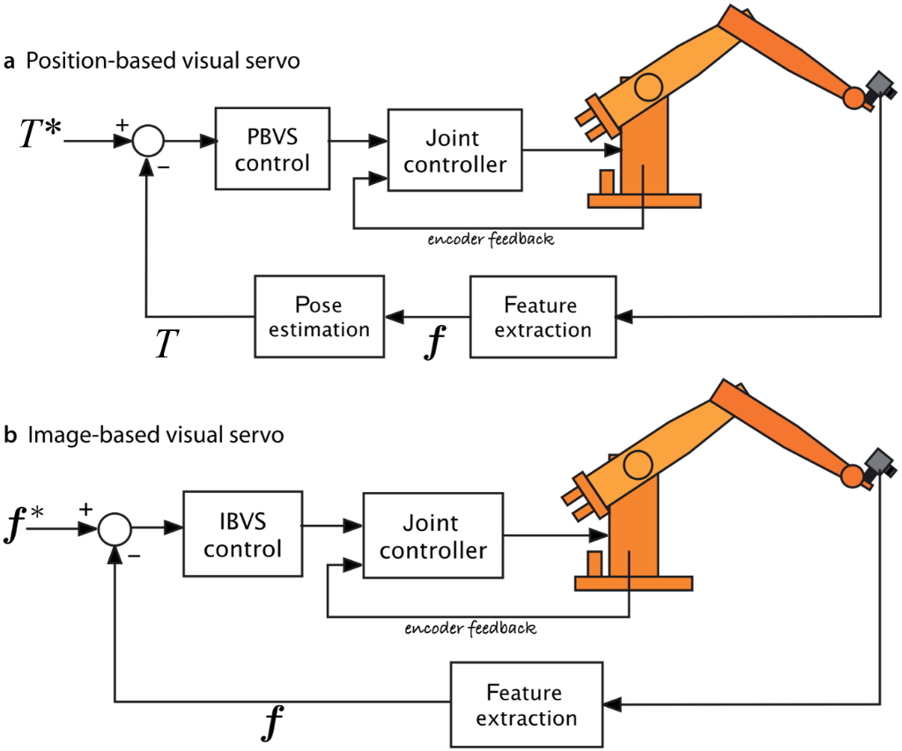
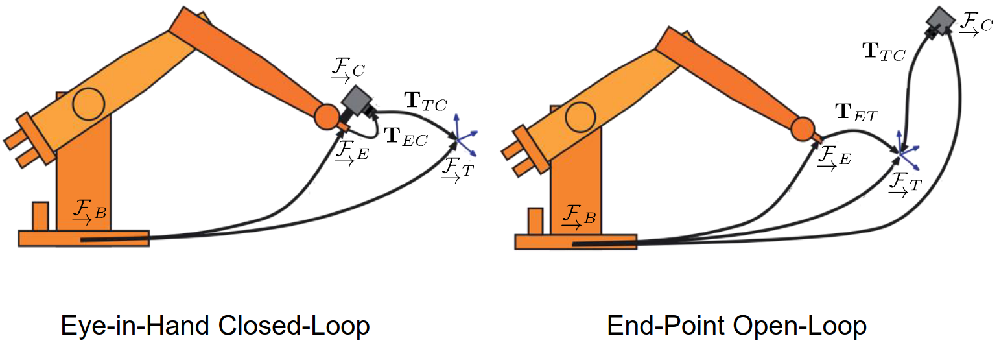
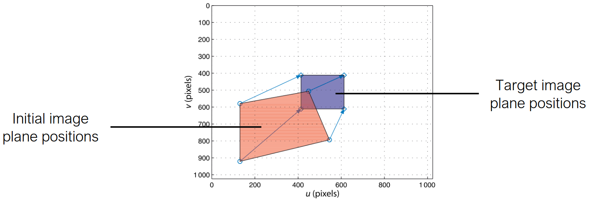
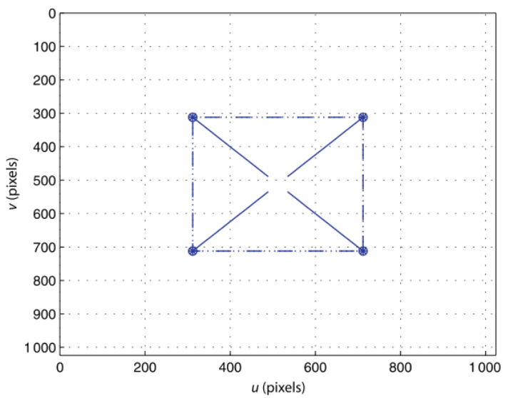
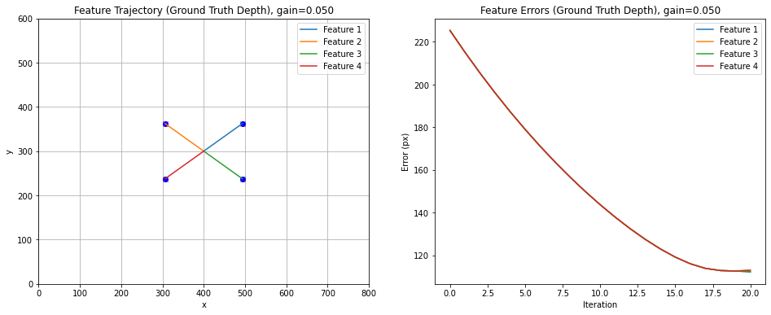

# Lecture 18, Nov 11, 2025

## Visual Servoing

{width=70%}

* A *servo mechanism* in general is a device that controls itself to drive to a desired position, by minimizing the error
* *Visual servoing* is the problem of controlling a robot (usually a manipulator) relative to a target of interest, by tracking visual features of the target
	* The camera can be mounted either on the robot (*eye-in-hand*) or mounted at a fixed external point
* Two different approaches:
	* *Position-based visual servoing* uses known calibration and target geometry to estimate target pose, and controls the robot in task space (e.g. $SE(3)$) to move to a desired pose
	* *Image-based visual servoing* operates directly using feature correspondences on the image, and controls the robot in image space to align the image features to desired locations
* In visual servoing we want to make incremental steps; one problem with the eye-in-hand configuration is that if we move too much, we may end up in a position where the target is not visible

### Position-Based Visual Servoing

* For PBVS, we need to know the 3D positions of the feature points on the target and the camera intrinsics
* We want to drive the end-effector pose to some $\bm T_{TE}^*$ relative to the target
* Estimate the current pose of the target in the camera frame using camera pose estimation; then we minimize the error function $\bm e_i = \bm x_i - \bm f(\bm p_i; \bm C, \bm t, \bm K)$
	* This is commonly done with fiducial markers like ArUco or AprilTag
* The target motion can be estimated using filtering approaches such as Kalman filtering or particle filtering, either in an inertial frame or a frame relative to the moving camera
* The controller can take one of two approaches:
	* *End-point open-loop*: Using inverse kinematics to move the arm directly to the desired location (often used for external camera)
	* *Eye-in-hand closed-loop*: Setting the end-effector velocity based on pose error
* PBVS requires that the depth/scale be known; this can be approximated, or we can lock in a scale on initialization
	* The depth can be estimated using the apparent size of the target, since we know the actual target size
* There is no direct constraint to keep the target within the camera FoV
	* Can be addressed with finite horizon planning and numerical optimization

{width=80%}

### Image-Based Visual Servoing

{width=90%}

* In IBVS, the target pose is not explicitly computed; we instead directly track the image feature positions in image space
	* We assume that we have correspondences
	* Applies to the eye-in-hand case
* *Uncalibrated visual servoing* is when we don't have the intrinsic calibration or only know it approximately
	* This is still possible since we only care about the visual appearance, but we won't explore it here
* The control problem is formulated in the image space to align observed and desired image feature locations; usually a linear controller is used
* By differentiating the forward camera model, we can obtain the Jacobian:
	* $\dot{\bm p} = \cvec{\dot u}{\dot v} = \mat{\mrow{-\frac{f}{Z}}{0}{\frac{u}{Z}}{\frac{uv}{f}}{-\frac{f^2 + u^2}{f}}{v}\mrow{0}{-\frac{f}{Z}}{\frac{v}{Z}}{\frac{f^2 + v^2}{f}}{-\frac{uv}{f}}{-u}}\cvec{v_x}{v_y}{v_z}{\omega _x}{\omega _y}{\omega _z} = \bm J_p\bm\nu$
	* This relates movements in Euclidean space to movements in image space
* Now we can stack the equations for at least 3 points and invert the stacked Jacobian (or use pseudoinverse) to solve for the desired camera motion
	* $\cvec{\dot{\bm p}_1}{\vdots}{\dot{\bm p}_n} = \cvec{\bm J_{p_1}}{\vdots}{\bm J_{p_n}}\bm\nu$
	* Note if the points are collinear, the Jacobian ends up being singular
* Given the desired locations for the feature points, $\bm p_i^d$, we can now compute the camera velocity that we need to command:
	* $\bm\nu = \lambda\cvec{\bm J_{p_1}}{\vdots}{\bm J_{p_n}}^\dagger\cvec{\bm p_1^d - \bm p_1}{\vdots}{\bm p_n^d - \bm p^n}$
	* This is a proportional controller, with $\lambda$ as the gain
* Note calculating the Jacobian requires knowledge of the depth, which we can estimate; the algorithm is typically very tolerant of depth errors
	* We can also use stereo, which would also enable PBVS
* Like in eye-in-hand PBVS, this also has no explicit constraint to keep the target within FoV
* Since the camera motion is calculated implicitly from the desired movement of feature points, IBVS can fail to converge for some cases where there is ambiguity
	* e.g. if we rotate the camera by $\pi$ for a rectangle, the desired trajectory of all image points will pass through the origin, so instead of rotating, the controller will actually move the camera further back; all feature points will end up converging at the origin as the camera moves further away, and the controller never converges

{width=40%}

{width=90%}

