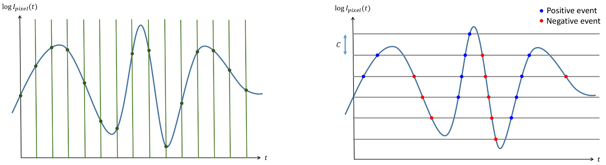
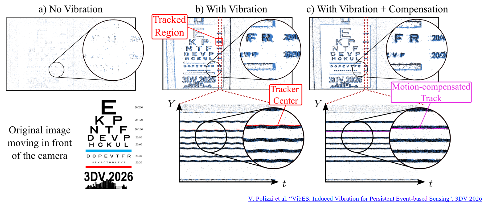
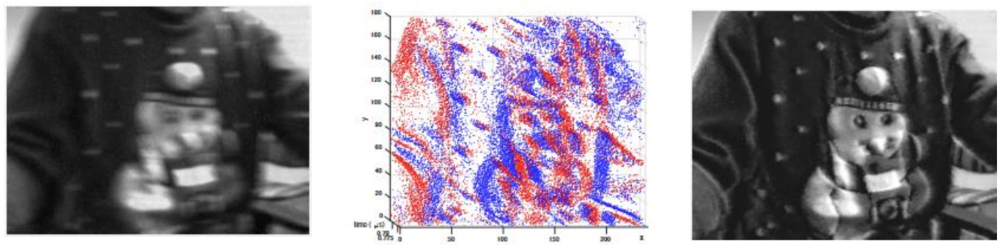

# Lecture 19, Nov 19, 2025

## Advances in Imaging: New Sensors and Systems

* How do we get depth information?
	* Stereo camera setup (e.g. Intel RealSense, which also uses lasers)
		* The range is limited by the baseline -- too close and we cannot find correspondences, too far and the disparity will be too small, and a tiny disparity error will translate to a huge depth error
	* Structured light (e.g. Kinect)
		* A projector projects a pattern of points onto the scene, and a camera observes the pattern and uses the warping of the pattern to estimate depth
	* Time-of-flight (ToF) sensors and LiDARs
	* Comparing images taken with different focal lengths
	* Neural network monocular depth estimation
* RGB-D cameras return colour values and a depth value for each pixel
	* Depth is typically returned as inverse depth or disparity map which is often better for numeric accuracy
* In addition to depth, normal cameras also suffer from other effects
	* Limited dynamic range, i.e. range of brightness intensities that it can measure in one image
		* Typically measured as the ratio of the most intense measurable brightness divided by the least intense brightness in decibels
		* Standard cameras usually have a dynamic range around 60 decibels
	* Motion blur from objects moving faster than the exposure time can handle
		* Typically limited to 100 to 1000 fps
	* Inefficient bandwidth use -- even when the scene is not changing we still need to use bandwidth

### Event Cameras

* *Event cameras* instead measure light intensity variations in the scene
	* They have much higher dynamic range (140 dB), very low latency (1 MHz), low bandwidth use, and very low power consumption
* The output of an event camera is an *event*, a tuple containing the time, pixel location, and *polarity*, i.e. the sign of the intensity change, whether the pixel got brighter or darker
	* More precisely, if the log intensity of a pixel changes by more than some threshold $C$, we emit an event
	* When there is no change, the camera does not output anything
	* Each pixel is asynchronous, i.e. it can trigger independently of all others, and up to once per microsecond

{width=100%}

* The asynchronous pixels of the event camera is similar to how the human eye works; we don't have enough nerves to transmit signals from all the cone cells all the time, so all the cones are asynchronous like in an event camera
* The event camera uses a generative event model
	* When $L(x, y, t + \Delta t) - L(x, y, t) = \pm C$ where $L(x, y, t) = \log I(x, y, t)$, we get an event
* Consider a point moving with velocity $(u, v)$, then it moves from $(x, y) \to (x + u, y + v)$; we can once again make the brightness constancy assumption as we did for optical flow, $L(x, y, t) = L(x + u, y + v, t + \Delta t)$
	* First-order Taylor approximation: $L(x + u, y + v, t + \Delta t) = L(x, y, t + \Delta t) + \pdiff{L}{x}u + \pdiff{L}{y}v$
	* Taking the difference, $L(x, y, t) - L(x, y, t + \Delta t) = \pdiff{L}{x}u + \pdiff{L}{y}v$
	* We can express the generative model as $-\pdiff{L}{x}u - \pdiff{L}{y}v = \pm C \implies -\Delta L \cdot \bm u = \pm C$
		* Physically, we can interpret this as saying that we get the most events the movement of a point aligns with the gradient
		* This means that events are triggered along the edges in the image, when the movement is perpendicular to the edge
* Since the event camera does not emit when there is no motion, to get a continuous stream we can explicitly induce vibrations using mechanical movement
	* This gives us continuous images where we can see the edges of objects
	* Since we know the vibration induced, we can explicitly compensate for it to get a stable image

{width=100%}

* The DAVIS sensor combines both events and frames, so the events give us information between frames
	* This information can be used to de-blur images (Qualcomm and Prophesee)
	* Motion blur is caused by the "summing of frames", and event cameras give us the change between frames; this means that if we "integrate" the events, we can subtract it from the final image and remove the effect of summing the extra frames, removing blur

{width=100%}

* We can also use networks such as E2VID to reconstruct scenes from event cameras

### Thermal Cameras

* Thermal cameras capture the infrared spectrum instead of visible light, which is emitted by warm objects
* This means we can see with no light (since objects emit their own light), and even see through smoke, fog, etc, and determine the temperature of objects
* Thermal cameras are not photometrically consistent over time
	* They can heat up themselves, which generates artifacts across time
	* The imaging sensors have non-uniform responses
	* There can be spatial artifacts
	* This breaks some systems since we made the brightness constancy assumption, which no longer holds
	* There are methods for photometric calibration to remove the artifacts and make the images more consistent
* The Luxonis OAK-T is an example combining thermal and normal imagery
* In low-light conditions, we can extract way more features from thermal imagery than visual imagery, so thermal cameras can be good for state estimation and localization

