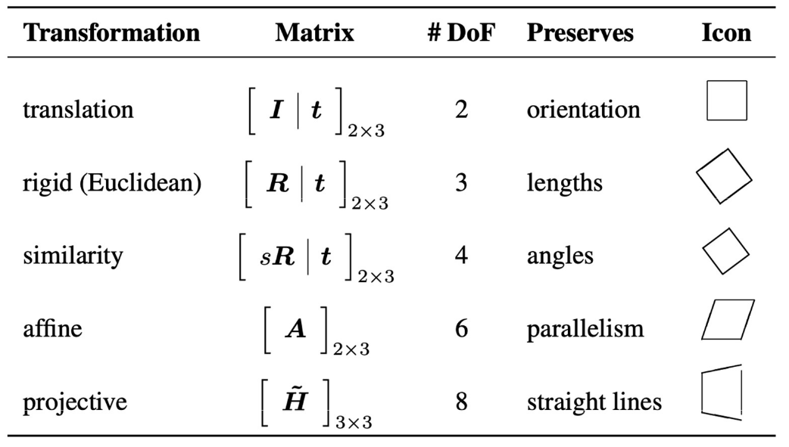
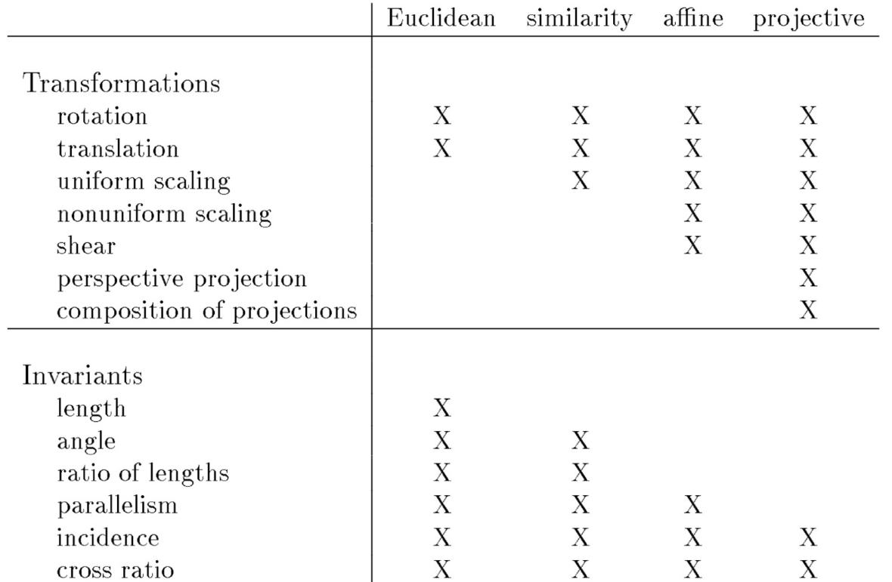

# Lecture 2, Sep 5, 2025

## Mathematical Fundamentals of Vision

* We need to reason over both the *geometric* (points, lines, shapes) and *photometric* (brightness, contrast, texture, shading) aspects of the scene, which are closely intertwined
* We will use $\vcx{F}_v$ to denote frame $v$ (vectrix notation) and column vectors like $\bm x = \cvec{x}{y}$

### 2D Transformations

* Points may also be represented in *homogeneous form*: $\tilde{\bm x} = (\tilde x, \tilde y, \tilde w) \in \mathbb{P}^2$
	* $\mathbb P^2 = \reals^3 \backslash (0, 0, 0)$ is a *projective space*
	* This can be converted back to an inhomogeneous vector by dividing by $\tilde w$: $\tilde{\bm x} = \tilde w(x, y, 1) = \tilde w\bar{\bm x}$
	* $\bar{\bm x} = (x, y, 1)$ is the *augmented vector* (note the bar), with a canonical scale of 1
	* $\tilde w = 0$ represent *points at infinity* (aka *ideal points*); hence $(0, 0, 0)$ is undefined and excluded from $\mathbb P^2$
* Projective geometry allows us to represent and manipulate objects at infinity, which is necessary for cameras
	* Since they are homogeneous (not affected by scalar multiplication), $\mathbb P^2$ is topologically equivalent to the unit sphere
* $\tilde{\bm l} = (a, b, c)$ represents the line $\bar{\bm x}\cdot \tilde{\bm l} = ax + by + c = 0$ in 2D
	* This can be normalized to $\bm l = (\hat n_x, \hat n_y, d) = (\hat{\bm n}, d)$ where $\hat{\bm n}$ is the unit normal vector and $d$ is the distance to origin
	* The intersection of two lines can be found by taking their cross product
* Define the *skew-symmetric form* $\skewsym{\bm u} = \matthreeb{0}{-u_3}{u_2}{u_3}{0}{-u_1}{-u_2}{u_1}{0}$
	* This is skew-symmetric, i.e. $\skewsym{\bm u}^T = -\skewsym{\bm u}$
	* This allows us to write the cross product as $\skewsym{\bm u}\bm v = \cvec{u_2v_3 - v_2u_3}{u_3v_1 - v_3u_1}{u_1v_2 - v_1u_2}$
* A rigid transformation can be represented as $\bm x' = \rvec{\bm C}{\bm t}\bar{\bm x}$ where $\bm C$ is a rotation matrix, $\bm t$ is a translation vector
	* Note $\det\bm C = 1$ and $\bm C\bm C^T = \bm C^T\bm C = \bm I$
	* We are rotating the vector while keeping the reference frame constant, instead of the other way around
* An *affine transformation* is $\bm x' = \bm A\bar{\bm x}$ where $\bm A \in \reals^{2 \times 3}$
	* Important to note parallel lines remain parallel after an affine transformation
	* This has 6 degrees of freedom
* A *projective transformation* or *homography* is $\tilde{\bm x}' = \tilde{\bm H}\tilde{\bm x}$
	* Straight lines remain straight, but parallel lines may not be parallel after the transformation
	* This has 8 degrees of freedom: $\tilde{\bm H} \in \reals^{3 \times 3}$ (note below)
	* Note $\tilde{\bm H}$ is also *homogeneous*, i.e. defined up to scale only
		* This is similar to homogeneous coordinates; if we multiply all 3 components by some scalar, we get the same point back just represented differently

{width=60%}

### 3D Transformations

* Rotations preserve the length and orientating (handedness) of space
* Rotations have the following properties: let $a, b, c$ be rotations, then:
	* Closure: $a \circ b$ is a rotation
	* Associativity: $(a \circ b) \circ c = a \circ (b \circ c)$
	* Invertibility: each rotation has a unique inverse rotation
	* Identity: the identity map is a rotation
* Therefore rotations form a *group* under composition; this is the *rotation group* or *special orthogonal group* on $\reals^3$, denoted $SO(3)$
* Rotations can be represented by matrices, Euler angles, axis/angle or quaternions
	* Euler angles decomposes rotations into the product of 3 elementary rotations about individual frame axes
		* Due to different orders, there are 12 possible rotation sequences
		* Suffers from gimbal lock
	* Axis-angle expresses rotations as angle $\theta$ around a unit vector $\hat{\bm n}$
		* Note only the perpendicular component rotates
		* *Rodriguez formula*: $\bm C(\hat{\bm n}, \theta) = \bm I_3 + \sin\theta\skewsym{\hat{\bm n}} + (1 - \cos\theta)\skewsym{\hat{\bm n}}^2$
			* This can be derived by decomposing the vector into parallel and perpendicular components and rotating the perpendicular component
	* Quaternions are hyper-complex numbers that take the form $\bm q = q_0 + q_1\ihat + q_2\jhat + q_3\khat$
		* $i^2 = j^2 = k^2 = ijk = -1$
		* $ij = k, jk = i, ki = j, ji = -k, kj = -i, ik = -j$
			* Note $i, j, k$ do not commute
		* The set of quaternions is denoted $\mathbb H$ and form a 4D non-commutative division algebra
		* Unit quaternions satisfy $\norm{\bm q}^2 = q_0^2 + q_1^2 + q_2^2 + q_3^2 = 1$ and can be mapped to rotations
		* They have a direct relationship with the axis angle form: $\bm q = \cvec{q_0}{\bm{\mathrm q}} = \cvec{\cos(\theta/2)}{\hat{\bm u}\sin(\theta / 2)}$
			* Using Rodriguez's formula, we have $\bm C = \bm I_3 + 2q_0\skewsym{\bm{\mathrm{q}}} + 2\skewsym{\bm{\mathrm q}}^2$
			* Explicit form: $\bm C(\bm q) = \matthreeb{1 - 2q_2^2 - 2q_3^2}{2q_1q_2 - 2q_0q_3}{2q_0q_2 + 2q_1q_3}{2q_0q_3 + 2q_1q_2}{1 - 2q_1^2 - 2q_3^2}{2q_2q_3 - 2q_0q_1}{2q_1q_3 - 2q_0q_2}{2q_0q_1 + 2q_2q_3}{1 - 2q_1^2 - 2q_2^2}$
		* To compose two rotations represented as quaternions, we can multiply them, following the rules of quaternion multiplication (denoted $\otimes$)
			* $\alignedeqntwo[t]{\bm p \otimes \bm q}{(p_0 + \bm{\mathrm p}) \otimes (q_0 + \bm{\mathrm q})}{p_0q_0 - \bm{\mathrm p}^T\bm{\mathrm q} + p_0\bm{\mathrm q} + q_0\bm{\mathrm p} + \bm{\mathrm p} \times \bm{\mathrm q}}$
			* Note order matters!
* In 3D, rigid transformations take the same form of $\bm x' = \rvec{\bm C}{\bm t}\bar{\bm x}$
* Affine transformations are analogous but $\bm A \in \reals^{3 \times 4}$
* Projective transformations now use $\tilde{\bm H} \in \reals^{4 \times 4}$

{width=%}

