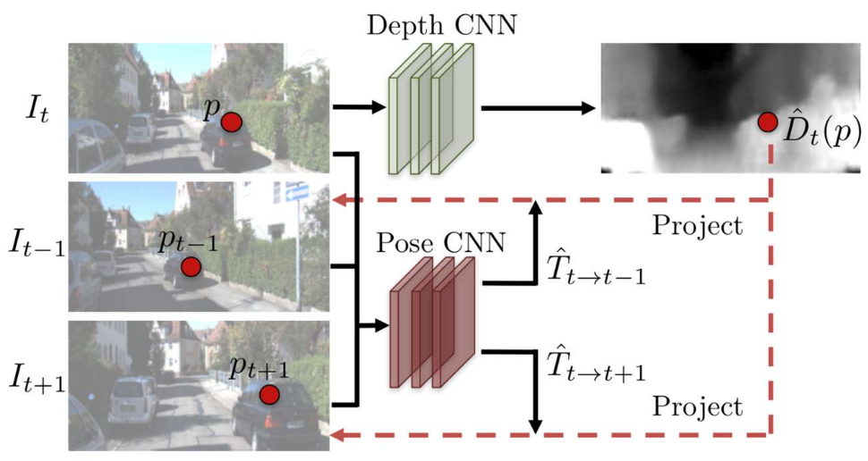
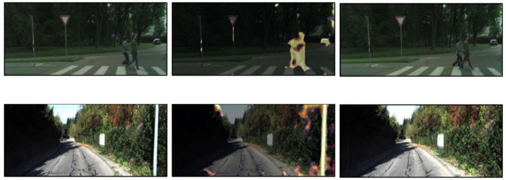
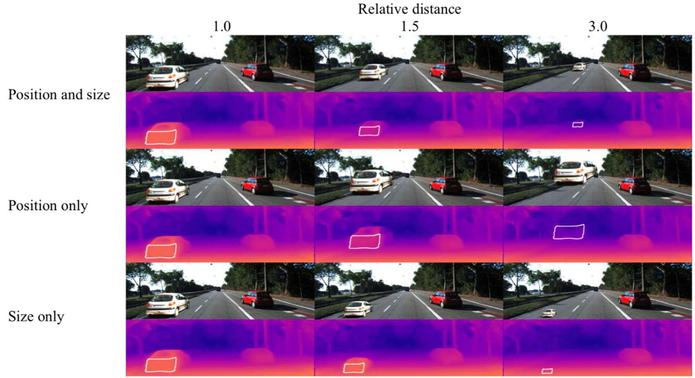

# Lecture 20, Nov 18, 2025

## Deep Learning for SfM and Localization

* *PoseNet* is a CNN for 6-DoF camera relocalization from a single image, i.e. identifying where you are in a scene
	* This solves the *kidnapped robot problem*, i.e. trying to relocalize a robot with no prior information about how it moved
	* Represents pose with position vector and orientation quaternion
	* Uses a geometric loss: $\mathcal L(I) = \norm{\hat{\bm x} - \bm x} + \beta\norm*{\hat{\bm q} - \frac{\bm q}{\norm{\bm q}}}$
		* $\hat{\bm x}, \hat{\bm q}$ are the ground-truth position and orientation quaternion, and the non-hat variables are the network predictions
		* $\beta$ balances rotation and translation error, which needs to be tuned for each dataset
		* Later work showed that $\beta$ could be learned or selected based on pose uncertainty
	* Architecture based on GoogLeNet, containing 6 inception modules, with fully connected regression layers instead of classification
	* Can visualize the parts of the image that the network pays attention to with a saliency map, which shows that the network pays attention to distinctive feature points (similar to feature detectors) and large textureless regions, and ignore dynamic objects like pedestrians
	* Capable of relocalizing within 2 m and 3 degrees for very large scenes spanning 50,000 square metres
		* An order of magnitude worse than classical methods, but faster and with less memory; instead of a large growing map, PoseNet compresses it all into a fixed-size network
			* We'd need to refine the pose with classical methods if we want to make it useable
		* The challenge is that the network is directly regressing a 7D vector from individual images, so it cannot impose consistency between images in a pose sequence
		* PoseNet is essentially just interpolating between poses in the training data, so it works more like image retrieval than actual camera pose estimation
* SfMLearner uses photometric loss for unsupervised learning, to predict depth of an image (monocular depth prediction) and relative pose difference between a pair of images (visual odometry)
	* During training, it attempts to recreate the next image in the sequence
	* We use the depth CNN to predict depth for the current image, and use the depth info along with predictions from the pose CNN to warp the current image to predict the next image, then minimize a photometric loss between the prediction and the true next image
	* It also learns an "explainability mask", which identifies regions of the image that should not be used for VO (e.g. dynamic objects, occlusions, reflective surfaces, etc)
		* Pixels that are masked have their importance decreased or ignored when computing the photometric loss
		* To prevent the mask from just being driven to zero everywhere, add a regularization term that encourages nonzero terms
		* Use another regularization term that encourages smoothness (i.e. penalizes second order gradients) to get geometrically plausible masks
	* Uses a U-Net architecture similar to segmentation networks for depth
		* Pose predictions and explainability mask are produced by parts of the same network; pose is taken with some fully connected layers at the bottleneck while explainability is taken at the later layers
	* Depth map can hallucinate objects, e.g. predicting car shapes where there are none due to the dataset typically having cars in a scene

{width=60%}

{width=90%}

* Single-image depth prediction networks tend to rely on the vertical position of an object to estimate depth, since it learns to associate objects that are higher with being further away due to the structure of the dataset
	* They can generalize to unseen objects, but only if the objects have shadows under them

{width=100%}

* Often best results can be achieved by fusing classical and learning based approaches, for which there are 3 general approaches:
	* Correction: Use classical techniques to estimate a solution, then use a learning based method to apply a correction
		* e.g. correcting systematic bias in pose estimation resulting from parameter errors
	* Augmentation: Using learning based methods to get additional information, then using a classical method to predict the solution with the extra information
		* e.g. estimating sun direction to limit orientation error
	* Initialization: Using learning methods to get an initial guess for the solution, then using classical methods to refine the solution accuracy
		* e.g. using PoseNet for initializing, then normal feature matching to get an accurate solution
* *Sun-BCNN* is an example of the augmentation approach; the network learn to predict the sun direction from an image, which can be fed to correct orientation errors in visual odometry, so we don't need a dedicated sun sensor
	* Orientation errors cause VO error to grow super-linearly, compared to just linear growth if orientation is corrected
	* Uses cues such as shadows, lighting, reflections, etc
		* Saliency maps shows that the network pays attention to the sky, well-lit regions, and shadows
	* Uses a Bayesian GoogLeNet, regressing a 3D vector and an uncertainty estimate, which can be used to fuse the sun orientation only when the network is certain
	* Used a cosine distance loss $\mathcal L = 1 - \hat{\bm s}_k \cdot \bm s_k$

