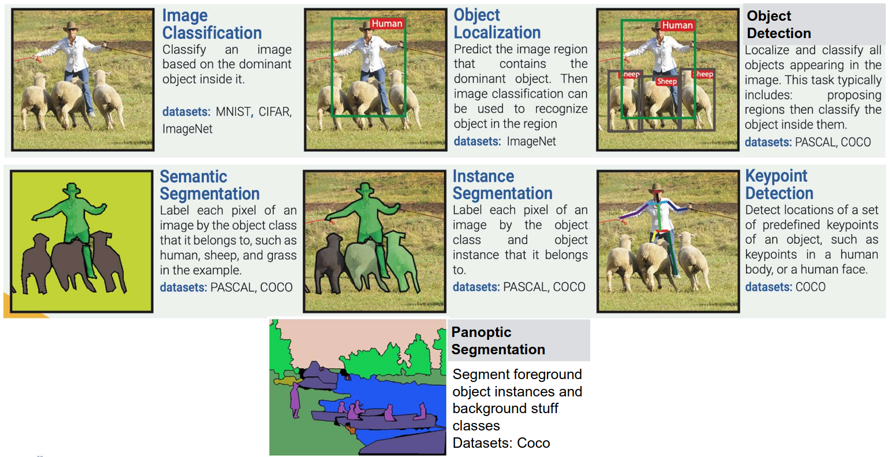
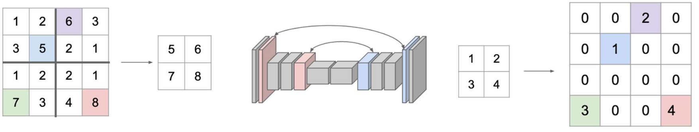
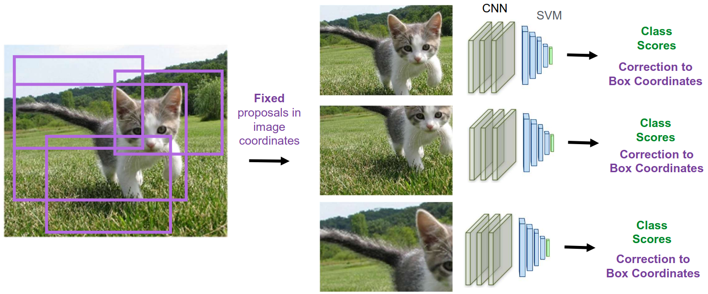
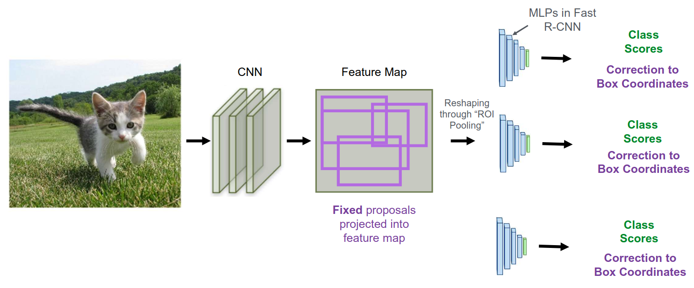
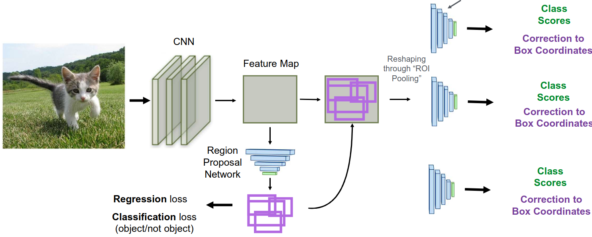
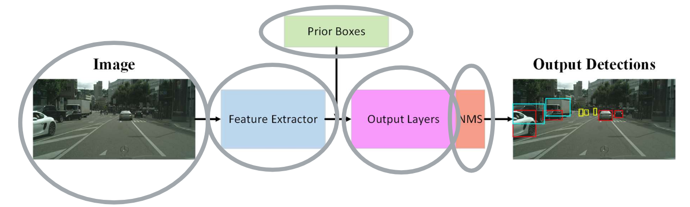
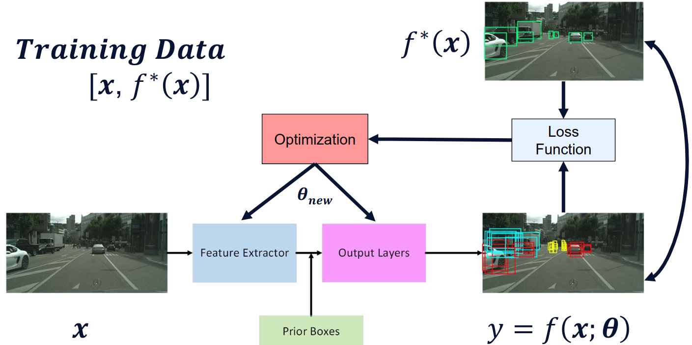
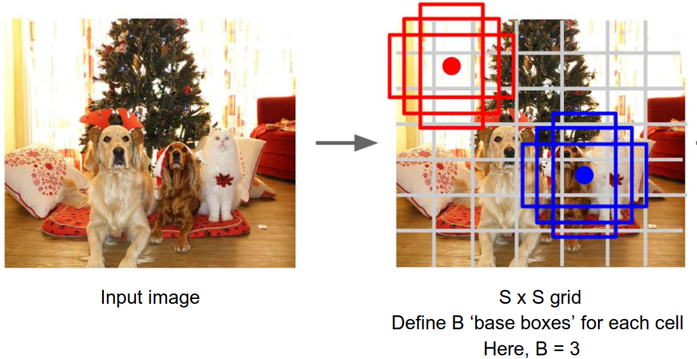

# Lecture 21, Nov 21, 2025

## Deep Learning for Computer Vision Tasks

{width=100%}

* A variety of tasks in computer vision:
	* Image classification: classify an object based on the dominant object inside it
	* Object localization: predict the image region that contains the dominant object
	* Object detection: localize and classify all objects in the image
	* Semantic segmentation: label each pixel in the image by the object class it belongs to
	* Instance segmentation: label each pixel of an image by the object class and instance it belongs to
	* Panoptic segmentation: combining semantic and instance segmentation to label both foreground object instances and background "stuff"
	* Keypoint detection: detect locations of a set of predefined keypoints of an object, e.g. points on a human body or face
* COCO (Common Objects in Context) is a large-scale object detection, segmentation, and captioning dataset
* Many segmentation networks use the SegNet shape where we have downsampling and then upsampling convolutions, with a bottleneck layer in the middle
	* The simplest upsampling method is nearest neighbours, which replaces each cell with the value of its nearest neighbour, or "bed of nails", where all cells without a value are replaced with zero
	* *Max-unpooling* is a technique where during the max pooling downsampling we remember which indices had the max value, then using a bed of nails unpooling with these indices
	* *Learnable upsampling* (aka upconvolution or transposed convolution) uses a kernel, which is multiplied by the input value and summed in the output, giving weighted copies of the filter
		* The parameters of the kernel are learnable, hence the name

{width=100%}

{width=50%}

### Object Localization and Detection

* Image classification has long been a solved problem, but how do we move from classification to localization and recognition?
* Object localization outputs a *bounding box proposal*, which is a rectangular image region that potentially contains the object
	* Usually represented as a vector $(x, y, w, h)$ along with a confidence score
	* To measure accuracy, we can use the $L2$ distance of the vectors, or more commonly use the *Intersection over Union* (IoU)
	* To remove duplicates, we can use non-maximum suppression, by thresholding by IoU and pick the highest confidence box
* To train an object localization network, we use a multitask loss consisting of the sum of the classification loss and bounding box regression loss
* For object detection, we need to detect all instances of objects, which we can do through region proposal methods
* The first approaches were the R-CNN family
	* In the original R-CNN, a proposal algorithm identifies potential regions of the image that can contain an object; we crop the image to each one of the regions, use a CNN and SVM to calculate the class scores and a correction to the box coordinates
		* This is slow because we need to run it for each proposal region
	* Fast R-CNN learns a feature map for the entire image -- we pass the whole image through a CNN to get a feature map, and do the same proposal + crop process on the feature map, so that we don't have to redo the CNN for each region
	* Faster R-CNN uses a neural network for the proposal as well -- the feature map is passed to a region proposal network, which predicts a number of proposals, where we take the top predictions and run the same crop + detection process

{width=80%}

{width=80%}

{width=80%}

{width=70%}

* This gave rise to a standard architecture, where the image is passed through a feature extractor, then prior boxes are used to crop each region, which is passed through output layers, and finally non-maximum suppression for the output
	* Most common extractors were VGG, ResNet, and Inception layers back in the day; nowadays vision transformers are becoming more popular
	* Output layers take a feature vector and outputs a class prediction and regresses a bounding box correction (i.e. a classification and a regression head)
* During training, we evaluate the network output on all region proposals (anchors), instead of just the best ones after NMS

{width=70%}

* Since we evaluate the training on all region proposals, not just the best ones, we end up with a lot more negative examples than positive examples
	* If we have too many background proposals, it'll just learn to classify everything as negative
	* To address this, we choose the "hardest" ones, i.e. the ones where the network's output is right on the threshold for determining positive/negative
	* Usually we take a 3:1 ratio of negative to positive anchors
* To perform NMS, we sort the predictions by confidence score, then starting with the highest confidences, we include each one, then prune out all the remaining boxes that have IoU with the box we just included over a certain threshold
	* This doesn't handle overlaps very well, and introduces another threshold parameter we must tune
	* Make sure to take class labels into account to handle overlapping objects

{width=60%}

* The other detection framework is YOLO (You Only Look Once), where detection is done without proposals
	* The original YOLO used a GoogLeNet structure to predict both bounding box coordinates and class probabilities directly from the whole image
	* Since predictions are made in a single pass, single-shot approaches run much faster than region proposal-based approaches, and can run accurately in real time
	* YOLO breaks the image into an $S \times S$ grid, where each grid cell predicts $B$ possible bounding boxes and confidences, and $C$ class probabilities (including the background class)
		* This results in $S \times S \times (5B + C)$ total output values, since each bounding box + confidence consists of 5 values
		* To get the final output, the bounding box confidence is multiplied by the class probability
		* For each class the boxes with the highest combined confidence is taken, and NMS is applied to eliminate duplicates as usual
* In general, Faster R-CNN gives better accuracies but is much slower than YOLO

