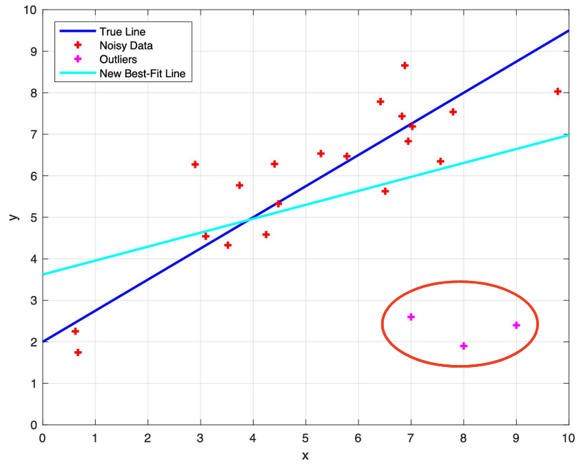
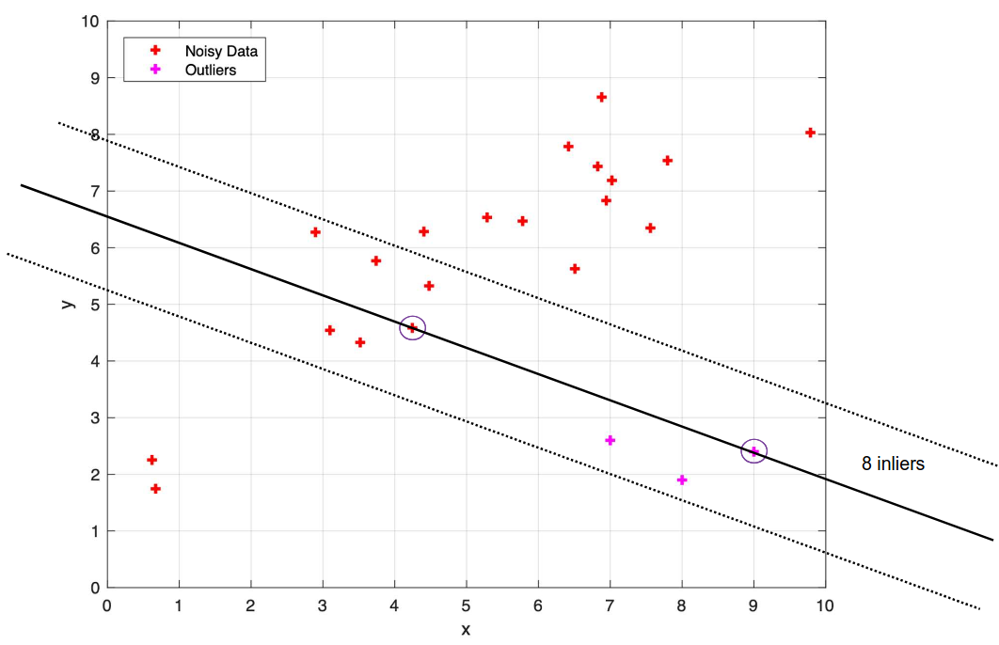
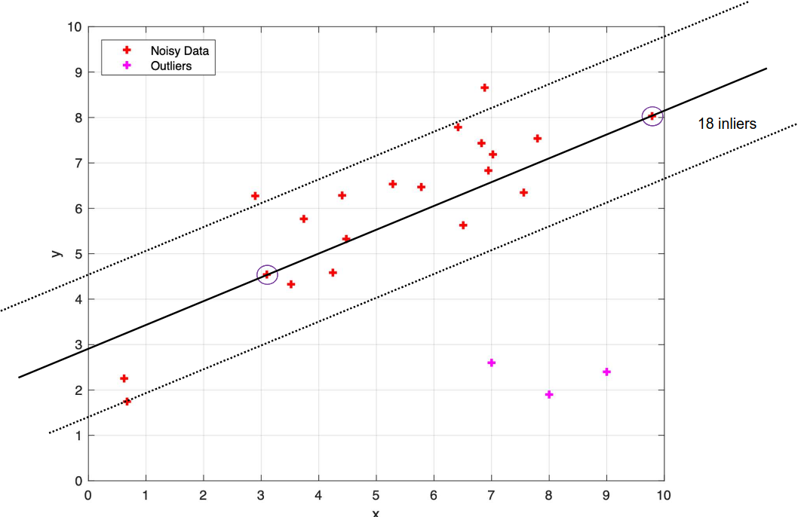

# Lecture 3, Sep 9, 2025

## Probability Theory Review

* A random variable $X$ is a variable whose value $x$ may vary due to randomness
	* For *probability density function* (PDF) $p(x)$ we have $\int _x p(x)\,\dx = 1$
	* $\int _a^b p(x)\,\dx$ is the probability of $x \in [a, b]$
* For joint distributions $p(x, y)$ we can find the *marginal distribution* by integrating over one or more variables (marginalization): $p(x) = \int p(x, y)\,\dy$
* A *conditional probability* is given by $p(x | y = y^*) = p(x | y) = \frac{p(x, y)}{p(y)} \iff p(x, y) = p(x | y)p(y)$
* This leads to *Bayes' rule*: $p(y | x) = \frac{p(x | y)p(y)}{p(x)}$
	* $p(y | x)$ is *posterior*
	* $p(y)$ is the *prior*
	* $p(x | y)$ is the *likelihood*
	* $p(x)$ is the *evidence*
	* e.g. if $y$ is some robot state and $x$ is a sensor measurement, we have that the probability of being in a state given that we have some measurement is equal to the probability of getting the measurement if we are in that state, times the previous belief of our probability of being in that state, divided by the probability of getting the measurement in general
* The *expectation* of $f(x)$ is $\bm E[f(x)] = \sum _x f(x)p(x)$ (discrete) or $\int _x f(x)p(x)\,\dx$ (continuous)
	* Note the expectation is a linear operator
* The *Gaussian/normal distribution*: $x \sim \mathcal N(\mu, \sigma^2) = \frac{1}{\sqrt{2\pi\sigma^2}}e^{-\frac{(x - \mu)^2}{2\sigma^2}}$ for mean $\mu$, standard deviation $\sigma$
	* In higher dimensions: $\bm x \sim \mathcal N(\bm\mu, \bm\Sigma) = 2\pi^{-\frac{n}{2}}\det\bm\Sigma^{-\frac{1}{2}}e^{-\frac{1}{2}(\bm x - \bm\mu)^T\bm\Sigma^{-1}(\bm x - \bm\mu)}$ for an $n$-dimensional Gaussian
* Often the PDF for a random variable is very complex, so to represent it in code we approximate it by one of many methods (e.g. single Gaussian for unimodal data, mixture of Gaussians for multimodal data, histogram, particle distribution for arbitrary distributions)

## Estimation Techniques

* Consider the linear regression problem, where we are given a number of noisy points $(x_i, y_i)$, and we want to fit our model $y_i = f(x_i; \bm\theta) = mx_i + b$ where $\bm\theta = (m, b)$ is the vector of parameters we wish to determine
* We want to minimize $E_{LS} = \sum _i \norm{\tilde y_i - f(x_i; \bm\theta)}^2 = \sum _i \norm{\tilde y_i - (mx_i + b)}^2$
	* $\tilde y_i$ are the measurements and $r_i = \tilde y_i - (mx_i + b)$ are the residuals
* In matrix form, $y = \rvec{x}{1}\cvec{m}{b} = \bm J(x)\bm\theta$ where $\bm J(x) = \pdiff{f(x; \bm\theta)}{\bm\theta}$ is the model Jacobian with respect to the parameters (this is possible since we have a linear model)
	* Substitute and expand: $E_{LS} = \bm\theta^T\left[\sum _i \bm J^T(x_i)\bm J(x_i)\right]\bm\theta - 2\bm\theta^T\left[\sum _i\bm J^T(x)\tilde y_i\right] + \sum _i \tilde y_i^2$
	* Since $\sum _i \tilde y_i^2$ is constant, we minimize the other part
	* By differentiation we get $\hat{\bm \theta} = \left[\sum _i\bm J^T(x_i)\bm J(x_i)\right]^{-1}\left[\sum _i \bm J^T(x_i)\tilde y_i\right]$ (*normal equation*)
* If data points are weighted differently, we change the loss to $E_{WLS} = \sum _i \sigma _i^{-2}\norm{r_i}^2$
	* This is known as the *Mahalanobis distance*
* But notice due to the quadratic cost function, this method is sensitive to outliers; the model is distorted significantly to account for just a few outliers

{width=60%}

### RANSAC

* *RANSAC* or *Random Sample Consensus* is a method for outlier rejection:
	1. Determine the smallest number of data points required to fit the model
		* In the linear regression case, we have 2 points for a line
	2. Draw the smallest possible subset to fit the model
		* Usually this is drawn by uniform sampling, unless we have a prior
	3. Check the number of points in the whole dataset that are within some threshold of the model prediction -- these are the inliers
	4. If we have enough points within the threshold, terminate
		* At this point we can re-fit the model to the inliers for better generalization/noise resistance
	5. Otherwise repeat from step 2 to generate a new hypothesis until we reached the max number of iterations

{width=80%}

{width=80%}

* RANSAC requires 2 parameters: the error tolerance for model compatibility, the max number of subsets to try, and the threshold for the number of inliers for a success
* Let $w$ be the probability of drawing an inlier, then we can model the expected number of trials $k$ needed to select $n$ good data points
	* Let $b = w^n$ be the probability of getting only inliers for our model, and $a = 1 - b$
	* $\alignedeqntwo[t]{\bm E[k]}{b + 2(1 - b)b + 3(1 - b)^2b + \cdots + i(1 - b)^{i - 1}b + \cdots}{b(1 + 2a + 3a^2 + \cdots + ia^{i - 1} + \cdots)}{b\sum _{i = 1}^\infty ia^{i - 1}}{\frac{1}{b}}{w^{-n}}$
* How many iterations do we need to get at least one good sample with probability $z$?
	* $z = 1 - (1 - w^n)^k = 1 - (1 - b)^k$
	* This gives $k = \frac{\log(1 - z)}{\log(1 - b)}$
	* Now we can substitute in the desired probability to get an outlier-free sample, $z$, and the probability of drawing a good sample $b = w^n$ to get the number of iterations that we should run RANSAC

\noteNote{For RANSAC, we want the subset that we draw to fit the model to contain only inliers and generalize well enough to the rest of the dataset. In most cases this means drawing the minimum number of points to fit the model, since this makes it less likely that we will draw an outlier, decreasing the expected number of required iterations. However, drawing more points has the benefit of reducing noise and numerical sensitivity and risk of degeneracy. Especially in cases where the outlier ratio is known to be low, it may be beneficial to draw non minimal samples sometimes.}

