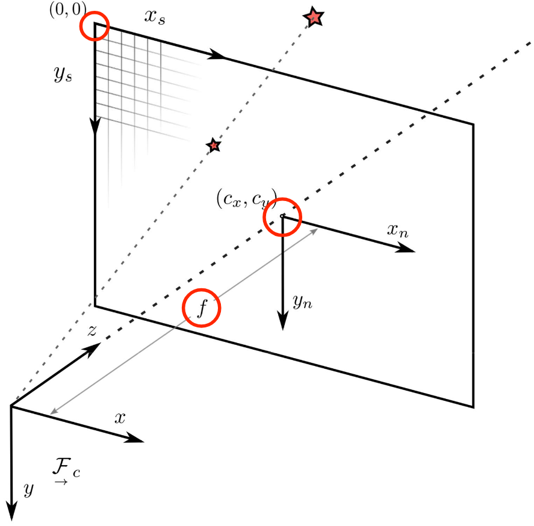
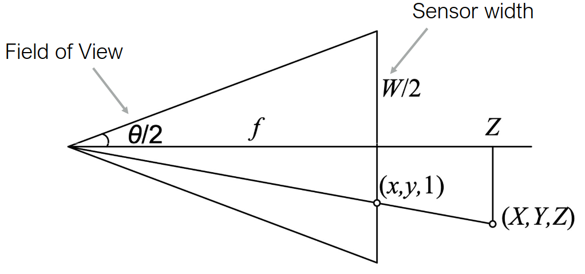
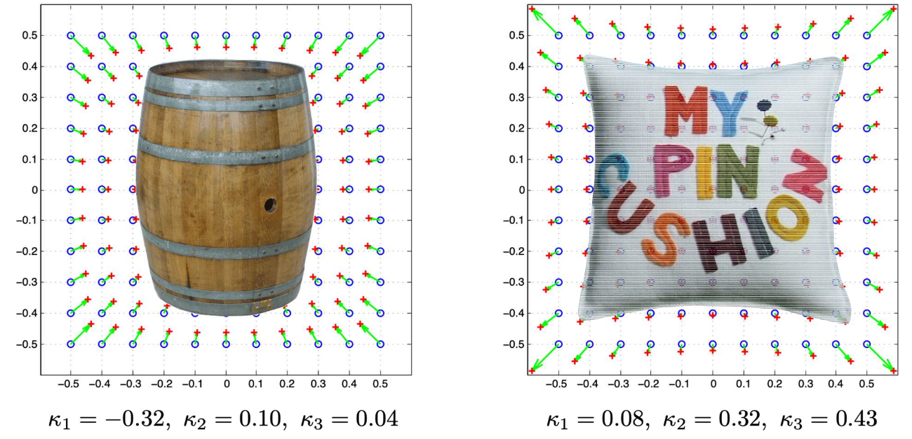
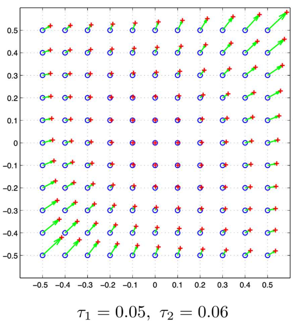
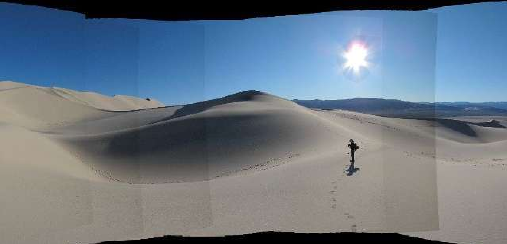

# Lecture 4, Sep 12, 2025

## Image Formation and Optics

* The simplest model is *orthographic projection*, $\bm x = \rvec{\bm I_2}{0}\bm p$, which simply discards the $z$ component
	* This is only an approximation for very long focal lengths (telephoto lens)
	* The *scaled orthographic projection*, $\bm x = \rvec{s\bm I_2}{0}\bm p$ further scales by $s$ to account for differences in coordinate systems
* The ideal perspective/pinhole model assumes a single point aperture, so all light rays intersect at the *optical center*, which is used as the origin of the camera frame
	* The optical axis pierces the image plane at the *principal point*, used as the origin of the image plane (note: not pixel) coordinate system
	* The camera frame is denoted $\vcx{F}_c$
* To project $p = (x, y, z)$ in the camera frame onto the image frame, define the *projective map* $\bar{\bm x} = \mathcal P_z(\bm p) = \cvec{x/z}{y/z}{1}$ which comes from similar triangles
	* This gives us the point's projection in the normalized image plane coordinate system (normalized by focal length)
	
{width=60%}

* To relate actual coordinates to pixel coordinates, we need camera parameters:
	* $(c_x, c_y)$ defines the principal point in pixel coordinates (note top left corner is the origin)
	* The focal lengths $f_x, f_y$, which may be different for the two axes
	* Sometimes, axes are not perfectly aligned, so the skew angle $s$ models this
		* This can often be ignored for modern cameras
* This is organized into the *intrinsic parameter matrix* $\bm K$: $\cvec{x_s}{y_s}{1} = \matthreeb{f_x}{s}{c_x}{0}{f_y}{c_y}{0}{0}{1}\cvec{x/z}{y/z}{1} = \bm K\frac{\bm p}{z}$

{width=50%}

* We can relate the focal length, FoV and sensor width: $\tan\frac{\theta}{2} = \frac{W}{2f}$
* The camera also has *extrinsic parameters* $\bm E$ that describe the relationship between the camera frame and another preferred frame (e.g. the base robot frame)
* Intrinsic and extrinsic parameters can be combined: $\bm P = \bm K\rvec{\bm C}{\bm t}$
	* In matrix form: $\tilde{\bm P} = \mattwo{\bm K}{0}{\bm 0^T}{1}\mattwo{\bm C}{\bm t}{\bm 0^T}{1} = \tilde{\bm K}\bm E$
	* Note we must be very careful that here $\bm E$ is the world frame to camera frame transform (since we are discussing the forward model), not the camera pose in the world frame (which would be the camera-to-world transform)
* This allows us to map the point $\bm p_w = \cvec{x_w}{y_w}{z_w}{1}$ in world coordinates to pixel coordinates by $\tilde{\bm x}_s = \tilde{\bm P}\bar{\bm p}_w$
	* The resulting coordinates must be normalized by dividing by the third element!
	* Note $\bm x_s = \cvec{x_s}{y_s}{1}{d}$, where $d$ is the inverse depth

### Distortion

* Real lenses all have distortion, which displace points from their ideal perspective position (i.e. straight lines are no longer straight)
	* *Radial distortion*: points are displaced radially from the centre of distortion, due to the lens
		* This is the most noticeable
	* *Tangential distortion*: pixels are shifted one direction, with further pixels shifted more, due to the lens and imaging plane not being perfectly parallel
* The most common distortion model is the *plumb bob model*, which uses a polynomial to model the distortion effects; this is a function that maps where the pixels should be to where they would appear due to distortion
	* $\cvec{x_d}{y_d} = \underbrace{(1 + \kappa _1r^2 + \kappa _2r^4 + \kappa _3r^6)\cvec{x_n}{y_n}}_{\text{radial distortion}} + \underbrace{\cvec{2\tau _1x_ny_n + \tau _2(r^2 + 2x_n^2)}_{2\tau_2 x_ny_n + \tau _1(r^2 + 2y_n^2)}}{\text{tangential distortion}}$
		* $r = \sqrt{x_n^2 + y_n^2}$ is the distance from the image center; note all coordinates are in the normalized image plane coordinate system
	* Often $\kappa _1$ and $\kappa _2$ are enough to model the radial distortion, while tangential distortion might be negligible
* For radial distortion, we can have a "barrel" distortion (points pulled out) or "pincushion" distortion (points pushed in), or "mustache" distortion (straight line curves like a mustache)
	* Note for the "barrel" distortion, all pixels are being pushed inward, but the ones on the sides of the barrel are pushed in less; conversely for pincushion all pixels are being pulled out, but the ones on the corners are pulled out more

{width=80%}

{width=40%}

* *Unwarping* is the process of removing distortion effects from the image, effectively reversing the distortion model
	* No analytical solution to the model exists in general, but we can precompute a nonlinear transform in a lookup table to approximate undistortion, since it only depends on image plane coordinates and not the image itself
	* This involves computing the distorted coordinates from normalized coordinates, and interpolating the pixel values
* Plumb bob is one of many models and is best suited for normal cameras; other types of cameras, e.g. fisheye (very large FOV) or cameras with different imaging geometry, e.g. catadioptric and omnidirectional cameras, require completely different camera models

\noteSummary{To transform a world point $\bar{\bm p}_w$ to image pixel coordinates:
\begin{enumerate}
	\item Transform into camera frame: $\bar{\bm p}_c = \mattwo{\bm C}{\bm t}{\bm 0^T}{1}\bar{\bm p}_w = \bm E\bar{\bm p}_w$
	\item Project into image plane and normalize: $\cvec{x_n}{y_n}{1} = \cvec{x/z}{y/z}{1} = \frac{\bm p_c}{z}$
	\item Apply distortion: $\alignedeqntwo[t]{\cvec{x_d}{y_d}{1}}{\mathcal D\left(\bm\kappa, \bm\tau, \cvec{x_n}{y_n}{1}\right)}{(1 + \kappa _1r^2 + \kappa _2r^4 + \kappa _3r^6)\cvec{x_n}{y_n}{0} + \cvec{2\tau _1x_ny_n + \tau _2(r^2 + 2x_n^2)}{2\tau_2 x_ny_n + \tau _1(r^2 + 2y_n^2)}{1}}$
	\item Transform to pixel coordinates: $\cvec{x_s}{y_s}{1} = \matthreeb{f_x}{s}{c_x}{0}{f_y}{c_y}{0}{0}{1}\cvec{x_d}{y_d}{1} = \bm K\cvec{x_d}{y_d}{1}$
\end{enumerate}}

### Other Camera Effects

* *Chromatic aberration* is an effect caused by the difference in refraction due to wavelength (like in a prism), so different colours focus at slightly different distances and with slightly different magnifications
	* This is less of an issue with modern hardware
* *Vignetting* is the tendency for brightness to decrease towards the edge of the image
	* This is caused by the foreshortening of the lens, i.e. for rays coming in from higher angles, the size of the lens is effectively smaller, so less light can come in
	* This can be modelled (e.g. $\cos^4$) to remove the effect
	* More noticeable in cheaper systems and can still be an issue today

{width=70%}

* Two main sensor types exist: CCD and CMOS
	* CCD uses the entire sensor surface for imaging and reads everything through the same circuitry, so it's very sensitive and uniform, but is very expensive (used in e.g. telescopes)
	* CMOS is much more common but only uses 1/3 of the surface for imaging, while the rest is used to build a circuit for each pixel
* Due to spatial sampling of the light, *aliasing* is another effect that is unavoidable
	* This can cause Moire patterns and other effects
* Imaging sensors have twice as many green pixel sensors since humans naturally have more receptors for green light, so this looks more natural to us

