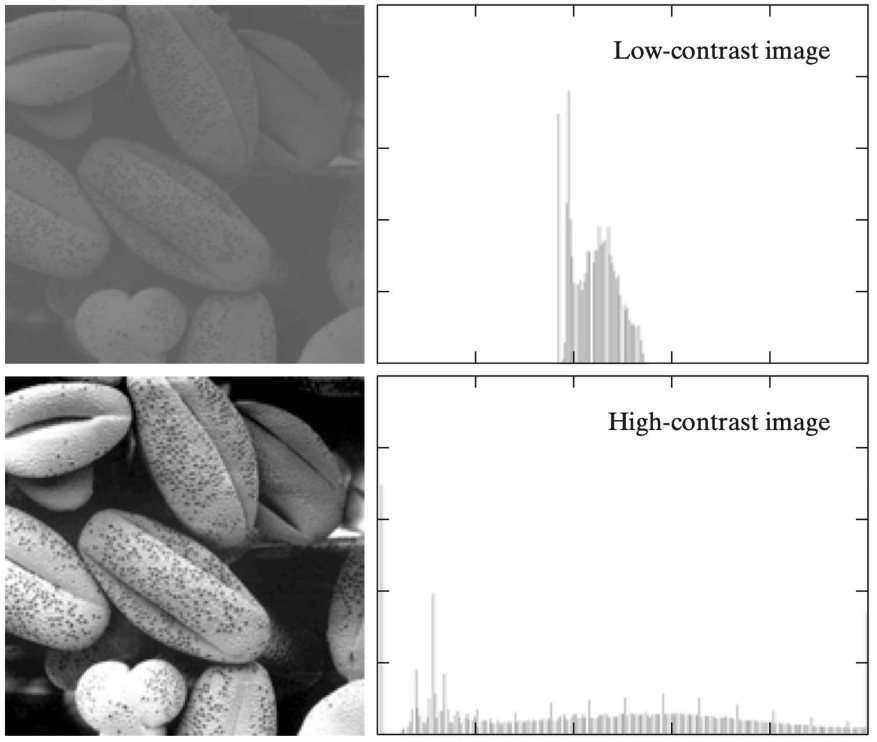

# Lecture 5, Sep 16, 2025

## Image Operations

### Point Operations

* Images can be thought of as functions, with the input being the pixel location and the output being the pixel intensity; we can apply operations to these functions
* The simplest operations are point operations, which operate on individual pixels -- a pixel depends only on itself (or maybe global image characteristics)
	* e.g. thresholding (to get a binary image), brightness and contrast adjustments, histogram equalization, gamma correction
	* This can he a *monadic* (i.e. single image) or *dyadic* (two image) operation (e.g. HDR), etc
* An *operator* is a function that takes one or more input images and produces an output image: $g(\bm x) = h(f_0(\bm x), \dots, f_n(\bm x))$
	* $\bm x = (i, j)$ is the pixel location
	* Example:
		* Gain and bias (brightness/contrast) adjustments: $g(\bm x) = af(\bm x) + b$
		* Gamma correction (removes nonlinear radiance map): $g(\bm x) = (f(\bm x))^\frac{1}{\gamma}$
* *Histogram equalization* is a method to "spread out" the range of pixel intensities in an image, so pixels intensities are more evenly distributed over the dynamic range
	* A *histogram* is a function $h(r_k) = n_k$ is a discrete lookup function that maps an intensity $r_k \in [0, L - 1]$ to the number of pixels $n_k$ with that intensity level
	* We often normalize this so $p(r_k) = \frac{n_k}{n}$ (where $n$ is the total number of pixels) is an estimate of the probability of grey level $r_k$
	* The image looks more high-contrast if the histogram is more distributed, so we use more of the available dynamic range
	* We want to find an intensity mapping $T(r_k)$ to transform each pixel so that the resulting histogram is approximately flat
	* We use the CDF: $s_k = T(r_k) = \sum _{j = 0}^k p_r(r_j) = \sum _{j = 0}^k \frac{n_j}{n}$
		* Can think of this as finding the percentile of each pixel -- the relative intensity of a pixel is approximately the proportion of pixels that it's brighter than
		* Note this CDF is scaled $[0, 1]$, so we multiply by $L - 1$ (usually 255) to convert back to integer intensities

{width=50%}

### Neighbourhood Operations

* *Neighbourhood operations* operate on a pixel given information about its neighbourhood (i.e. Surrounding pixels)
* A *linear filter* is defined as $g(i, j) = \sum _{k, l} f(i - k, j - l)h(k, l)$
	* This operation is known as a *convolution* $g = f * h$; here $h(k, l)$ is the *kernel* (impulse response)

{width=70%}

{width=70%}

* When we're at the end of the image, the kernel goes over the edge of the image, so we need to make a choice of *padding*
	* Zero: all pixels past the edge are treated as zero
	* Wrap: pixels on the edge wrap around to the other side
	* Clamp: pixels past the edge take on the same value as the edge pixel
	* Mirror: the edge is "mirrored", so pixels past the edge take the same values as the pixels before the edge, in reverse order
	* In the context of learning none of them seem to have a major impact, so zero padding is often used
* Generally convolutions require $K^2$ multiplication and additions per pixel where $K$ is the kernel size
	* *Separable* linear filters can be decomposed into a 1D horizontal convolution followed by a 1D vertical convolution (only $2K$ operations)
	* A separable kernel can be decomposed like $\bm K = \bm v\bm h^T$
		* We can tell whether a kernel is separable analytically using an SVD
* The *isotropic Gaussian kernel* (aka *Gaussian blurring*) is $G(x, y; \sigma) = \frac{1}{2\pi\sigma^2}e^{-\frac{x^2 + y^2}{2\sigma^2}}$
	* This is a separable kernel, so we can compute it using fewer resources
	* Can be thought of a low-pass filter, since sharp details are smoothed out
* *Band-pass filters* removes low and high frequencies from an image
	* The *Laplacian of Gaussian* filter is $\nabla^2 G(x, y; \sigma) = \left(\frac{x^2 + y^2 + 2\sigma^2}{\sigma^4}\right)G(x, y; \sigma)$ where $G(x, y, \sigma)$ is the Gaussian filter
		* This combines a Laplacian filter $\nabla^2 f = \pdiffn{2}{f}{x} + \pdiffn{2}{f}{y}$ which removes low frequencies with the Gaussian which removes high frequencies
	* This can be used for edge detection; noise in the signal is cancelled out by the symmetric filter, but zero crossings are amplified
	* Due to the shape, this is also known as the sombrero filter

{width=60%}

* A *summed area table* or *integral image* is an efficient technique for computing a sum of any rectangular area of an image
	* This can be efficiently computed recursively
	* Useful for certain applications like computing box filter convolutions
* *Median filters* are a type of nonlinear filter which selects the median pixel from each pixel's neighbourhood
	* This is good at removing *shot noise*
	* Min and max filters are other examples of common nonlinear filters

{width=60%}

* The *bilateral filter* soft-rejects pixels whose value differs too much from the centre pixel
	* $g(i, j) = \frac{\sum _{k, l} f(k, l)w(i, j, k, l)}{\sum _{k, l} w(i, j, k, l)}$ where the weighing function is $w(i, j, k, l) = d(i, j, k, l)r(i, j, k, l)$
	* $d(i, j, k, l) = e^{-\frac{(i - k)^2 + (j - l)^2}{2\sigma_d^2}}$ is the *domain kernel*
		* Similar to a Gaussian centered around the pixel
	* $r(i, j, k, l) = e^{-\frac{\norm{f(i, j) - f(k, l)}^2}{2\sigma_r^2}}$ is the *data-dependent range kernel*
		* This attenuates large differences in pixel intensities
	* This filter removes noise while preserving edges and is often used to increase image resolution

{width=80%}

### Geometric Transformations

{width=70%}

* *Geometric transformations* apply to the domain of the image instead, i.e. $g(\bm x) = f(\bm h(\bm x))$, effectively moving pixels around
* A *forward transform* (or warp) maps each pixel location in the input to a new location, $\bm x' = \bm h(\bm x)$
	* The problem is that starting with some integer pixel location in the input, we end up with a non-integer location in the output
	* Rounding to the nearest pixel results in aliasing and leads to holes and gaps
* The best way to map the pixel back is to perform an *inverse transform* on each pixel in the target image, which gives us a location in the original image; now we apply a bilinear interpolation to get the correct intensity for that pixel
	* This requires being able to invert the transformation, which is often the case (just need to invert a matrix for most cases)
	* This is used when removing radial distortion -- the undistorted pixel location is mapped to the distorted location and interpolated to get its value

{width=40%}

### Regularization

* Many vision problems are ill-posed and ill-conditioned inverse problems, i.e. solutions are severely underconstrained; *regularization* is a technique to solve these problems
	* We also see this in training neural networks, e.g. weight decay
* We define a global *energy function* with some desired property (akin to applying a prior), and then finding a minimum energy solution
	* Often we know that the result we want is smooth, so we combine a smoothness penalty with a data penalty
	* $\varepsilon _1 = \iint f_x^2(x, y) + f_y^2(x, y)\,\dx\,\dy$
		* $f_x, f_y$ denotes gradients
		* This forces the solution to have smooth gradients
	* $\varepsilon _d = \iint (f(x, y) - d(x, y))^2\,\dx\,\dy$
		* This ensures the solution respects the data points we have
	* We find the overall global minimum $\varepsilon = \varepsilon _d + \lambda \varepsilon _1$
	* Can think of this as "poking up a tent" -- with only $\varepsilon _1$ we get a flat surface, and for each data point we add it "pokes up" the surface

