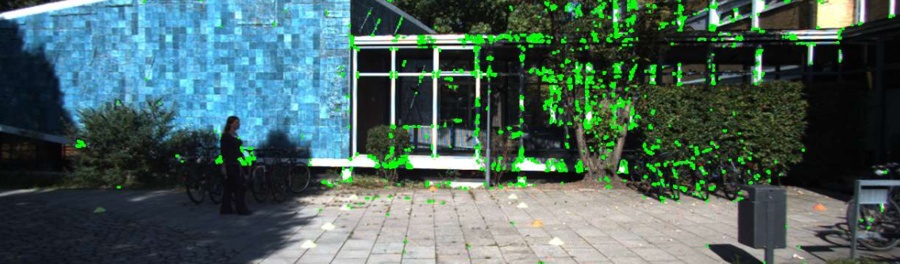
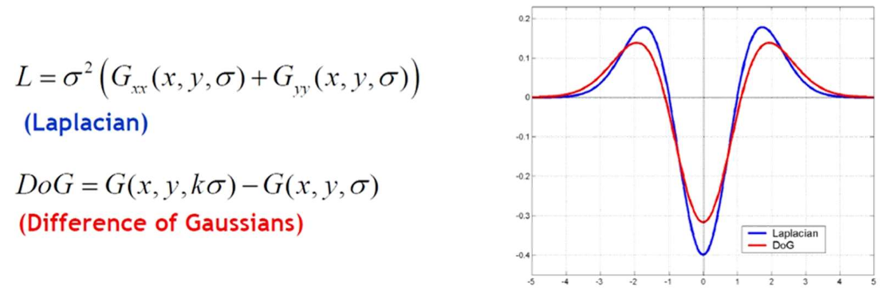
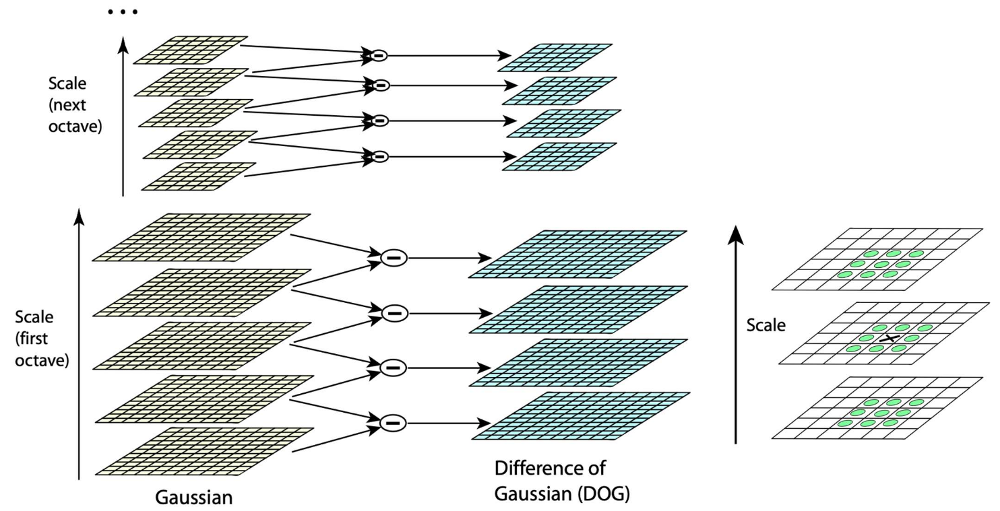
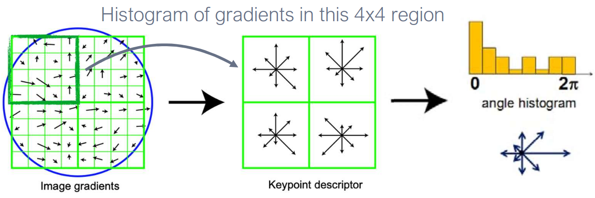
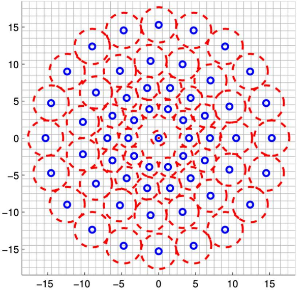
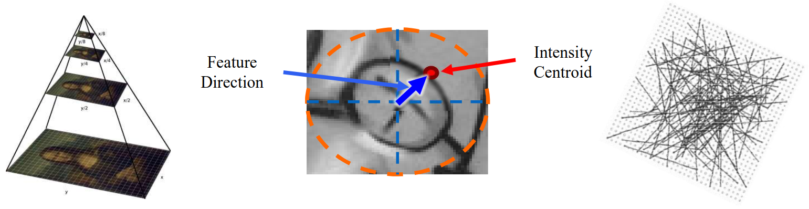

# Lecture 6, Sep 19, 2025

## Image Features

* *Image features* (aka *interest points*) are regions in the image that are:
	* Salient: distinctive, identifiable, and different from its immediate neighbourhood
	* Local: occupies a small subset of the image pixels, so it has a precise location
	* Repeatable: can be found in other images, even if transformed a little
	* Compact: can be represented efficiently
	* Unique: should be different from the other features in the image, so matching can be done reliably
* Used for detection, matching, tracking
	* Identify a set of features in two different images, match them across the images (identify *correspondences*), and calculate motion/homography/etc
	* Can be used for e.g. making a panorama, tracking an object, SLAM
* Patches of low variation (e.g. sky) or repeating patterns (e.g. linear edges) are usually not good features, while things like corners are much better
	* A *stable corner* is a point in the image where we have a pronounced gradient in both $x$ and $y$, i.e. a corner
	* For an edge we only have a gradient in one direction, while for a textureless region we have low gradients in both directions
* Consider a simple way to match 2 patches across different images, with an offset $u$; we compute a weight for each one of the surrounding pixels and sum them: $E_{WSSD}(\bm u) = \sum _i w(\bm x_i)(I_1(\bm x_i + \bm u) - \bm I_0(\bm x_i))^2$
	* The *autocorrelation* function $E_{AC}(\Delta\bm u) = \sum _i w(\bm x_i)(I_0(\bm x_i + \Delta\bm u) - I_0(\bm x_i))^2$ is obtained by using $I_0$ for both images and small $\Delta\bm u$
		* Where we have a high autocorrelation, we have a distinctive region, since this means it stands out from surrounding locations
	* This can be approximated with a first-order Taylor series, using the gradients $\sum _i w(\bm x_i)(\nabla I_0(\bm x_i) \cdot \Delta\bm u)^2 = \Delta\bm u^T\bm A\Delta\bm u$
		* This gradient can be computed using a convolution
* The autocorrelation matrix takes the form $\bm A = w * \mattwo{I_x^2}{I_xI_y}{I_xI_y}{I_y^2}$ where $w$ is the weight kernel matrix
	* The inverse of this matrix is a lower bound on the uncertainty of the location of the feature
	* Therefore we can use eigenvalue analysis to determine the uncertainties -- smaller eigenvalues corresponds to more uncertainty, so we want to choose locations so that the smallest eigenvalue is maximized
* This leads to the *Harris corner detector*, which gives each point a score: $\det\bm A - \alpha\tr\bm A^2 = \lambda _0\lambda _1 - \alpha(\lambda _0 + \lambda _1)^2$
	* When both eigenvalues are large, we have a high score, indicating a good feature
* Note the Harris detector only detects key points, but do not assign a descriptor to them, so it cannot be used for matching

{width=70%}

### SIFT (Scale Invariant Feature Transform)

* The Harris corner detector depends highly on the patch size that we use to construct the autocorrelation function, therefore it is very sensitive to scale and also rotations (it would still detect them but might not match well)
	* A sharp corner under blur may look like it's rounded, or a rounded corner at a distance away looks sharp
	* We need a scale and orientation invariant feature detector/representation
* SIFT is a scale-invariant algorithm with the following steps:
	1. Construct a *scale space representation* of the input image
		* To find the scale space representation, we essentially apply Gaussian blurs of increasingly larger covariances, and then downsample (rescale) the image to be increasingly smaller
	2. Find keypoints with difference of Gaussian (DoG) operator
		* DoG is similar to LoG but cheaper to compute since we are already applying Gaussian blur
			* The extrema of the DoG is used as the keypoints
			* The idea is that sharp features like corners will be lost when applying Gaussians, so if we take the difference we can see where large changes occurred and it corresponds to features
		* For each of the pixels at each scale, it is compared against immediate neighbours in both its scale and one scale up/down; if it is an extrema then we know that feature is the most prominent at that scale
	3. Reject poor keypoints similar to the Harris approach
		* Compute the Hessian at each point $\bm H = \mattwo{D_{xx}}{D_{xy}}{D_{xy}}{D_{yy}}$ and reject points for which $\frac{(\tr\bm H)^2}{\det\bm H} > 10$ (i.e. large difference between eigenvalues)
	4. Assign an orientation to each keypoint
		* Identify the principal rotation direction of the feature
		* Construct a gradient magnitude histogram: sample points in a local region around the keypoint, and compute gradients and the direction of the gradient for each point; then create a 36-bin histogram (10 degrees per bin) from these orientations
		* The bin with the highest peak is used as the orientation; if there is a bin with a peak greater than 80% of the highest peak, it is also used (a new feature is created)
		* Note this is all done at the Gaussian scale that the keypoint was most prominent on
	5. Assemble into a descriptor for the feature
		* Take the 16x16 patch around the keypoint and break it up into 16 subpatches of 4x4 pixels; for each subpatch, calculate the gradient direction on each pixel, and put into a histogram with 8 bins
		* The histograms of each subpatch is assembled together for the final feature vector (4x4 grid with 8-orientation histogram per grid gives 128 dimensions)
		* To achieve orientation invariance, subtract the feature's orientation (from the previous step) from each gradient direction before binning it

{width=80%}

{width=80%}

{width=80%}

* Due to all the steps involved, SIFT is relatively expensive

### SURF (Speeded-Up Robust Features)

* Another scale and rotation-variant detector designed to to compete with SIFT
* Also uses Hessians and scale space, but to make it faster instead of using Gaussians it uses box filters, which can be computed very efficiently using integral images (see previous lecture)
* The descriptor size is only half as big as SIFT (64 elements)
* About 3x as fast as SIFT and often performs better in terms of accuracy

### FAST (Features from Accelerated Segment Test)

* Simple algorithm:
	* For each possible pixel location, look at the 16 pixels in a circle (radius 3) around the pixel, and look at how many of them are brighter than the centre pixel by some threshold
	* $p$ is a corner if there is a set of $n$ contiguous pixels in the circle which are all brighter or all darker (in the original paper this was chosen as 12)
	* We can make this even faster if we check only 4 points (1, 5, 9, 13), and if those do not pass the test then we don't need to test further
* The $n$ parameter is very sensitive -- any lower and there are much more features, higher and there are too few features
* Uses non-maximum suppression (i.e. for each maximum, look in an area around it and suppress all other maxima in that region)
* This method is very fast but can make matching hard

### BRISK (Binary Robust Invariant Scalable Keypoints)

* BRISK is a much faster and much more compact feature detector
* It uses concentric circles around the keypoint, and samples pairs of points within the circles and compares their brightnesses, generating one bit for each comparison
	* Note we're not looking at individual pixels, but instead we apply a Gaussian to the surrounding region
	* The comparison of the points is done in a systematic pattern

{width=50%}

### BRIEF (Binary Robust Independent Elementary Features)

* BRIEF draws pairs of points randomly around each pixel to be tested, according one of several distributions, and compares the pairs in a manner similar to BRISK and forms a descriptor
	* A number of different ways exist to sample the pixel pairs but they have similar performance
	* To draw the samples we can do it uniformly (GI), with a Gaussian around the center (GII), with a Gaussian around the location of the first pixel (GIII), draw both from a coarse polar grid (GIV), or use the center pixel and draw from the coarse grid for the other pixel (GV)
* This generates 512-bit vectors
* Note the locations of the pairs sampled are randomly chosen but is consistent across features/images, to facilitate matching
* It is highly efficient, but does not have scale or rotation invariance, and can be sensitive to noise

### ORB (Oriented FAST and Rotated BRIEF)

* Combines FAST and BRIEF and adds orientation and scale invariance
* One of the most reliable free feature detectors, used by systems like ORB-SLAM
* ORB downsamples the image at multiple scales, and applies FAST across all layers to detect keypoints; for each feature the orientation is computed based on the intensity centroid of the patch, and uses the orientation to compute a rotated BRIEF descriptor across scales
	* For each patch, we find its centroid using the pixel intensity as weight, and the direction of the intensity centroid relative to the test pixel is the orientation
	* To compute the rotated BRIEF descriptors we rotate the sampling points by the orientation that we found in the previous step (equivalently, rotate the image)

{width=80%}

### Deep Learning Based Detectors

* Learned feature representations have been becoming more popular
* Supervised methods can use hand-engineered features (e.g. SIFT or ORB) to match image patches to generate ground truth
* Self-supervised and unsupervised methods use sequences of images with pose information to learn how to match images
* Learned invariant feature transform (LIFT) is one of the first learned feature detectors, an end-to-end feature detector consisting of 3 CNNs for detection, orientation estimation, and generating a description
	* Trained with contrastive loss -- maximize descriptor similarity of matching pairs, maximize disparity for different features

