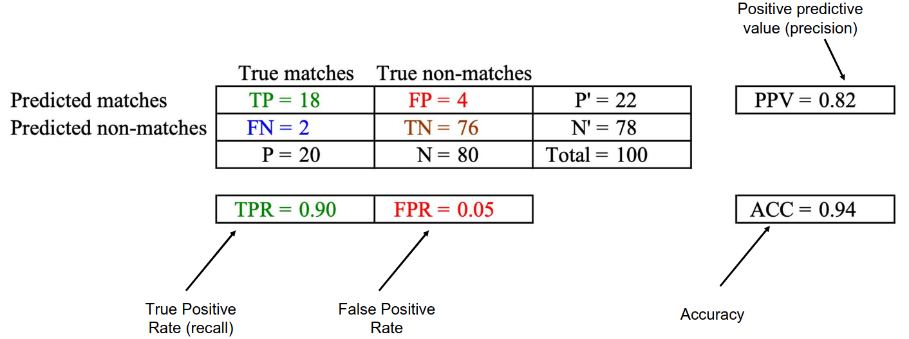
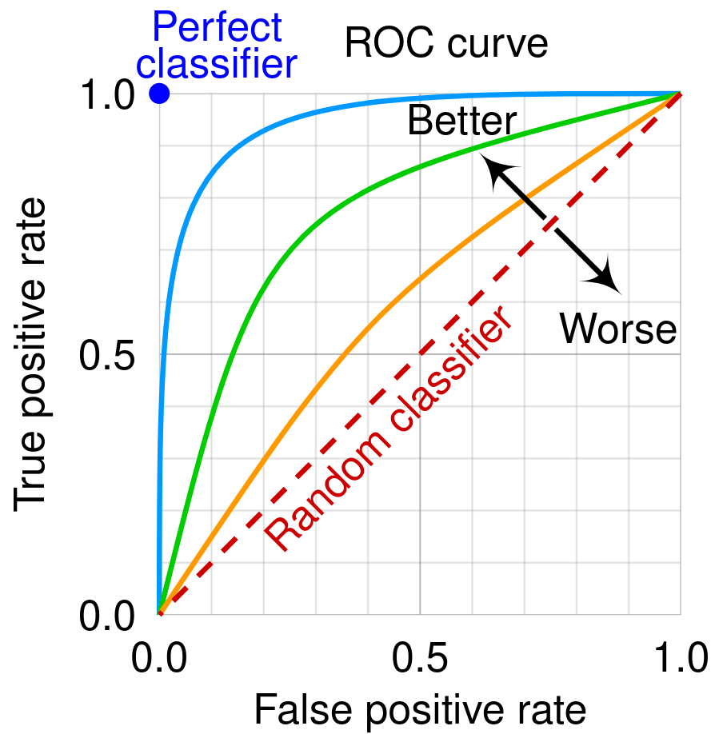
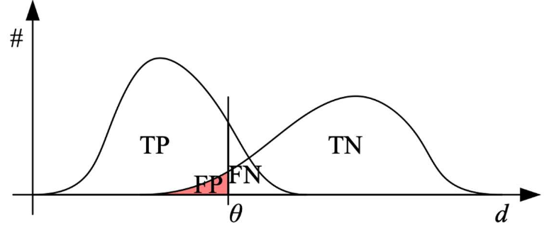
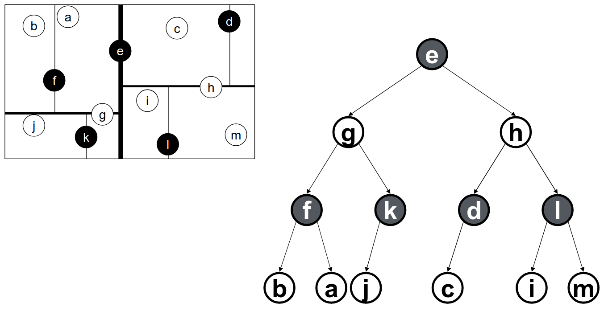

# Lecture 7, Sep 23, 2025

## Image Feature Matching and Tracking

* To use image features, we need to match them across images, i.e. identify correspondences
* We need a distance function that computes the similarity of two descriptors, so when matching we minimize this distance
	* For features without a descriptor, the simplest distance function is the *sum of squared differences* (SSD) between local patches around each feature
	* For vector-based descriptors like SIFT and SURF Euclidean distance is often used
	* Binary descriptors like SURF can use *Hamming distance* instead (number of bits that differ)
	* Also consider the ratio of the distance between the first best vs. second best match; if these are too close, the feature is likely ambiguous so we don't want to include it since it might lead to a false positive
* To quantify the performance of matching, we build a *confusion matrix* (aka *contingency table*) out of the true positives ($TP$, number of correct matches detected), false negatives ($FN$, number of matches missed), false positives ($FP$, number of incorrect matches), and true negatives ($TN$, number of incorrect matches correctly rejected)
	* Often false negatives are much less important since we often have enough true positives
	* However false positives are very bad since they can significantly distort the resulting transformation
		* RANSAC can be used to reject outliers (calculate homography with a subset of matches, and check if enough features match)

{width=80%}

* We can compute a number of stats using the confusion matrix:
	* True positive rate: number of true positives out of all positives in the data $TPR = \frac{TP}{TP + FN}$ (aka recall)
	* False positive rate: number of false positives out of all negatives in the data $FPR = \frac{FP}{FP + TN}$
	* Positive predictive value: number of true positives out of all detected positives $PPV = \frac{TP}{TP + FP}$ (aka precision)
	* Accuracy: number of correct matches out of the total dataset size $ACC = \frac{TP + TN}{P + N}$
* We can evaluate the overall performance of a classifier using a *receiver operating characteristic* (ROC) curve, which compares the true positive and false positive rates for different threshold values
	* Often FP and FN rates go hand-in-hand as thresholds are changed, so the ROC curve allows us to see how they relate for a given classifier

{width=40%}

{width=50%}

### Efficient Matching

* If we brute force the feature matching, we need $O(n^2)$ complexity
	* This is often good enough if the feature detector is selective enough, e.g. SIFT, but descriptors like ORB or FAST generate more features and need more efficient matching
* If we have some idea of the relative transformation (i.e. assume we didn't move too much between images), we can use the spatial cue to match more efficiently
	* More often this is done in descriptor space, i.e. the $k$-D tree is built using the descriptor vector
	* However this does not make sense for binary descriptors
* $k$-D trees are a data structure that allows us to efficiently find the nearest neighbour, which is often the most likely feature to match
	* They are similar to a multi-dimensional binary tree, and allow us to do a repeated binary search to find the nearest neighbour
	* Construction can be done in $O(kn\log n)$ and takes $O(n)$ space, where $k$ is the number of dimensions of the datapoints (considered constant) and $n$ is the number of datapoints
	* Allows us to efficiently search for the nearest neighbour in $O(\log n)$ time
* To build a $k$-D tree, we split along the median of the next dimension at each level
	* Cycle through every dimension until there is at most one datapoint in each partition, i.e. we have a binary tree
	* Each node contains a key and value for the node, the dimension that the node splits on, and left and right subtree pointers

{width=80%}

* To search for the existence of a specific value, we perform a search similar to a standard binary tree, except we cycle through dimensions as we move down the tree
* To find the nearest neighbour:
	1. Find the node in the same partition as the query point by searching down the tree, and set the current min distance to the distance between this node and the query point
	2. Go back up the tree, and at each parent node check the following:
		1. Check the node against the current best and update if necessary
		2. Check if the other branch (other than the one we came from) can possibly contain a point closer to the query point than the current best
			* In practice this is done by using the distance between the query point and the partitioning point, along the partitioning axis
			* If the current best distance is less than this, since all nodes in the subtree will necessarily have a distance longer than this, the entire subtree can be eliminated
			* Otherwise, run the entire search recursively down the subtree and update the current best in the process
	3. When the root node has been checked, the algorithm terminates
* In OpenCV, `cv2.BFMatcher()` does a brute-force search; `cv2.FlannBasedMatcher()` does a $k$-D tree based approximate nearest neighbour matcher
	* `FlannBasedMatcher()` can be configured to stop with an approximate result, but for feature matching we often want the exact best neighbour
* Recently learning-based matching approaches have become more popular and can significantly outperform some classical methods
	* Superglue is the first to use a GNN to demonstrate this
	* First use Superpoint (learned CNN feature detector) to detect features in two images, then construct a graph out of them and use GNN to find correspondences
	* GNNs do surprisingly well on repeating patterns; they can use features even though they look similar since they also use geometry information

### Incremental Tracking

* In most applications, the camera only moves a small amount between frames, so we can search a smaller space for potential matches
	* We might have e.g. a Kalman filter giving us an idea of where we moved to
* The detect-then-track approach to matching searches a small region in subsequent images for a feature that appeared in the initial image, which works well if motion and scene deformation (e.g. viewpoint) is small
	* Good features for matching are also good for tracking
	* For larger changes we can use additional strategies using e.g. multi-resolution search (to eliminate scale differences) or using motion prediction models (for objects or egomotion)
* The Kanade-Lucas-Tomasi (KLT) tracker is a full tracking algorithm
	* Predictive motion models are used to refine the search space
	* Patches are matched between frames using gradient information
	* An additional feature selection algorithm similar to Harris is used
	* Keep track of the feature dissimilarity between the current frame and the first frame in the sequence, and discard the feature when this grows too large (RMS residual)
		* i.e. in every frame, add new features, and discard features that have grown too dissimilar to when they were first added

