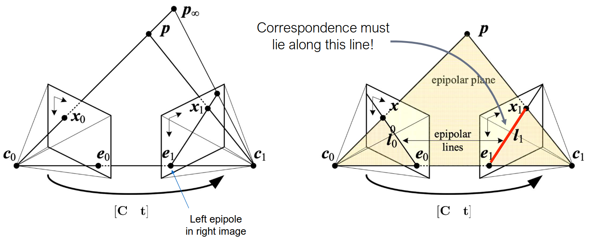
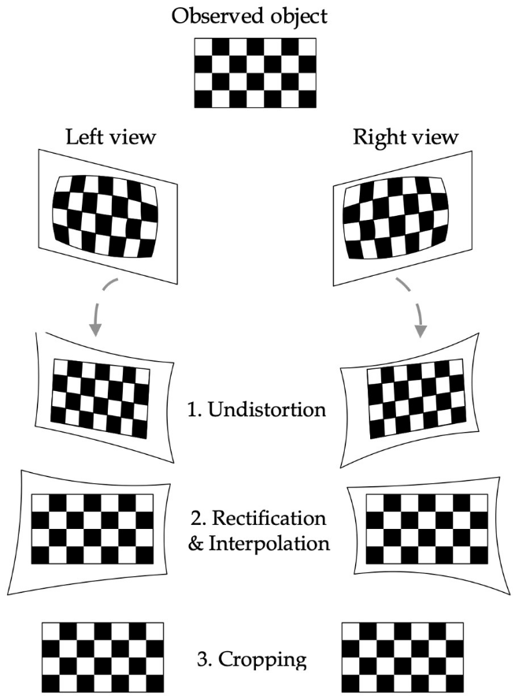
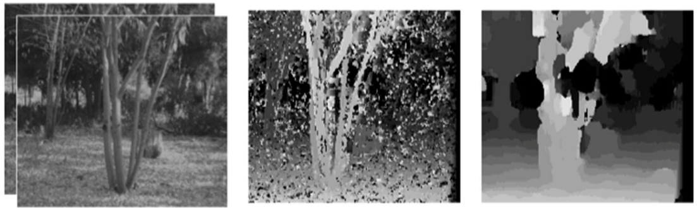

# Lecture 9, Sep 20, 2025

## Stereo Vision

* *Stereo vision* is the technique of using 2 cameras with an offset (*baseline*) between them to infer depth, based on the differences in the appearances of objects between two images, similarly to how humans and animals perceive depth
	* Objects that are closer to the camera will appear to have moved more between the two images compared to objects further away; this effect is known as *parallax*
	* This process is known as *stereo triangulation*
	* Stereo can produce a depth value for almost every pixel in the image, as long as it can be matched across the images (which is often a difficult process)
* To calculate the depth of a pixel, we need to find and match its location between the two images, a process known as *stereo matching*
	* We can reduce the search space for matching using *epipolar constraints*, which arise from the geometry of the cameras
* Matching is made feasible due to *epipolar constraints* arising from the geometry of the problem
	* We can project the optical centre of one camera to the other camera to get the *epipole* or *epipolar point*
		* Another way to think about this is where the line connecting the two camera centres intersect the imaging planes
	* Each point on one camera's image plane projects into an entire *epipolar line* on the other camera's image plane
		* This applies for any orientation of the cameras
	* Therefore to do matching for a point $p$, we find its epipolar line in the other camera's image plane and search along this line
	* The epipole forms an *epipolar plane* along with the epipolar line of a pixel; projecting this plane onto the second camera gives the corresponding epipolar line in the second imaging plane, which is the line we will search on

{width=80%}

* We can constrain the problem further and make the epipolar lines horizontal by applying *rectification*
	* Applying rectification and then searching along only a horizontal line makes our algorithms significantly faster and more accurate
	* This results in a *fronto-parallel* (aka *standard rectified*) plane geometry, where both image planes are parallel (looking forward) at the same depth and rotationally aligned

{width=40%}

* The matching process for rectified images produces a *disparity* value $d = x_0 - x_1$, which is the difference between the $x$ coordinates of the point between the two images
	* The disparity is inversely proportional to the depth
	* We can recover the depth using the disparity, baseline (distance between cameras), and focal distance using simple geometry
	* By the geometry of the problem we will always get $x_0 > x_1$ since the second camera is on the right

{width=70%}

* We can derive the relation using similar triangles:
	* $\frac{Z}{f} = \frac{X}{x_0} \implies Zx_0 = fX$ for the triangle formed in the first image
	* $\frac{Z}{f} = \frac{X - b}{x_1} \implies Zx_1 = fX - fb$ for the triangle in the second image
	* $Zx_1 = Zx_0 - fb$
	* This gives rise to the final stereo equation $Z = \frac{fb}{d}$
	* We can also recover the $X$ and $Y$ location as $X = \frac{Zx_0}{f}, Y = \frac{Zy_0}{f}$
		* This relation with the focal length means we can see depth in more detail using a long focal length camera (telephoto lens)
* This gives rise to the stereo camera model $\cvec{x_0}{y_0}{d} = \bm f(\bm p_c) = \frac{f}{Z}\cvec{X}{Y}{b} + \cvec{c_x}{c_y}{0}$
	* Note the convention is to have the stereo camera frame be the left camera frame
* Observations about the properties of disparity:
	* The disparity is inversely proportional to depth
		* The further a point, the smaller its disparity, and therefore the more noise in our measurement
		* Points at infinity have no disparity
	* The disparity is proportional to the baseline
		* Having a larger baseline improves measurement accuracy, but the overlapping FOV of the cameras decreases and might make matching difficult
* Typically disparity values are integers, but for longer range subpixel disparity can be critical
	* For probabilistic models, there is a disparity-dependent bias, i.e. there is a natural bias to estimate depth closer than it actually is
	* For narrow baseline values, the geometry means that we have a lot of depth noise; Gaussian approximations for the uncertainty are less accurate since we have a long "tail" (the uncertainty in front of the object is over-approximated, while the uncertainty behind is under-approximated)
		* If we approximate as a Gaussian (e.g. for an EKF), we tend to think the object is actually closer
	* At wider baseline values the uncertainty is smaller and more Gaussian-like

{width=70%}

### Stereo Matching Algorithms

* In robotics we often want dense depth, i.e. depth for every pixel, so we can't use only sparse feature matching
	* This can be fundamentally unreliable for textureless regions
* *Local* algorithms match only finite regions along the epipolar line while *global* algorithms aggregate information over the whole image
	* Due to speed constraints local methods are much more common
	* Recently (2020s) many learning-based matching algorithms have been proposed
* We need to define a similarity measure between pixels for matching
	* Sum-of-squared-differences and sum-of-absolute-differences are commonly used, basic (fast) similarity measures
	* Normalized cross-correlation and gradient-based techniques can be better for rejecting camera gain and bias differences
* Local methods slide a window over the epipolar line and compute the score at each point, which can be performed using a convolution $C(x, y, d) = w(x, y, d) * C_0(x, y, d)$
	* This can be accelerated using integral images for moving average box filters
	* Usually the pixel is just matched to the single pixel in the other image with the best similarity
* Larger windows result in smoother, less noisy images, and are less susceptible to *foreshortening*, but are less detailed, so the window size needs to be balanced
	* *Foreshortening* is the effect of oblique objects appearing as different sizes in the two images due to perspective change
	* This effect is more pronounced the larger the baseline is
	* Foreshortening means that a fixed window size is not always reliable, since it maps to different sized patches in real life for the two images
* Block matching and semi-global depth matching are some of the classic baseline methods, and are implemented in OpenCV
	* Often a good place to start!

{width=80%}

{width=40%}

* Modern state-of-the-art methods are learning-based, often using CNNs
	* This combines local matching with semi-global aggregation, e.g. GA-Net (2019)
	* Learning-based methods often produce depth maps that are smoother and with fewer holes, since the network learns to predict and fill in places where matches are bad
* Common standard datasets for stereo matching:
	* Tsukuba stereo dataset (1997): original dataset for stereo; contains ground truth from laser scanners
	* Middlebury stereo datasets (2001, 2014): contains sub-pixel accurate ground truth via structured light sensor
	* KITTI stereo (2012, 2015): outdoor dataset, with ground truth from interpolated LIDAR and CAD model fitting for segmented cars; only ~200 images for training
	* Scene flow datasets (2016): synthetic datasets rendered in Blender, containing disaprity and optica flow; a very large dataset designed for neural network training
		* Beware of sim-to-real gap!

{width=80%}

{width=80%}

{width=80%}

{width=50%}

