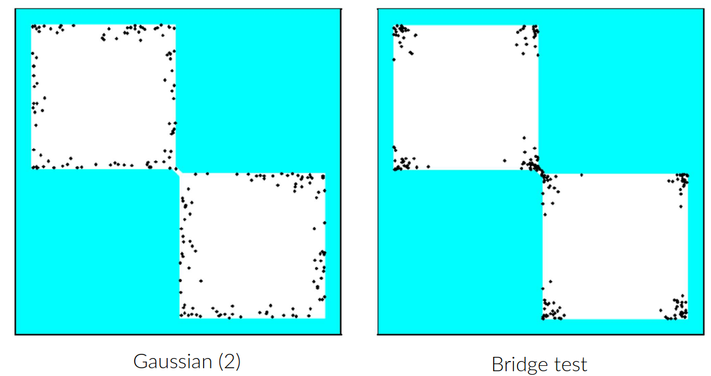
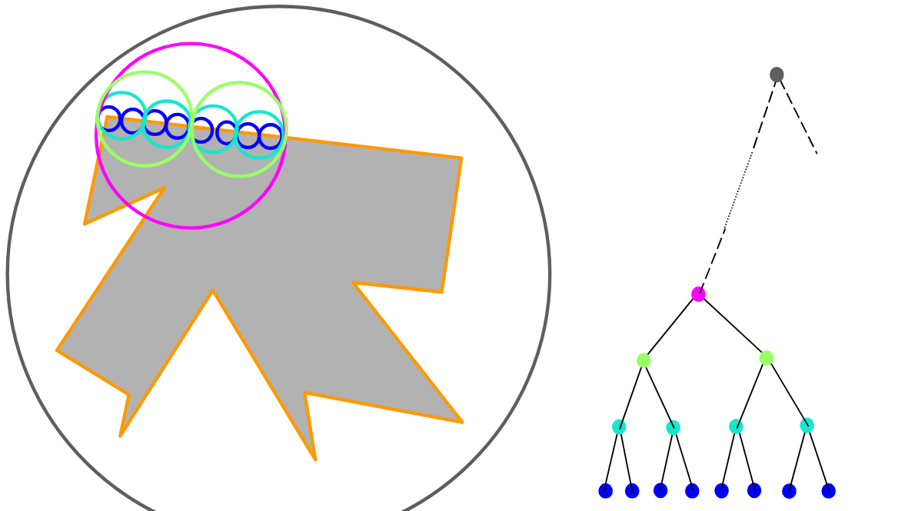
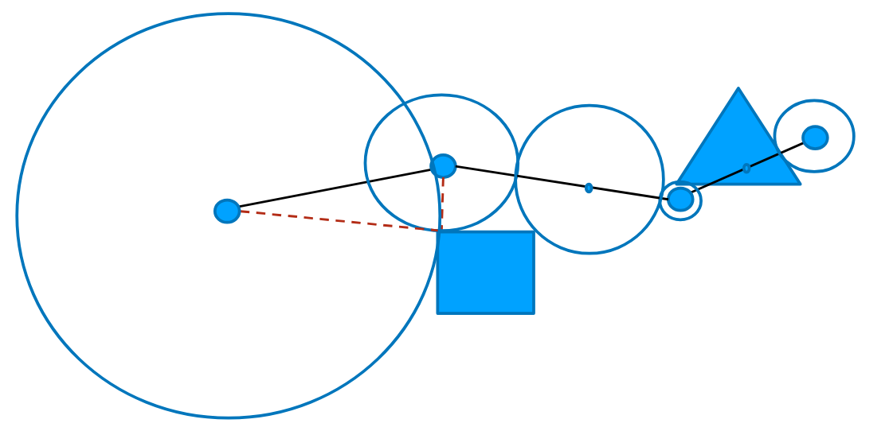

# Lecture 10, Jan 26, 2026

## Efficient Sampling-Based Planning

* Goal: minimize the PRM size we need to find a feasible path to the end configuration
* Instead of uniform sampling we try to identify samples with good visibility; regions with poorer visibility (e.g. narrow passages) should be more densely sampled than open space
* 4 strategies exist for milestone sampling:
	* Workspace-guided strategies: find narrow passages in the workspace and map them into the configuration space to sample those areas more
		* This is simple but limited
	* Filtering strategies: sample many configurations to find interesting patterns, and only retain promising configurations, since checking configurations is cheap but connecting them is much more expensive
		* *Gaussian sampling*: sample a configuration uniformly at random, then another configuration with a Gaussian distribution centered at the first; if one sample is in free space and the other is in collision, retain the one in free space, otherwise skip
			* The idea is that we bias retained samples to those that are near the boundaries of free space and occupied space
			* Less likely to get samples in the middle of free space
			* One variation is to sample uniformly within a ball centred at the first sample, with the size of the ball determined by sampling a 1D Gaussian, which may be faster
		* *Bridge sampling*: sample 2 configurations using the Gaussian technique; if both are in collision, find the midpoint between the samples, and retain that sample if it's in free space
			* This biases the samples even further to narrow passages
		* Gaussian sampling covers all surfaces while bridge sampling focuses on narrow passages, which may scale better in higher dimensions
	* Adaptive strategies: adjusting the sampling distribution on the fly by considering collisions
	* Deformation strategies: deforming the free space and morphing the resulting path

{width=70%}

* For connection sampling, nearest neighbour checking is usually the simplest and most successful
* Collision checking is usually the most computationally expensive; a few techniques can be used to optimize
	* *Bounding volume hierarchy*: instead of checking for collisions of the entire complex shape, enclose objects into successively tighter bounding volumes and checking starting from the largest bounding volume
		* This can be done with e.g. circular or rectangular bounding volumes; lower level bounding volumes can be created by breaking up into subregions and creating a bounding volume for each one
			* Considerations include bounding volume accuracy and ease of computation
		* If we detect a collision with a bounding volume, we then check again with all the sub-volumes enclosed within it until we get to the lowest level with the desired accuracy
		* Most obstacles will be far away, so the first checks can eliminate lots of obstacles with very little work
		* This is particularly helpful in static environments since bounding volumes can be computed in advance
	* To check a path for collisions, we can first check the distance between endpoints and obstacles to eliminate large parts of the path, then bisect any remaining path length successively

{width=60%}

{width=50%}

* Most collision-free connections will not be a part of the final path, so we can do lazy collision checking to only check edges when they are being searched
	* Find a shortest path without checks, then collision check every edge on the path; if any have collisions redo the search without those edges

