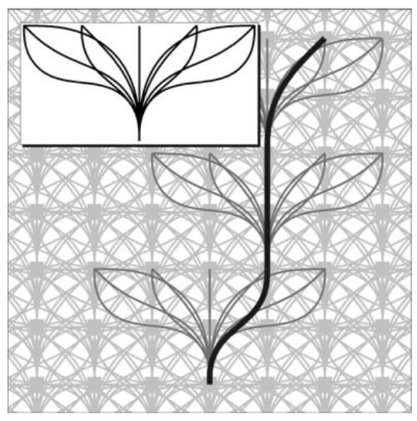
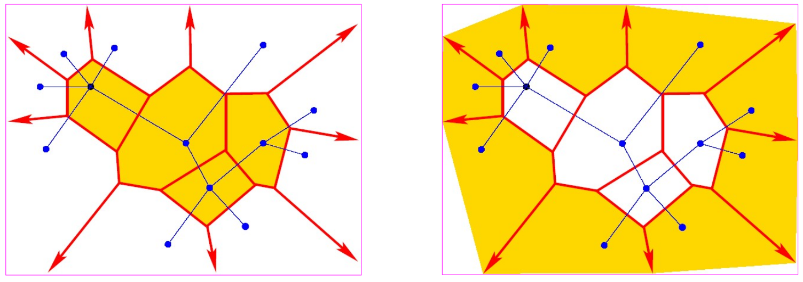
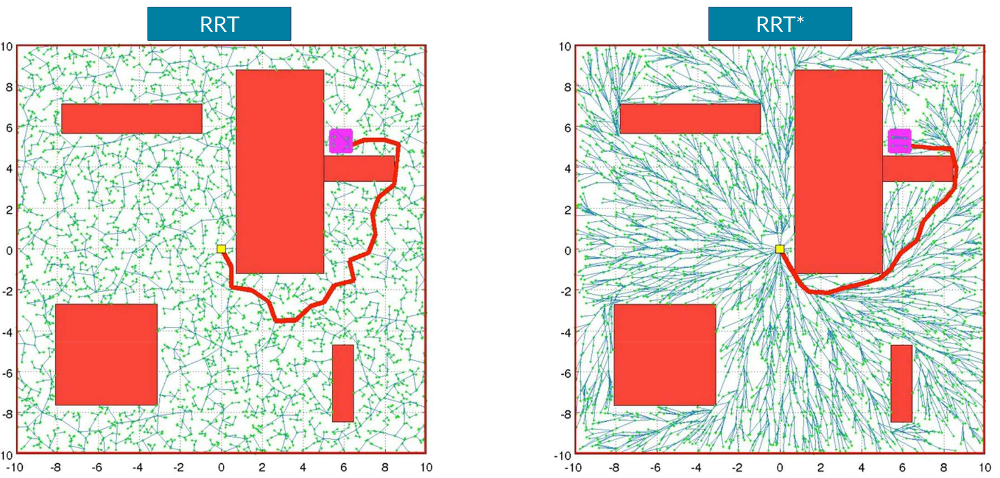
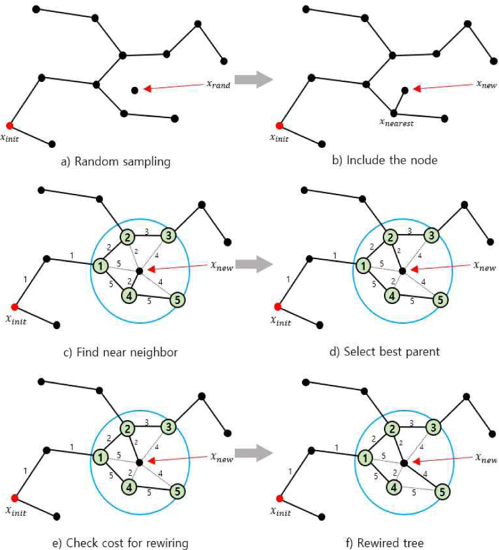
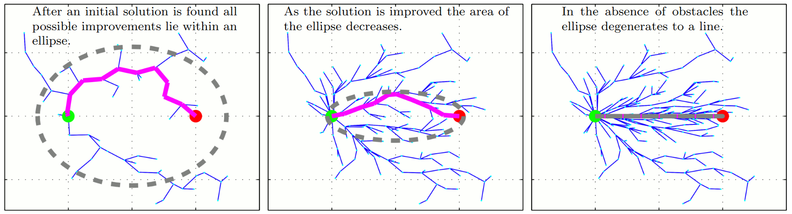
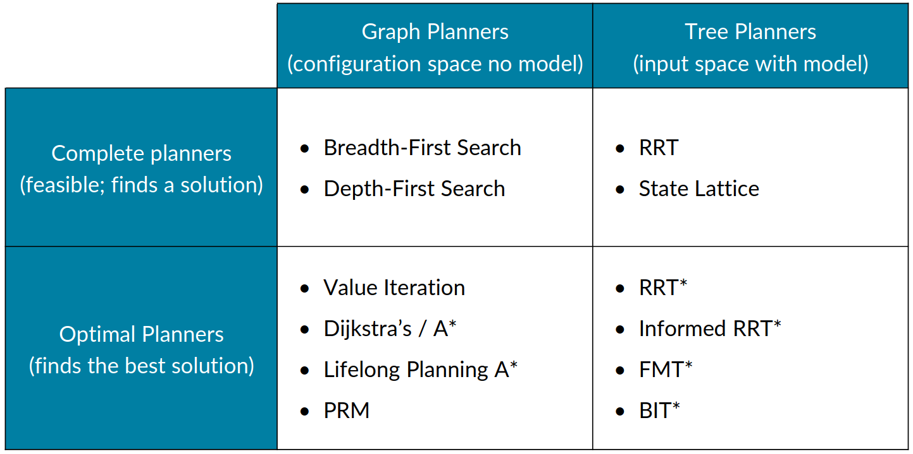

# Lecture 11/12, Jan 28, 2026

## Using Vehicle Models in Planning -- Rapidly-exploring Random Trees (RRTs)

* Grid-based planning methods we previously discussed do not account for vehicle kinematics; this can work when the grid size is large so the robot can stay within the cells while respecting kinematic constraints, but when the grid is small it can fail
* To account for kinematics, we can define a state lattice where nodes are connected with motion primitives, so each node is an inherently feasible state
	* However, the grid cannot be arbitrarily fine, so the solution may not be resolution complete
	* This can be problematic especially in highly cluttered environments

{width=30%}

* When vehicle constraints are involved, we often cannot execute an action backwards, so the structure we build will be a tree with directed edges instead of a graph as generated by PRM
* RRTs can be used to produce paths that are feasible by the vehicle model by building a tree, where every branch in the tree is a sequence of inputs we can apply, guaranteeing each state is feasible
* To construct the RRT:
	1. Randomly pick some point in space
		* We can work in physical or configuration space
	2. Identify the closest node in the tree to that point
	3. Select the vehicle input that would move us towards the point we sampled
		* Note that with constraints it's often impossible to determine the exact input that will take us to the sampled point, so we just go a small amount towards the sampled point
		* This is a critical difference from PRM
		* This can be done approximately, or through trajectory rollout, or through random sampling, or solving the boundary value problem
	4. Simulate the vehicle forward to determine the expected result, checking for obstacles, creating a new node if feasible
	5. Repeat until we reach the goal state
* RRT covers the space quickly as it explores, but it may take a long time to find a specific goal location, and the longer it takes to find the goal the more convoluted the final path will be
	* Therefore it's advisable to have a large goal region
* On each random sample, we can either get a refinement of the regions we've already explored (connecting to a vertex that already has connections), or an expansion into an unknown region (connecting to a new vertex)
	* The probability of extending each vertex is proportional to the area of its Voronoi region, with heavily favours expansion over refinement since the Voronoi cells of outer vertices are much larger
	* We can control the probability of refinement vs. expansion by restricting samples to within a bounding box of the root node
		* Start with a smaller box and gradually expand outwards; the larger the bounding box, the more expansion dominates
		* This favours early refinement to fully explore the space

{width=80%}

* Important drawbacks of RRT:
	* Solutions are sub-optimal and not smooth (further refinement often needed)
	* Difficulty handling small openings similar to PRM
	* Non-deterministic behaviour
* RRTs are probabilistically complete, but not optimal, because once an edge is added between nodes it never changes
* RRT* is an improvement which considers more than just the closest node when sampling and allows edges to be rewired to make path improvements, making it asymptotically optimal
	* After connecting a new node, RRT* further considers a ball in the neighbourhood of the new node; if we can connect to any nodes within the neighbourhood that results in a shorter total path, we connect to that node instead
	* After rewiring, we check all other nodes in the ball to see if the new node we added results in an improvement
	* For leaf nodes, we can allow heading variations for additional flexibility

{width=100%}

{width=70%}

* Informed RRT* uses a heuristic to bound the search space instead of expanding randomly in all directions, similar to the idea of A*
	* After finding an initial path, we can form an ellipse where possible better paths can be in, using the path length and starting and ending nodes as foci, and restricting the sampling to only within this space
	* Batch Informed RRT* (BIT*) also biases the initial goal search to an ellipse

{width=100%}

{width=80%}

