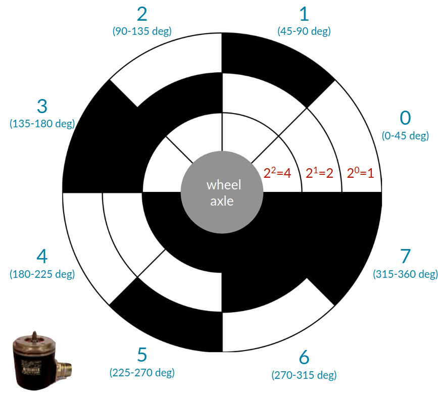
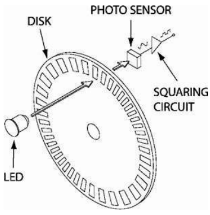

# Lecture 16, Feb 4, 2026

## Overview of Sensors -- Interoceptive Sensors

* Sensors produce measurements that are *interoceptive* (measuring states internal to the robot, e.g. IMUs, encoders) or *exteroceptive* (measuring things external to the robot, e.g. cameras, LiDAR, arguably GPS)
* Sensors can be *active* (emitting energy and measuring environment's response, e.g. LiDAR, radar) or *passive* (measuring ambient environmental energy, e.g. cameras, star trackers)
	* Since we are emitting energy with active sensors, we have a lot more control over what we can see, and more robustness compared to passive sensors
* *Inertial measurement units* (IMUs) measure accelerations and angular rates, usually in 3 axes, with an accelerometer and gyroscope
	* Accelerometers measure *proper acceleration*, i.e. relative to free fall, so an object at rest will still measure a gravity vector
		* This needs to be accounted for when estimating position, but can be used to get some orientation information
	* Integrating the gyroscope data and using the gravity information from the accelerometer can result in a good orientation estimate, but errors accumulate over time
	* Time-varying biases exist, e.g. due to temperature change, which might need to be estimated
	* Operating principle (MEMS sensors):
		* Each axis of the accelerometer uses an internal spring-mass system and measures how much it stretches using a capacitive system
		* Gyroscopes operate on a similar principle, but measures Coriolis forces by driving a mass to oscillate at some frequency perpendicular to the axis measured
	* Because of their internal structure, IMUs are sensitive to vibration, so in some applications we need vibration isolation to get usable measurements
* *Compass/magnetometers* measures the surrounding magnetic field to determine heading
	* They are generally difficult to work with for several reasons:
		* The magnetic field varies depending on where you are on the Earth, so this must be accounted for
		* Magnetic fields can be created by many parts of the robot (e.g. motors, wire loops) which can disrupt the field
		* No usable magnetic field in most places outside of Earth
* *Inclinometers* measures the gravity field to determine the pitch and roll of the sensor
	* This is affected by vehicle accelerations
* *Sun sensors/star trackers* provides a body-frame vector to a celestial body (e.g. the sun or stars at night)
	* This is often used in planetary exploration applications and satellites and less on Earth
* Combining a magnetometer and inclinometers gives us absolute values for all 3 axes of rotation, which can be noisy but does not accumulate error like with IMUs

{width=50%}

{width=30%}

* *Encoders* measure rotation of wheels around an axis
	* Using this we can do wheel odometry, which can be used to augment state estimation and combined with GPS, which has much lower frequency output
	* Can be of two types:
		* *Absolute*: the disk is broken up into a number of sections, with each section having a unique binary pattern which is measured by a sensor
			* This allows us to measure the absolute angle, but can result in skips and misreadings when multiple bits change at once
			* We can improve it by using a pattern where only one bit changes when moving between adjacent sections
			* Noise can be modelled as quantization noise, with a uniform distribution in the section
		* *Relative*: generates a pulse for each increment of shaft rotation; pulses can be counted to determine displacement
			* *Quadrature* encoders allow us to determine rotation direction by using two sensors placed exactly half a slot apart
			* Depending on the direction of rotation, one of the sensors will get the rising edge before the other
			* This also doubles the resolution

