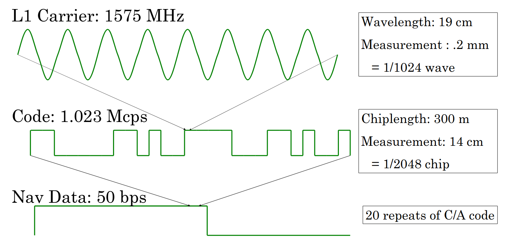

# Lecture 17, Feb 9, 2026

## Overview of Sensors -- Exteroceptive Sensors

* *LiDAR* (Light Detection And Ranging) uses light pulses to measure the distance from the sensor to each point in the environment, in 2D or 3D
	* LiDARs send laser pulses using a rotating optical system, and measures the time of flight of each pulse to determine the distance
		* Time of flight is usually determined using phase shift of the light wave sent out, using interference
		* We could get more than a single return for each beam (e.g. the beam can go through snow or leaves); modern sensors will give all the returns as well as the strongest one, so we can see through some things
		* The returning pulse also provides an intensity, which depends on the range, surface material, and angle of incidence
		* Complete scans can be produced using a spinning head, rotating mirror, or other optical system (e.g. Rinsley prisms, MEMS mirrors/solid state)
	* For a 2D scanner, we get bearings of the pulses and ranges for each pulse
		* $\psi^s = \rvec{-\psi^s_\text{min}}{\cdots}{\psi^s_\text{max}}$
		* $r^s = \rvec{r_1^s}{\cdots}{r_J^s}, r_j^s \in [0, r^s_\text{max}]$
		* Given a landmark in some position, we can compute the bearing and range or vice versa
	* For 3D scanners we get two angles for each pulse
		* $\rho _{ij} = \sqrt{x_{ij}^2 + y_{ij}^2 + z_{ij}^2} + \Delta\rho$
		* $\theta _{ij} = \tan^{-1}\left(\frac{y_{ij}}{x_{ij}}\right) + \Delta\theta$
		* $\alpha _{ij} = \tan^{-1}\left(\frac{z_{ij}}{\sqrt{x_{ij}^2 + y_{ij}^2}}\right) + \Delta\alpha$
	* Early LiDAR systems needed manual calibration, but modern LiDARs come pre-calibrated and the calibration usually stays valid throughout the sensor lifetime
* *Time-of-flight* (ToF) cameras (aka *flash LiDARs*) work similarly to LiDARs but captures the entire point cloud at once
	* Range is computed using phase modulation similarly to LiDAR
	* Due to the modulation, there is typically a range ambiguity beyond $\sim\SI{7}{m}$
	* More suitable for indoor use since direct sunlight can cause issues
* *Sonic range finders* (*SODARs*) measures the time of flight of an ultrasonic pulse to determine distance to a single point
	* They are popular in underwater applications since sound travels faster and doesn't have issues with light-based sensors
	* Range is relatively limited, and the sound wave has a wide cone of spread, making them useful for free space mapping/obstacle avoidance but not precise mapping
	* The speed of sound also limits the top update rate of these sensors (i.e. the sound wave must travel the full range before the next one is sent)
* *Radar* reflects long-wavelength radio waves off objects to determine range via time of flight
	* Requires a lot of signal processing on the returned signal to get a useable image
	* Generates primarily 2D measurements in a plane
	* Becoming more popular in automotive applications using millimetre-wave radar (which measures distance and velocity, but not angle reliably)
* *Global navigation satellite systems* (GNSS) are satellites with known orbits and synchronized clocks that transmit signals to triangulate the position of the receiver
	* To solve for the position, we need 4 satellites for the 3 position DoFs and a receiver clock offset
	* GPS uses a base carrier signal at $\SI{1575}{MHz}$, which is modulated into a code at $\SI{1.023}{MHz}$; this code is then further modulated to transmit the actual navigation data (including satellite orbit corrects etc.) at $\SI{50}{bps}$
		* The code uses a set pattern (32 unique *gold codes*), which are very distinct and easy to match
	* The path the signal takes from the satellite to the receiver is curved, resulting in the *pseudorange*
		* Nonlinear least squares is used to solve for receiver position and clock bias from pseudorange measurements
		* The more satellites, the more accurate our estimates; most modern receivers are multi-system
		* Can be augmented with a motion model if known
	* Many sources of error can occur:
		* Satellite geometry is one of the most important factors (*dilution of precision*)
			* The more distributed the satellites, the more precision we get; if satellites are bunched up, pseudoranges from different satellites won't be independent
		* Ionospheric and tropospheric errors due to humidity
		* *Multi-path* effects can occur where signals bounce off other objects before getting received
	* Errors are often measured in *circular error probable* (CEP), e.g. $\SI{5}{m}$ 50% CEP means 50% of measurements will lie within a $\SI{5}{m}$ circle of the average
	* With plain GPS, we can get $\sim\SI{10}{m}$ accuracy since atmospheric effects cause inaccuracies
	* With differential GPS (DGPS), a base station with known location is used, errors from atmospheric effects can be corrected, resulting in $<\SI{10}{cm}$ of accuracy
		* This is known as single difference and eliminates atmospheric errors and satellite clock errors, since both the base station and rover receive the same signal
		* However this adds a base clock error which requires an additional satellite to solve for
	* With RTK GPS, a base station is used along with the phase of the carrier signal to get $\sim\SI{2}{cm}$ of accuracy relative to the base station
		* RTK GPS uses double difference, which uses the difference between single differences to also eliminate base clock error
			* In theory we can keep taking higher differences, but this compounds the receiver measurement errors and becomes impractical fast

{width=80%}

