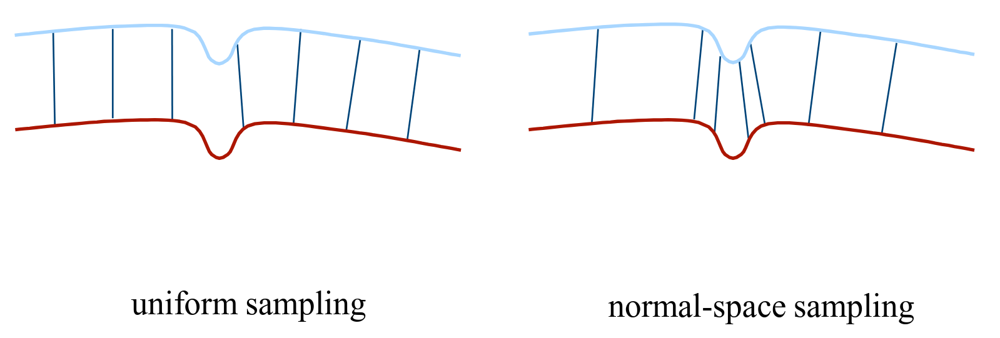
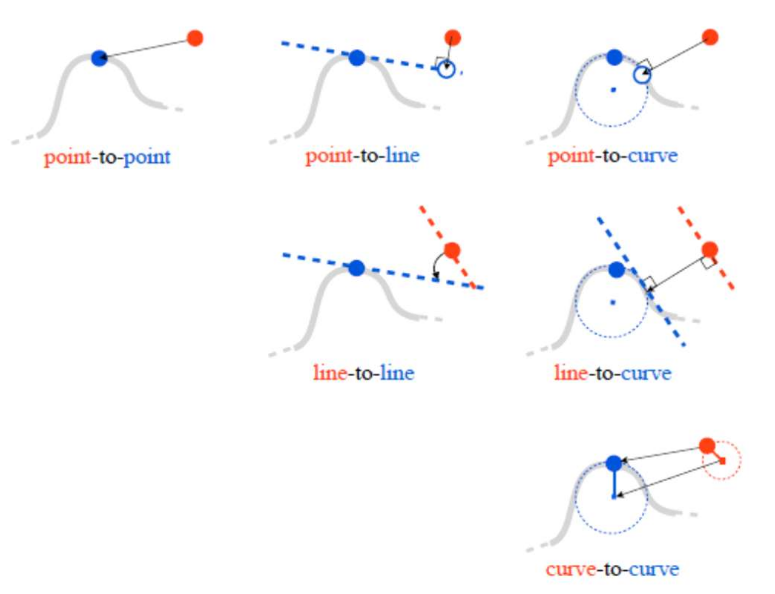
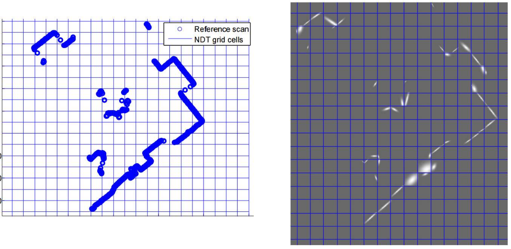

# Lecture 22, Mar 4, 2026

## LiDAR Scan Registration

* Using scan alignment with LiDAR, we can get a much better version of dead reckoning compared to wheel odometry
* Consider a model (reference) point set $M = \set{\bm p_M^1, \dots, \bm p_M^{N_M}}$ and data (target) point set $D = \set{\bm p_D^1, \dots, \bm p_D^{N_D}}$, and assume that each point in $D$ corresponds to a single point in $M$, i.e. $N_M = N_D$, but unlike in feature-based odometry we no longer have correspondences
	* We wish to find $\bm T_{MD} = \set{\bm C_{MD}, \bm t_D^{D}}$, the transformation between two scans
	* The goal is to minimize $\Delta = \bm p_M^i - \bm C_{MD}(\bm p_D^j - t_D^{MD})$
	* Form a loss $\mathcal J$, then we have $T^* = \argmin _{T \in SE(3)} \mathcal J(M, T(D))$
* Many variations are possible in the problem formulation, including parameterization of the transformation, point dimensionality (e.g. intensity, colour, learned features), and point-level filtering, cost metrics, association (e.g. using semantic information)
* In the basic *iterative closest point* (ICP) algorithm:
	1. Transform data points $\bm p_M^j = \bm C_k(\bm p_D^j - \bm t_k)$ to form $\tilde D$
	2. Find nearest neighbour correspondences $\set{I, J} = \on{NN}(M, \tilde D)$ between all points in $M$ and transformed points in $D$
	3. Form quadratic error: $\mathcal J = \frac{1}{2}\sum _{j = 1}^J w^j\left(\bm p_M^i - \bm C_k\left(\bm p_D^j - \bm t_k\right)\right)^T\left(\bm p_M^i - \bm C_k\left(\bm p_D^j - \bm t_k\right)\right)$
		* Each $w^j$ is a scalar weight
		* Similar to visual odometry, we can also use matrix weightings here; however usually for LiDAR we have similar uncertainties in all dimensions, unlike in stereo vision, so we usually use scalar weights
	3. Gradient descent: $\bm T_{k + 1} = \bm T_k + \alpha\nabla\mathcal J$
	4. Iterate until convergence
* To control the size of point clouds, we can subsample points (from one or both sets)
	* The basic method uses every point
	* Uniform (voxel-based) sub-sampling preserves the structure of the point cloud
	* Random sampling preserves the density but may lose structure
	* Feature-based sampling tries to identify structural features to preserve traits of the environment
	* Normal-space sampling tries to sample a subset with surface normals distributed as uniformly as possible, to preserve important information
		* This is better for mostly smooth areas with sparse features

{width=80%}

* We can use many other methods to weight point correspondences in our cost function
	* The basic method uses point-to-point correspondences
	* Point-to-plane (or point-to-line in 2D) can be performed by calculating surface normals, and only penalize errors in the normal plane
		* This is especially useful since LiDAR has density varying with distance
		* $\mathcal J = \frac{1}{2}\sum _{j = 1}^J w^j\left(\bm p_M^i - \bm C_k\left(\bm p_D^j - \bm t_k\right)\right)^T{\bm n^j}^T{\bm n^j}\left(\bm p_M^i - \bm C_k\left(\bm p_D^j - \bm t_k\right)\right)$ where $\bm n$ are the surface normals
	* Plane-to-plane follows a similar idea but calculates surface normals in both sets
		* Use covariances $\bm\Sigma _\varepsilon = \matthree{\varepsilon}{0}{0}{0}{1}{0}{0}{0}{1}$ for some small $\varepsilon$
			* This makes the error weighted much more in the direction of the surface normal
		* Transform each covariance: $\bm\Sigma _i^M = \bm C(\bm n_i^M)\bm\Sigma _\varepsilon\bm C(\bm n_i^M)^T, \bm\Sigma _j^D = \bm C(\bm n_j^D)\bm\Sigma _\varepsilon\bm C(\bm n_j^D)^T$
			* $\bm C$ is a rotation matrix that aligns $\bm n$ with the $x$ axis (we don't care about the other directions)
		* $\mathcal J = \frac{1}{2}\sum _{j = 1}^J\left(\bm p_M^i - \bm C_k\left(\bm p_D^j - \bm t_k\right)\right)^T(\bm\Sigma _i^M + \bm C_k\bm\Sigma _j^D\bm C_k^T)^{-1}\left(\bm p_M^i - \bm C_k\left(\bm p_D^j - \bm t_k\right)\right)$
			* Note that we had to transform $\bm\Sigma _j^D$ further, since it's in a different frame
	* This can be extended to curves but is less common
	* The *normal distribution transform* (NDT) tries to match clusters to clusters
		* Divide the scan into cells and model the surface within each cell as a Gaussian
			* $\rho _{c_i}(\bm p) = \exp\left(-\frac{(\bm p - \bm\mu _i^T)\bm\Sigma _i^{-1}(\bm p - \bm\mu _i)}{2}\right)$
		* Each point in the data point cloud is scored based on the probability density of the Gaussian in its cell
			* $\Lambda(\bm T) = -\sum _{\bm p_D^j \in D}\rho _c(\bm T(\bm p_D^j))$ where $\rho _c$ is taken for the grid that $\bm p_D^j$ falls into
		* In highly concentrated surfaces, e.g. walls, we get narrow Gaussians, which helps a lot with alignment; however corners get blurred
			* We can use clustering to dynamically allocate the cell sizes to reduce the blurring issue

{width=50%}

{width=80%}

* To compute surface normals, we find a neighbourhood of local points around each point, and identify principal components
	* Assume a linear model with best fit hyperplane $a^Tp = c$ where $a, c$ are parameters, $p$ are the points
	* Minimize $\frac{1}{k}\sum _{i = 1}^k (\bm a^T\bm p_i - c)^2$
	* This reduces to PCA of the outer product $M = \frac{1}{k}\sum _{i = 1}^k (\bm p_i - \bar{\bm p})(\bm p_i - \bar{\bm p})^T$
		* The eigenvectors indicate the principal directions of variance
		* The eigenvector associated with the smallest eigenvalue is the direction of least variance, which is the surface normal direction
* For data association, we also have options:
	* Closest point (basic option)
	* Closest compatible point (e.g. checking that normals/colours/curvature/etc are within range)
	* Normal shooting travels along the surface normal and selects the first point (i.e. closest point along the surface normal)
	* Outlier rejection with e.g. RANSAC, or checking with the previous transformation
		* We can reject points that have distances that are not consistent with neighbours, but must be tuned to avoid getting stuck in local minima
* Practical considerations:
	* Point cloud distortion from movement of the vehicle during a scan
		* We can usually get a motion estimate during the data capture to undistort it
	* Anisotropic filtering to remove points that don't provide much information
		* Filtering based on distance
		* Same idea as subsampling the point cloud
	* Optimizations for real-time constraint
		* Coarse-to-fine alignment (start with downsampled point cloud that can be quickly registered, progressively use more points to refine)
	* Quality estimation to detect incorrect registrations
		* Using covariance of the final point associations
		* Using overlap between consecutive scans or features
* Note that all methods we've discussed are local solutions; for global point cloud registration we usually rely on geometric feature matching

