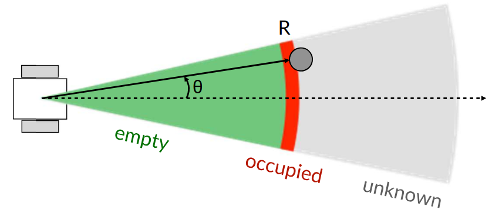
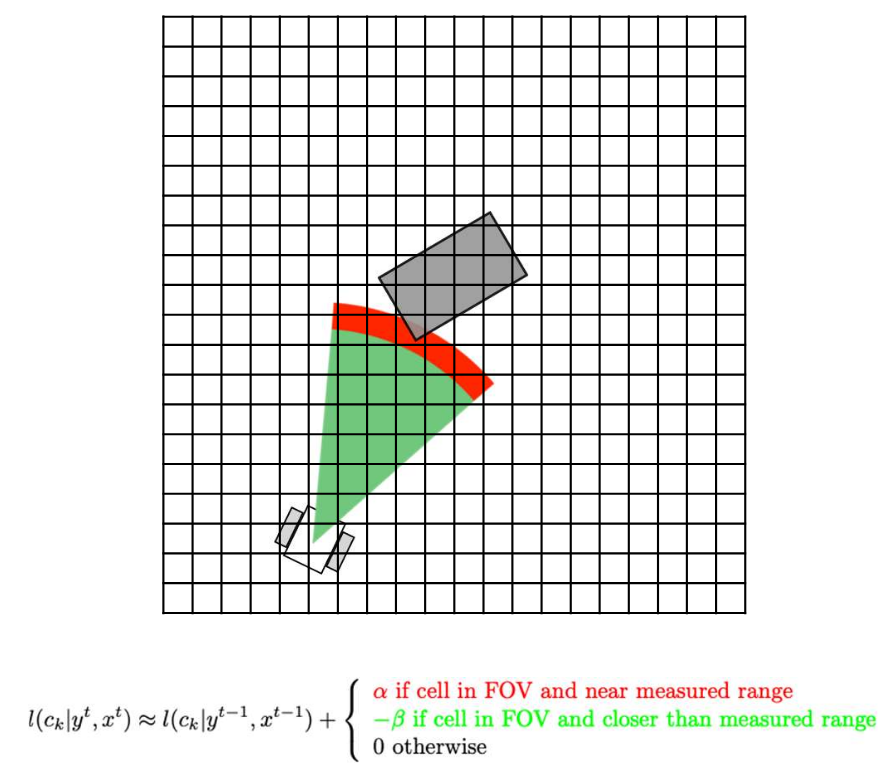

# Lecture 24, Mar 9, 2026

## Grid-Based Mapping With Known Poses

* Early mapping by Moravec and Elfes used an array of sonar sensors to pinpoint objects, mapping on a grid and assuming poses are already known; this evolved into the idea of *occupancy grid* or *evidence grid* maps
	* Localization was obtained using wheel odometry or LiDAR scan matching
* For sonar, we break the scan into regions and assign some probability of emptiness or occupied-ness to each region, and superimpose scans to fill in the grid-based map
	* This allows us to account for uncertainties introduced by the wide cone of sonar
	* In the original algorithm each cell stores an "empty" value and "occupied value"; this was a heuristic algorithm instead of probabilistic

{width=60%}

* We can formulate the problem probabilistically:
	* We want the likelihood of each possible map configuration $m$ given sensor readings $y^t = (y_1, \dots, y_t)$ and known poses $x^t = (x_1, \dots, x_t)$
		* Note, superscript $t$ denotes the whole set of measurements up to time $t$ while subscript $t$ denotes measurement at time $t$
	* We assume cell independence: $p(m | y^t, x^t) \approx \prod _{k = 1}^K p(c_k | y^t, x^t)$ where $c_k$ is each cell
		* This is necessary since otherwise we'd have $2^K$ configurations
		* This gives up the connectivity of space
	* $p(c_k | y^t, x^t) = \frac{p(y^t | c_k, x^t)p(c_k | x^t)}{p(y^t | x^t)} \approx p(c_k)\prod _{\tau = 1}^t \frac{p(y_\tau | c_k, x_\tau)}{p(y_\tau)} = \frac{p(y_t | c_k, x_t)}{p(y_t)}p(c_k | y^{t - 1}, x^{t - 1})$
		* We assume that the cell occupancy is independent of the robot movement (so $p(c_k | x^t) = p(c_k)$), and combine the remaining terms by further assuming independence between time steps
		* The last step separates out the current measurement $x_t, y_t$ explicitly, resulting in a recursive formulation that we can compute online
* In practice for faster computation and numerical stability, we use *log-odds*
	* $l(c_k | y^t, x^t) = \ln\left(\frac{p(c_k | y^t, x^t)}{1 - p(c_k | y^t, x^t)}\right) \iff p(c_k | y^t, x^t) = \frac{\exp(l(c_k, | y^t, x^t))}{1 + \exp(l(c_k | y^t, x^t))}$
		* This now ranges from $(-\infty, \infty)$ with zero representing a probability of 0.5, or no information
	* $\alignedimp[t]{p(c_k | y^t, x^t) = \frac{p(y_t | c_k, x_t)}{p(y_t)}p(c_k | y^{t - 1}, x^{t - 1})}{l(c_k | y^t, x^t) = l(c_k | y^{t - 1}, x^{t - 1}) + \ln\left(\frac{p(y_t | c_k, x_t)}{1 - p(y_t | c_k, x_t)}\right)}$
	* The update term can be derived using our sensor model, or chosen using a good heuristic
		* For sonar we can use $\alpha$ if the cell is in the FOV and near the occupied range (red), $-\beta$ if cell is in the FOV and closer than the occupied range (green), and 0 otherwise
	* Our update equation is still just adding or subtracting some value, but this is now formally probabilistic
* Occupancy grid mapping algorithm:
	1. Initialize all cells to some prior likelihood, typically 0.5 (log-odds zero) if no information
	2. For each scan, for all cells in the FOV of the scan, update using the equation and where the cell is relative to the scan
	3. Threshold each cell based on whether they became more or less likely than the prior, to get the final binarized map

{width=60%}

### Terrain Assessment

* Terrain assessment is the process of determining which parts of terrain are safe to traverse and which parts are not
* This can be done with regular grids, by plane fitting and categorizing cells based on the slope, height, roughness and number of points, or irregular grids
* Given a point cloud of the ground, we break it up into patches and try to fit a plane to each patch:
	* Using the plane model $z = a + bx + cy$
	* Let $\bm A_j = \matthree{1}{x_{1j}}{y_{1j}}{\vdots}{\vdots}{\vdots}{1}{x_{n_jj}}{y_{n_jj}}, \bm x_j = \cvec{a_j}{b_j}{c_j}, \bm b_j = \cvec{z_{1j}}{\vdots}{z_{n_jj}}$
	* The plane fitting error is $\bm e_j = \bm A_j\bm x_j - \bm b_j$
	* Use least square solution, $\bm x_j = (\bm A_j^T\bm A_j)^{-1}\bm A_j^T\bm b_j$
* This can be done recursively by accumulating a $4 \times 4$ matrix
	* Let $\bm p_{ij} = \rvec{1}{x_{ij}}{y_{ij}}{z_{ij}}^T$ where $i$ denotes the $i$th measurement
	* $\bm P_j = \sum _i \bm p_{ij}\bm p_{ij}^T = \mattwo{\bm A_j^T\bm A_j}{\bm A_j^T\bm b_j}{(\bm A_j^T\bm b_j)^T}{\bm b_j^T\bm b_j}$
	* We can keep accumulating the $\bm P_j$ matrix, which contains everything we need to compute the plane fit and other quantities:
		* Number of points: $n_j = p_{11}$
		* Residuals: $e_j = p_{44} - \rvec{p_{14}}{p_{24}}{p_{34}}\matthree{p_{11}}{p_{12}}{p_{13}}{p_{21}}{p_{22}}{p_{23}}{p_{31}}{p_{32}}{p_{33}}^{-1}\cvec{p_{14}}{p_{24}}{p_{34}}$
			* Note $\cvec{a_j}{b_j}{c_j} = \matthree{p_{11}}{p_{12}}{p_{13}}{p_{21}}{p_{22}}{p_{23}}{p_{31}}{p_{32}}{p_{33}}^{-1}\cvec{p_{14}}{p_{24}}{p_{34}}$
		* Average height: $h_j = \frac{p_{14}}{n_j}$
	* Max slope: $\alpha _j = \cos^{-1}\frac{1}{b_j^2 + c_j^2 + 1}$
* We also need to use RANSAC to eliminate outliers
* The above properties can then be used to classify each patch as safe or unsafe to traverse, e.g. using a weighted sum of all the properties and a threshold

