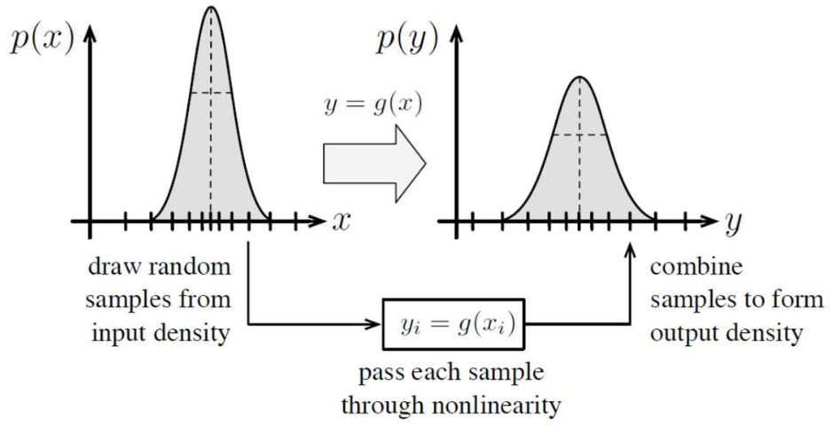

# Lecture 25, Mar 11, 2026

## Filter-Based Localization

* Suppose we have a motion model $\bm x_k = \bm f(\bm x_{k - 1}, \bm v_k, \bm w_k)$ for state $\bm x_k$, input $v_k$ and process noise $\bm w_k$; we also have a measurement model $\bm y_k = \bm g(\bm x_k, \bm n_k)$ for some measurement noise $\bm n_k$; we want to produce an estimate $\hat{\bm x}_k$ of the true state, given the measurements, inputs, and models
* We assume that the process is *Markovian* (Markov assumption): the conditional PDFs of future states depends on the present state only, and is independent of any past states
	* This essentially means that our state contains enough information so that predicting the future states does not rely on the past states
* Our goal is to compute $p(\bm x_k | \check{\bm x}_0, \bm v_{1:k}, \bm y_{0:k})$, known as the *belief function* for $\bm x_k$
	* Using Bayes' rule: $p(\bm x_k | \check{\bm x}_0, \bm v_{1:k}, \bm y_{0:k}) = \eta p(\bm y_k | \bm x_k)p(\bm x_k | \check{\bm x}_0, \bm v_{1:k}, \bm y_{0:k - 1})$ for some scaling factor $\eta$
		* Note that we can do this since the measurements $\bm y$ are conditionally independent given $\bm x$
	* The second term is $\alignedeqntwo[t]{p(\bm x_k | \check{\bm x}_0, \bm v_{1:k}, \bm y_{0:k - 1})}{\int p(\bm x_k, \bm x_{k - 1} | \check{\bm x}_0, \bm v_{1:k}, \bm y_{0:k - 1})\,\dd\bm x_{k - 1}}{\int p(\bm x_k | \bm x_{k - 1}, \check{\bm x}_0, \bm v_{1:k}, \bm y_{0:k - 1})p(\bm x_{k - 1} | \check{\bm x}_0, \bm v_{1:k}, \bm y_{0:k - 1})\,\dd\bm x_{k - 1}}$
		* We've introduced the hidden state $\bm x_{k - 1}$ through essentially reverse marginalization
	* Since the state has no dependence on future inputs, $p(\bm x_{k - 1} | \check{\bm x}_0, \bm v_{1:k}, \bm y_{0:k - 1}) = p(\bm x_{k - 1} | \check{\bm x}_0, \bm v_{1:k - 1}, \bm y_{0:k - 1})$
	* Due to the Markov assumption, $p(\bm x_k | \bm x_{k - 1}, \check{\bm x}_0, \bm v_{1:k}, \bm y_{0:k - 1}) = p(\bm x_k | \bm x_{k - 1}, \bm v_k)$
	* Finally, $p(\bm x_k | \check{\bm x}_0, \bm v_{1:k}, \bm y_{0:k}) = \eta p(\bm y_k | \bm x_k)\int p(\bm x_k | \bm x_{k - 1}, \bm v_k)p(\bm x_{k - 1} | \check{\bm x}_0, \bm v_{1:k - 1}, \bm y_{0:k - 1})\,\dd\bm x_{k - 1}$
		* Note that this takes on a familiar predictor-corrector form: the prior $p(\bm x_{k - 1} | \check{\bm x}_0, \bm v_{1:k - 1}, \bm y_{0:k - 1})$ is first used to generate a prediction using the motion model through $p(\bm x_k | \bm x_{k - 1}, \bm v_k)$, then corrected using $p(\bm y_k | \bm x_k)$, from the measurement model and current observation
* However, the Bayes filter is unimplementable, since arbitrary PDFs are infinite dimensional and the integral is also impossible to compute without additional assumptions
	* To make this tractable, we must make approximations:
		* Analytical models -- approximate the PDFs as some known type with a finite number of parameters, e.g. Gaussians
			* With the Gaussian approximation, this leads to the plain Kalman Filter, Extended Kalman Filter, and Unscented Kalman Filter
		* Histograms -- discretize the state space and record a value for each cell
		* Particles -- represent the distribution with a large number of hypotheses
			* This leads to particle filtering
* We will use $\check{\bm x}$ to denote the state prediction before the measurement is incorporated and $\hat{\bm x}$ to denote the prediction after the measurement is fused

### Particle Filtering

{width=50%}

* *Particle filtering* represents the distribution with particles; we maintain many hypotheses for the robot's localization, and propagate them through our models
* Given enough computational resources this is able to handle any arbitrary PDF and nonlinearities in the models, since we need no assumptions
* We don't need analytical expressions for the motion or observation model as long as we can compute them
* Particle filter procedure:
	1. Prediction step:
		* Draw $M$ samples $\cvec{\check{\bm x}_{k - 1, m}}{\bm w_{k, m}}, m = 1, \dots, M$ from the joint density with both the prior and motion noise, $p(\bm x_{k - 1} | \check{\bm x}_0, \bm v_{1:k - 1}, \bm y_{0:k - 1})p(\bm w_k)$
		* Generate a prediction of the posterior by propagating each particle through the model: $\check{\bm x}_{k, m} = \bm f(\hat{\bm x}_{k - 1, m}, \bm v_k, \bm w_{k, m})$
	2. Correction step:
		* Assign each particle a weight $w_{k, m} = \frac{p(\check{\bm x}_{k, m} | \check{\bm x}_0, \bm v_{1:k}, \bm y_{0:k})}{p(\check{\bm x}_{k, m} | \check{\bm x}_0, \bm v_{1:k}, \bm y_{0:k - 1})} = \eta p(\bm y_k | \check{\bm x}_{k, m})$ where $\eta$ is some normalizing scalar
			* In practice we simulate an expected measurement $\check{\bm y}_{k, m} = \bm g(\check{\bm x}_{k, m}, \bm 0)$, and then assume $p(\bm y_k | \check{\bm x}_{k, m}) = p(\bm y_k | \check{\bm y}_{k, m})$ where $p(\bm y_k | \check{\bm y}_{k, m})$ is some known density we derive from the measurement model
		* Resample the particles probabilistically based on the weight to get $\hat{\bm x}_{k, m}$, so particles with higher weight has a higher probability to get sampled
			* Several different ways exist but *Madow systematic sampling* is one effective and simple way
			* Create $M$ bins based on cumulative weights, with the size of bin $m$ being proportional to $w_{k, m}$; then starting at some random point, march along in steps of $1/M$ and sample from each bin that is visited
				* This has the advantage that if a particle has weight more than $1/M$, it is guaranteed to be sampled, which combats sample depletion; particles with lower weights are only sometimes sampled due to the random starting point
* Particle diversity (variance) is important in particle filters, since if none of the particles accurately models the true state, then we will never converge
	* As we resample, some particles will get missed due to the probabilistic sampling, and over time particles might deplete in diversity
	* Often we might want to simulate more noise than there actually is in the system, to maintain sufficient particle diversity; paradoxically having a noise variance that is too low will often hurt the filter performance
	* During the prediction step we may want to add particles uniformly drawn from the entire sample space to recover from sample impoverishment
	* We may want to resample less often to avoid this as well
* For low dimensional problems a few hundred or thousand particles might be enough, but this increases exponentially with dimensionality
	* Particle count can be picked online using a heuristic based on the sum of weights; if the sum of weights is low (i.e. all of the hypotheses are uncertain) then we might want to add more particles

